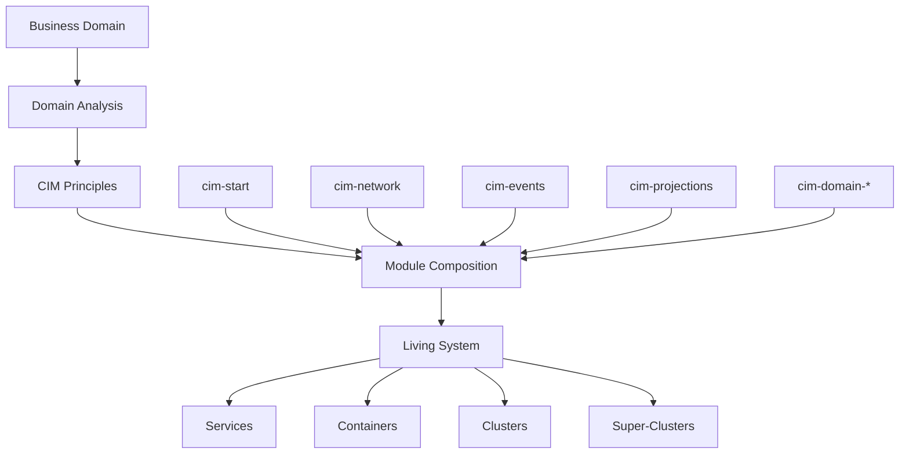

# CIM - The Composable Information Machine

<div align="center">


**The Architectural DNA for Domain-Driven Business Systems**

[](LICENSE)
[](doc/cim_comprehensive_manual.md)
[](https://nixos.org)

</div>

## 🧬 What is CIM?

CIM (Composable Information Machine) is not just another framework or library - it's a **philosophical approach** to building business systems that mirror the natural organization of information in your domain. Think of CIM as the **DNA blueprint** for creating living, breathing information systems that evolve with your business.

This repository serves as:
- 🏛️ **The Architectural Foundation** - Core principles and patterns for building CIMs
- 🗺️ **The Assembly Guide** - How to compose modules into domain-specific systems
- 🔬 **The Research Hub** - Theoretical foundations and design documentation
- 🚀 **The Launch Pad** - Your starting point for building a CIM for your business domain

## 🎯 Purpose

Traditional software architectures force businesses to adapt to rigid technical structures. CIM inverts this relationship - the **business domain drives the architecture**.

CIM enables you to:
- Build systems that think like your business thinks
- Compose functionality from reusable, domain-aligned modules
- Create self-documenting architectures that business experts can understand
- Evolve systems naturally as your domain understanding deepens

## 🏗️ Architecture Overview



## 📚 Repository Structure

```
cim/
├── doc/                    # Comprehensive documentation
│   ├── design/            # Architectural patterns and principles
│   ├── research/          # Theoretical foundations
│   └── cim_comprehensive_manual.md
├── examples/              # Example CIM assemblies
├── nix/                   # Nix expressions for composition
│   ├── lib/              # Reusable Nix functions
│   ├── modules/          # NixOS module definitions
│   └── environments/     # Environment configurations
├── .claude/              # AI assistant integration
│   ├── instructions/     # Claude AI patterns
│   └── patterns/         # Development patterns
└── flake.nix            # Development environment
```

## 🚀 Getting Started

### Prerequisites

- [Nix](https://nixos.org/download.html) package manager
- Understanding of your business domain
- Curiosity about composable architectures

### 1. Enter the Development Environment

```bash
# Clone this repository
git clone https://github.com/thecowboyai/cim
cd cim

# Enter the CIM architect environment
nix develop

# You'll see a welcome message with available tools and resources
```

### 2. Understand CIM Principles

Start with the comprehensive manual:
```bash
# Open the manual in your browser
mdbook serve doc/
```

Key documents to review:
- `doc/cim_comprehensive_manual.md` - Core concepts and philosophy
- `doc/design/core-architecture.md` - Architectural patterns
- `doc/design/event-correlation-causation.md` - Event-driven design

### 3. Analyze Your Domain

CIM provides agents and sub-agents to help you:
- Map your business domain to information structures
- Identify natural boundaries and contexts
- Discover compositional opportunities
- Align technical design with business reality

### 4. Begin Assembly

Once you understand your domain through the CIM lens:
```bash
# Visit the cim-start repository
gh repo clone thecowboyai/cim-start

# Follow the assembly guide to create your domain-specific CIM
```

## 🧩 The CIM Ecosystem

CIM modules are distributed across multiple repositories, each serving a specific purpose:

### Core Infrastructure
- [`cim-start`](https://github.com/thecowboyai/cim-start) - Template for new CIM assemblies
- [`cim-events`](https://github.com/thecowboyai/cim-events) - Event sourcing with CID chains
- [`cim-projections`](https://github.com/thecowboyai/cim-projections) - CQRS projections

### Domain Modules
- [`cim-domain`](https://github.com/thecowboyai/cim-domain) - Core domain modeling
- [`cim-domain-nix`](https://github.com/thecowboyai/cim-domain-nix) - Nix integration
- [`cim-domain-git`](https://github.com/thecowboyai/cim-domain-git) - Git operations

### Specialized Modules
- [`cim-network`](https://github.com/thecowboyai/cim-network) - Network infrastructure
- [`cim-cattle`](https://github.com/thecowboyai/cim-cattle) - Resource management
- [`cim-moo`](https://github.com/thecowboyai/cim-moo) - Quick operations

## 🎓 Learning Path

1. **Philosophy** - Understand why CIM exists and its core principles
2. **Architecture** - Learn the patterns that make CIM composable
3. **Domain Modeling** - Practice analyzing domains through the CIM lens
4. **Module Composition** - Understand how modules fit together
5. **Assembly** - Build your first domain-specific CIM

## 🤝 Contributing

CIM is a living philosophy that grows through community insight. We welcome:
- Domain analysis examples
- Architectural patterns
- Module contributions
- Documentation improvements

See [CONTRIBUTING.md](CONTRIBUTING.md) for guidelines.

## 📖 Documentation

- [Comprehensive Manual](doc/cim_comprehensive_manual.md)
- [Architectural Design](doc/design/)
- [Research Papers](doc/research/)
- [API Documentation](https://docs.thecowboyai.com/cim)

## 🌟 Why CIM?

In nature, DNA doesn't dictate exactly how an organism will develop - it provides the patterns and principles that guide growth in response to the environment. CIM applies this same principle to software:

- **Adaptive** - Systems that evolve with your business
- **Composable** - Build complex behavior from simple modules
- **Domain-Driven** - Technology serves the business, not vice versa
- **Self-Documenting** - Architecture that explains itself

## 📬 Contact & Support

- **GitHub Issues**: Technical questions and bug reports
- **Discussions**: Architecture and philosophy discussions
- **Email**: cim@thecowboyai.com
- **Documentation**: [docs.thecowboyai.com/cim](https://docs.thecowboyai.com/cim)

## 📄 License

MIT - See [LICENSE](LICENSE) for details.

---

<div align="center">

**Build systems that think like your business thinks.**

🧬 CIM - Where Business Domains Come to Life 🧬

</div>