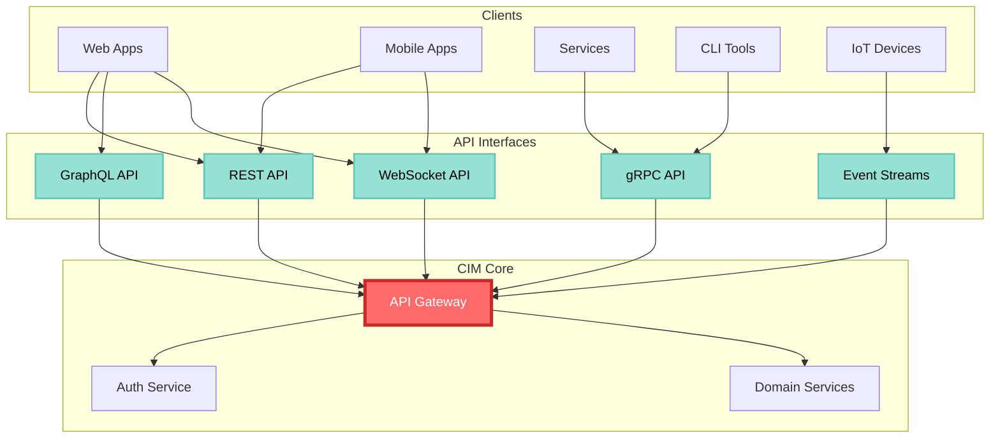

# CIM API Reference

Complete API documentation for the Composable Information Machine, covering REST APIs, gRPC services, event schemas, and client libraries.

## Table of Contents

1. [API Overview](#api-overview)
2. [Authentication](#authentication)
3. [REST API](#rest-api)
4. [gRPC API](#grpc-api)
5. [Event API](#event-api)
6. [GraphQL API](#graphql-api)
7. [WebSocket API](#websocket-api)
8. [Client Libraries](#client-libraries)
9. [Error Handling](#error-handling)
10. [Rate Limiting](#rate-limiting)

## API Overview

CIM provides multiple API interfaces for different use cases:



### Base URLs

| Environment | REST API | gRPC | WebSocket |
|-------------|----------|------|-----------|
| Production | `https://api.cim.io/v1` | `grpc://api.cim.io:443` | `wss://api.cim.io/ws` |
| Staging | `https://staging-api.cim.io/v1` | `grpc://staging-api.cim.io:443` | `wss://staging-api.cim.io/ws` |
| Development | `http://localhost:8080/v1` | `grpc://localhost:9090` | `ws://localhost:8080/ws` |

## Authentication

### API Keys

```bash
# Request header
Authorization: Bearer <api_key>

# Example
curl -H "Authorization: Bearer cim_live_abc123..." \
  https://api.cim.io/v1/domains
```

### OAuth 2.0

```bash
# Authorization endpoint
https://auth.cim.io/oauth/authorize?
  response_type=code&
  client_id=YOUR_CLIENT_ID&
  redirect_uri=YOUR_REDIRECT_URI&
  scope=read:domains+write:events

# Token exchange
POST https://auth.cim.io/oauth/token
Content-Type: application/x-www-form-urlencoded

grant_type=authorization_code&
code=AUTH_CODE&
client_id=YOUR_CLIENT_ID&
client_secret=YOUR_CLIENT_SECRET
```

### JWT Tokens

```json
{
  "alg": "RS256",
  "typ": "JWT"
}
{
  "sub": "user:123",
  "iss": "https://cim.io",
  "aud": "https://api.cim.io",
  "exp": 1640995200,
  "iat": 1640908800,
  "scopes": ["read:domains", "write:events"],
  "tenant_id": "tenant_456"
}
```

## REST API

### Domains

#### List Domains
```http
GET /v1/domains
```

**Response:**
```json
{
  "domains": [
    {
      "id": "inventory",
      "name": "Inventory Management",
      "version": "1.0.0",
      "status": "active",
      "endpoints": {
        "commands": "/v1/domains/inventory/commands",
        "queries": "/v1/domains/inventory/queries",
        "events": "/v1/domains/inventory/events"
      }
    }
  ],
  "meta": {
    "total": 15,
    "page": 1,
    "per_page": 20
  }
}
```

#### Get Domain Details
```http
GET /v1/domains/{domain_id}
```

**Response:**
```json
{
  "id": "inventory",
  "name": "Inventory Management",
  "version": "1.0.0",
  "description": "Manages product inventory and stock levels",
  "aggregates": ["InventoryItem", "Warehouse"],
  "commands": [
    {
      "name": "CreateItem",
      "schema": {
        "$ref": "#/components/schemas/CreateItemCommand"
      }
    }
  ],
  "events": [
    {
      "name": "ItemCreated",
      "schema": {
        "$ref": "#/components/schemas/ItemCreatedEvent"
      }
    }
  ]
}
```

### Commands

#### Send Command
```http
POST /v1/domains/{domain_id}/commands
Content-Type: application/json

{
  "command": "CreateItem",
  "data": {
    "sku": "WIDGET-001",
    "name": "Super Widget",
    "initial_quantity": 100
  },
  "metadata": {
    "correlation_id": "req-123",
    "user_id": "user-456"
  }
}
```

**Response:**
```json
{
  "command_id": "cmd_789",
  "status": "accepted",
  "events": [
    {
      "event_id": "evt_123",
      "type": "ItemCreated",
      "aggregate_id": "WIDGET-001",
      "version": 1
    }
  ]
}
```

### Queries

#### Execute Query
```http
POST /v1/domains/{domain_id}/queries
Content-Type: application/json

{
  "query": "GetLowStockItems",
  "parameters": {
    "threshold": 10,
    "warehouse_id": "WH-001"
  }
}
```

**Response:**
```json
{
  "query_id": "qry_456",
  "results": [
    {
      "sku": "WIDGET-001",
      "name": "Super Widget",
      "quantity": 5,
      "reorder_point": 20
    }
  ],
  "meta": {
    "execution_time_ms": 23,
    "from_cache": false
  }
}
```

### Events

#### List Events
```http
GET /v1/events?domain={domain_id}&from={timestamp}&to={timestamp}
```

**Response:**
```json
{
  "events": [
    {
      "event_id": "evt_123",
      "type": "ItemCreated",
      "domain": "inventory",
      "aggregate_id": "WIDGET-001",
      "version": 1,
      "timestamp": "2024-01-29T10:30:00Z",
      "data": {
        "sku": "WIDGET-001",
        "name": "Super Widget",
        "initial_quantity": 100
      },
      "metadata": {
        "correlation_id": "req-123",
        "causation_id": "cmd_789",
        "user_id": "user-456"
      }
    }
  ],
  "continuation_token": "eyJsYXN0X2V2ZW50X2lkIjoiZXZ0XzEyMyJ9"
}
```

#### Subscribe to Events (SSE)
```http
GET /v1/events/stream?domain={domain_id}&types={event_types}
Accept: text/event-stream
```

**Response:**
```
event: ItemCreated
id: evt_124
data: {"sku":"WIDGET-002","name":"Mega Widget","quantity":50}

event: StockLow
id: evt_125
data: {"sku":"WIDGET-001","current":5,"reorder_point":20}
```

## gRPC API

### Proto Definition

```protobuf
syntax = "proto3";

package cim.api.v1;

service DomainService {
  rpc SendCommand(CommandRequest) returns (CommandResponse);
  rpc ExecuteQuery(QueryRequest) returns (QueryResponse);
  rpc SubscribeEvents(EventSubscription) returns (stream Event);
}

message CommandRequest {
  string domain = 1;
  string command = 2;
  google.protobuf.Any payload = 3;
  map<string, string> metadata = 4;
}

message CommandResponse {
  string command_id = 1;
  Status status = 2;
  repeated Event events = 3;
  string error = 4;
}

message Event {
  string event_id = 1;
  string type = 2;
  string domain = 3;
  string aggregate_id = 4;
  int64 version = 5;
  google.protobuf.Timestamp timestamp = 6;
  google.protobuf.Any data = 7;
  map<string, string> metadata = 8;
}

enum Status {
  UNKNOWN = 0;
  ACCEPTED = 1;
  PROCESSED = 2;
  FAILED = 3;
}
```

### gRPC Client Example

```python
import grpc
from cim.api.v1 import domain_service_pb2 as pb2
from cim.api.v1 import domain_service_pb2_grpc as pb2_grpc

# Create channel with authentication
channel = grpc.secure_channel(
    'api.cim.io:443',
    grpc.ssl_channel_credentials(),
    options=[
        ('grpc.default_authority', 'api.cim.io'),
    ]
)

# Add auth interceptor
channel = grpc.intercept_channel(
    channel,
    AuthInterceptor(api_key='cim_live_abc123...')
)

# Create stub
stub = pb2_grpc.DomainServiceStub(channel)

# Send command
request = pb2.CommandRequest(
    domain='inventory',
    command='CreateItem',
    payload=Any(value=json.dumps({
        'sku': 'WIDGET-003',
        'name': 'Ultra Widget',
        'quantity': 200
    }).encode()),
    metadata={'user_id': 'user-456'}
)

response = stub.SendCommand(request)
print(f"Command ID: {response.command_id}")
```

## Event API

### Event Schema

All events follow this base schema:

```json
{
  "$schema": "http://json-schema.org/draft-07/schema#",
  "type": "object",
  "required": ["event_id", "type", "domain", "timestamp", "data"],
  "properties": {
    "event_id": {
      "type": "string",
      "pattern": "^evt_[a-zA-Z0-9]+$"
    },
    "type": {
      "type": "string"
    },
    "domain": {
      "type": "string"
    },
    "aggregate_id": {
      "type": "string"
    },
    "version": {
      "type": "integer",
      "minimum": 1
    },
    "timestamp": {
      "type": "string",
      "format": "date-time"
    },
    "data": {
      "type": "object"
    },
    "metadata": {
      "type": "object",
      "properties": {
        "correlation_id": {"type": "string"},
        "causation_id": {"type": "string"},
        "user_id": {"type": "string"},
        "tenant_id": {"type": "string"}
      }
    }
  }
}
```

### Domain Events

#### Inventory Events

```typescript
// ItemCreated
interface ItemCreatedEvent {
  sku: string;
  name: string;
  description?: string;
  initial_quantity: number;
  reorder_point: number;
  reorder_quantity: number;
}

// StockReceived
interface StockReceivedEvent {
  sku: string;
  quantity: number;
  batch_id: string;
  supplier: string;
  received_date: string;
}

// StockSold
interface StockSoldEvent {
  sku: string;
  quantity: number;
  order_id: string;
  customer_id?: string;
}

// LowStockAlert
interface LowStockAlertEvent {
  sku: string;
  current_quantity: number;
  reorder_point: number;
  suggested_order_quantity: number;
}
```

## GraphQL API

### Schema

```graphql
type Query {
  domain(id: ID!): Domain
  domains(filter: DomainFilter, page: Int, perPage: Int): DomainConnection!
  
  events(
    domain: ID
    types: [String!]
    from: DateTime
    to: DateTime
    first: Int
    after: String
  ): EventConnection!
  
  aggregate(domain: ID!, aggregateId: ID!): Aggregate
}

type Mutation {
  sendCommand(input: CommandInput!): CommandResult!
}

type Subscription {
  eventStream(domain: ID!, types: [String!]): Event!
}

type Domain {
  id: ID!
  name: String!
  version: String!
  status: DomainStatus!
  aggregates: [AggregateType!]!
  commands: [CommandType!]!
  events: [EventType!]!
}

type Event {
  id: ID!
  type: String!
  domain: Domain!
  aggregateId: ID
  version: Int!
  timestamp: DateTime!
  data: JSON!
  metadata: JSON
}

input CommandInput {
  domain: ID!
  command: String!
  data: JSON!
  metadata: JSON
}

type CommandResult {
  commandId: ID!
  status: CommandStatus!
  events: [Event!]!
  error: String
}

enum DomainStatus {
  ACTIVE
  INACTIVE
  DEPRECATED
}

enum CommandStatus {
  ACCEPTED
  PROCESSED
  FAILED
}
```

### GraphQL Example

```javascript
// Query
const GET_LOW_STOCK = gql`
  query GetLowStock($domain: ID!, $threshold: Int!) {
    domain(id: $domain) {
      aggregate(query: {
        type: "LowStockItems",
        parameters: { threshold: $threshold }
      }) {
        items {
          sku
          name
          quantity
          reorderPoint
        }
      }
    }
  }
`;

// Mutation
const CREATE_ITEM = gql`
  mutation CreateItem($input: CommandInput!) {
    sendCommand(input: $input) {
      commandId
      status
      events {
        id
        type
        data
      }
    }
  }
`;

// Subscription
const STOCK_EVENTS = gql`
  subscription StockEvents($domain: ID!) {
    eventStream(domain: $domain, types: ["StockSold", "StockReceived"]) {
      id
      type
      aggregateId
      data
      timestamp
    }
  }
`;
```

## WebSocket API

### Connection

```javascript
const ws = new WebSocket('wss://api.cim.io/ws');

ws.onopen = () => {
  // Authenticate
  ws.send(JSON.stringify({
    type: 'auth',
    token: 'Bearer cim_live_abc123...'
  }));
  
  // Subscribe to events
  ws.send(JSON.stringify({
    type: 'subscribe',
    domain: 'inventory',
    events: ['StockSold', 'LowStockAlert']
  }));
};

ws.onmessage = (event) => {
  const message = JSON.parse(event.data);
  
  switch(message.type) {
    case 'event':
      console.log('Received event:', message.event);
      break;
    case 'error':
      console.error('Error:', message.error);
      break;
  }
};
```

### Message Types

```typescript
// Client -> Server
interface ClientMessage {
  type: 'auth' | 'subscribe' | 'unsubscribe' | 'command' | 'query';
  [key: string]: any;
}

// Server -> Client
interface ServerMessage {
  type: 'connected' | 'event' | 'command_result' | 'query_result' | 'error';
  [key: string]: any;
}
```

## Client Libraries

### JavaScript/TypeScript

```bash
npm install @cim/client
```

```typescript
import { CIMClient } from '@cim/client';

const client = new CIMClient({
  apiKey: process.env.CIM_API_KEY,
  environment: 'production'
});

// Send command
const result = await client.domains.inventory.commands.createItem({
  sku: 'WIDGET-004',
  name: 'Premium Widget',
  quantity: 150
});

// Subscribe to events
const subscription = client.domains.inventory.events.subscribe(
  ['StockSold', 'StockReceived'],
  (event) => {
    console.log('Event received:', event);
  }
);

// Query
const lowStock = await client.domains.inventory.queries.getLowStockItems({
  threshold: 10
});
```

### Python

```bash
pip install cim-client
```

```python
from cim import CIMClient

client = CIMClient(
    api_key=os.environ['CIM_API_KEY'],
    environment='production'
)

# Send command
result = client.domains.inventory.commands.create_item(
    sku='WIDGET-005',
    name='Python Widget',
    quantity=75
)

# Async event handling
async def handle_event(event):
    print(f"Event: {event.type} for {event.aggregate_id}")

# Subscribe to events
subscription = await client.domains.inventory.events.subscribe(
    event_types=['StockSold', 'StockReceived'],
    handler=handle_event
)
```

### Rust

```toml
[dependencies]
cim-client = "0.1"
```

```rust
use cim_client::{CIMClient, Command};

#[tokio::main]
async fn main() -> Result<(), Box<dyn std::error::Error>> {
    let client = CIMClient::new()
        .api_key(std::env::var("CIM_API_KEY")?)
        .build()?;
    
    // Send command
    let result = client
        .domain("inventory")
        .send_command(CreateItem {
            sku: "WIDGET-006".to_string(),
            name: "Rust Widget".to_string(),
            quantity: 100,
        })
        .await?;
    
    // Subscribe to events
    let mut event_stream = client
        .domain("inventory")
        .subscribe_events(vec!["StockSold", "StockReceived"])
        .await?;
    
    while let Some(event) = event_stream.next().await {
        println!("Event: {:?}", event?);
    }
    
    Ok(())
}
```

## Error Handling

### Error Response Format

```json
{
  "error": {
    "code": "INSUFFICIENT_STOCK",
    "message": "Cannot sell 50 units. Only 10 available.",
    "domain": "inventory",
    "details": {
      "requested": 50,
      "available": 10,
      "sku": "WIDGET-001"
    },
    "trace_id": "trace_123abc"
  }
}
```

### HTTP Status Codes

| Status | Meaning | Example |
|--------|---------|---------|
| 200 | Success | Query executed successfully |
| 201 | Created | Resource created |
| 202 | Accepted | Command accepted for processing |
| 400 | Bad Request | Invalid input data |
| 401 | Unauthorized | Missing or invalid API key |
| 403 | Forbidden | Insufficient permissions |
| 404 | Not Found | Domain or resource not found |
| 409 | Conflict | Business rule violation |
| 429 | Too Many Requests | Rate limit exceeded |
| 500 | Internal Error | Server error |
| 503 | Service Unavailable | Temporary outage |

### Error Codes

```typescript
enum ErrorCode {
  // General
  INTERNAL_ERROR = 'INTERNAL_ERROR',
  INVALID_REQUEST = 'INVALID_REQUEST',
  UNAUTHORIZED = 'UNAUTHORIZED',
  FORBIDDEN = 'FORBIDDEN',
  NOT_FOUND = 'NOT_FOUND',
  
  // Domain specific
  AGGREGATE_NOT_FOUND = 'AGGREGATE_NOT_FOUND',
  INVALID_COMMAND = 'INVALID_COMMAND',
  BUSINESS_RULE_VIOLATION = 'BUSINESS_RULE_VIOLATION',
  OPTIMISTIC_LOCK_ERROR = 'OPTIMISTIC_LOCK_ERROR',
  
  // Event related
  EVENT_STORE_ERROR = 'EVENT_STORE_ERROR',
  INVALID_EVENT_SEQUENCE = 'INVALID_EVENT_SEQUENCE',
  
  // Rate limiting
  RATE_LIMIT_EXCEEDED = 'RATE_LIMIT_EXCEEDED',
  QUOTA_EXCEEDED = 'QUOTA_EXCEEDED'
}
```

## Rate Limiting

### Headers

```http
X-RateLimit-Limit: 1000
X-RateLimit-Remaining: 999
X-RateLimit-Reset: 1640995200
X-RateLimit-Reset-After: 3600
```

### Rate Limits

| Tier | Requests/Hour | Burst | Events/Hour |
|------|--------------|-------|-------------|
| Free | 1,000 | 100 | 10,000 |
| Starter | 10,000 | 500 | 100,000 |
| Professional | 100,000 | 2,000 | 1,000,000 |
| Enterprise | Unlimited | Custom | Unlimited |

### Handling Rate Limits

```javascript
async function makeRequest(url, options, retries = 3) {
  for (let i = 0; i < retries; i++) {
    const response = await fetch(url, options);
    
    if (response.status === 429) {
      const resetAfter = response.headers.get('X-RateLimit-Reset-After');
      const delay = parseInt(resetAfter) * 1000;
      
      console.log(`Rate limited. Waiting ${delay}ms...`);
      await new Promise(resolve => setTimeout(resolve, delay));
      continue;
    }
    
    return response;
  }
  
  throw new Error('Max retries exceeded');
}
```

## API Versioning

### Version Header

```http
Accept: application/vnd.cim.v1+json
CIM-Version: 2024-01-29
```

### Breaking Changes

Breaking changes are communicated via:
1. Deprecation headers
2. Email notifications
3. Migration guides
4. Sunset dates

```http
Deprecation: true
Sunset: Sat, 31 Dec 2024 23:59:59 GMT
Link: <https://docs.cim.io/migrations/v2>; rel="deprecation"
```

## Best Practices

1. **Use Idempotency Keys**
   ```http
   Idempotency-Key: unique-request-id
   ```

2. **Implement Exponential Backoff**
   ```javascript
   const delay = Math.min(1000 * Math.pow(2, attempt), 30000);
   ```

3. **Handle Partial Failures**
   ```json
   {
     "batch_id": "batch_123",
     "succeeded": 95,
     "failed": 5,
     "failures": [...]
   }
   ```

4. **Use Field Masks**
   ```http
   GET /v1/domains/inventory/aggregates/WIDGET-001?fields=sku,name,quantity
   ```

5. **Implement Circuit Breakers**
   ```javascript
   const breaker = new CircuitBreaker(apiCall, {
     timeout: 3000,
     errorThresholdPercentage: 50,
     resetTimeout: 30000
   });
   ```

---

*Next: [Troubleshooting Guide](./troubleshooting-guide.md) - Common issues and solutions*