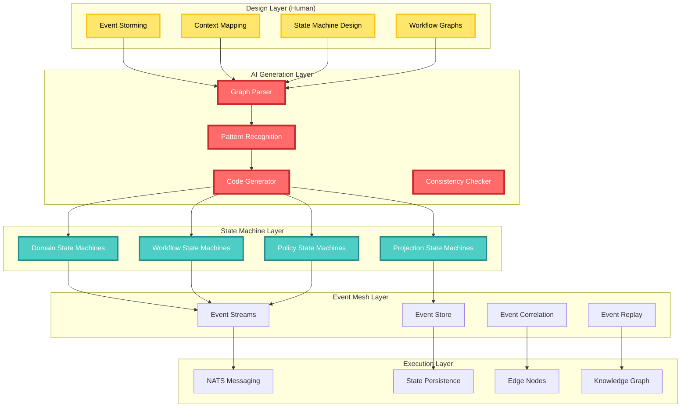
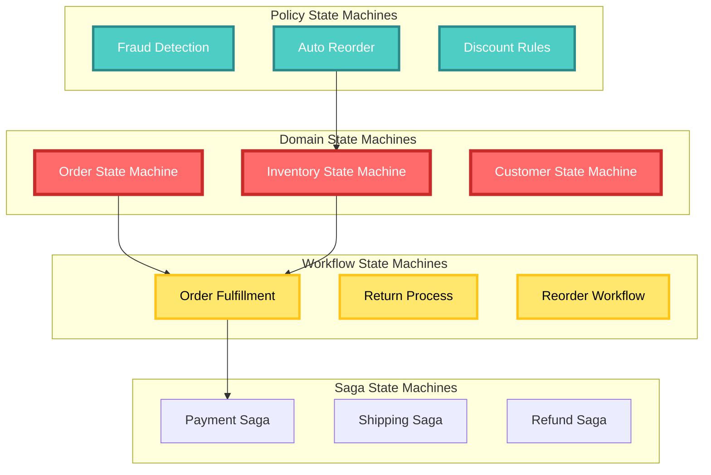
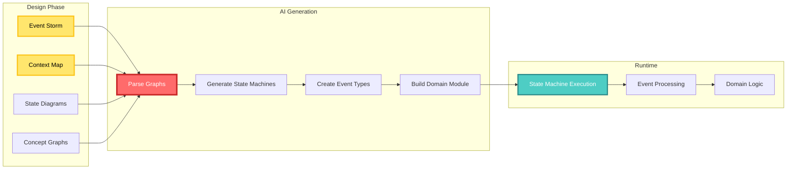
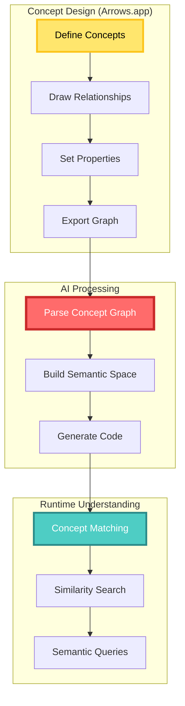
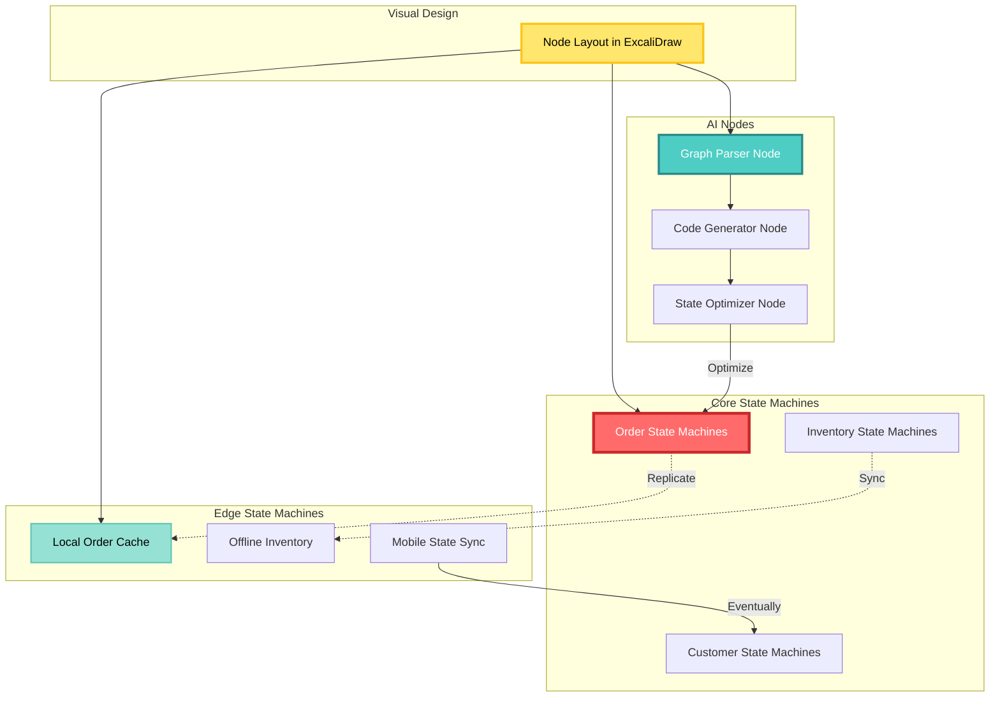
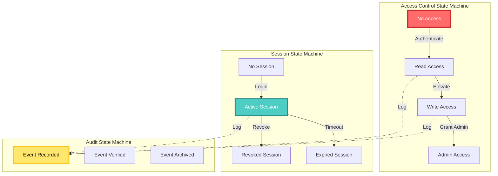
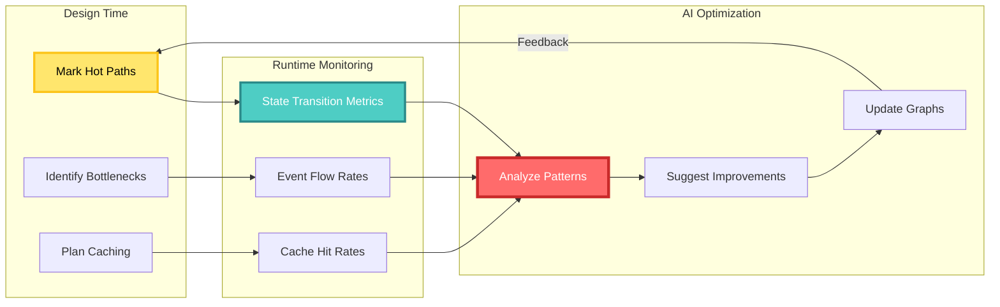
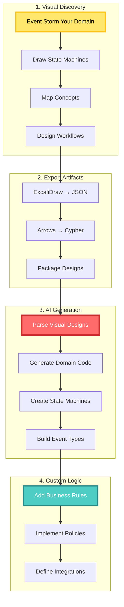
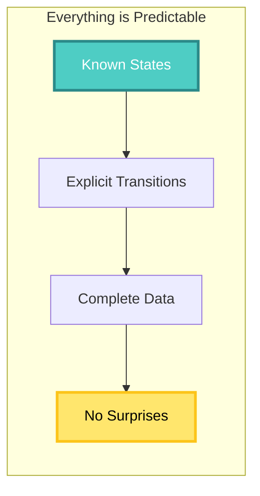

# CIM Architecture Deep Dive

Understanding CIM's visual-first, state machine-driven architecture.

## Table of Contents

1. [Architectural Philosophy](#architectural-philosophy)
2. [Visual Architecture](#visual-architecture)
3. [State Machine Foundation](#state-machine-foundation)
4. [Event-Driven Core](#event-driven-core)
5. [Graph-Based Design](#graph-based-design)
6. [Distributed State Machines](#distributed-state-machines)
7. [AI Integration Layer](#ai-integration-layer)
8. [Security Through States](#security-through-states)
9. [Performance Patterns](#performance-patterns)

## Architectural Philosophy

CIM's architecture fundamentally differs from traditional systems:

### 1. Graphs as Executable Specifications

In CIM, visual graphs ARE the system design:

```
Traditional: Requirements → Code → System
CIM:         Visual Graphs → AI Generation → Execution
```

The graphs you draw in ExcaliDraw and Arrows.app directly execute:
- State machines define behavior
- Context maps define boundaries  
- Workflow graphs define processes
- Concept graphs define relationships

### 2. Everything is a State Machine

CIM doesn't have objects, services, or controllers. It has state machines:

```
Traditional Architecture        CIM Architecture
────────────────────────       ─────────────────────
- Services                     - Domain State Machines
- Controllers                  - Workflow State Machines  
- Models                       - Aggregate State Machines
- Repositories                 - Projection State Machines
- Middleware                   - Policy State Machines
```

### 3. AI-Native Design

AI isn't added to CIM - it's built into the foundation:
- AI reads your visual designs
- AI generates state machine implementations
- AI orchestrates cross-domain workflows
- AI maintains consistency across the mesh

## Visual Architecture

CIM's architecture starts with visual design:



### Architecture Flow

1. **Visual Design** - Humans create understanding through graphs
2. **AI Generation** - AI reads graphs and generates state machines
3. **State Execution** - State machines process events
4. **Event Flow** - Events flow through the mesh
5. **Distribution** - Execution happens across nodes

## State Machine Foundation

### Everything is a State Machine

In CIM, all behavior is modeled as state machines:

```rust
// Not objects with methods, but states with transitions
pub trait StateMachine {
    type State;
    type Event;
    type Command;
    
    fn current_state(&self) -> &Self::State;
    fn handle_command(&self, cmd: Self::Command) -> Vec<Self::Event>;
    fn apply_event(&mut self, event: Self::Event);
}
```

### State Machine Types



### State Completeness Principle

Each state contains ALL data needed for that state:

```rust
// ❌ Wrong: Incomplete states
enum BadOrderState {
    Placed,      // Where's the order data?
    Paid,        // How much was paid?
    Shipped,     // What's the tracking info?
}

// ✅ Right: Complete states
enum GoodOrderState {
    Placed {
        order_id: OrderId,
        customer: CustomerId,
        items: Vec<LineItem>,
        total: Money,
        placed_at: DateTime,
    },
    Paid {
        order_id: OrderId,
        payment_id: PaymentId,
        amount: Money,
        paid_at: DateTime,
    },
    Shipped {
        order_id: OrderId,
        tracking: TrackingNumber,
        carrier: Carrier,
        shipped_at: DateTime,
    },
}
```

## Graph-Based Domain Design

### From Visual Design to Domain Code

In CIM, domains start as visual graphs that AI transforms into state machines:



### Visual Domain Boundaries

Domains are defined visually in ExcaliDraw:

```
┌─────────────────────────────────────┐
│         ORDER DOMAIN                │
│  Everything is a State Machine      │
│                                     │
│  Order State Machine                │
│  ├─ Draft → Placed → Paid          │
│  └─ Cancelled (from any state)     │
│                                     │
│  Order Saga State Machine           │
│  ├─ Started → Processing            │
│  └─ Completed / Failed              │
└─────────────────────────────────────┘
        │ Events │
        ▼        ▼
┌─────────────────────────────────────┐
│      INVENTORY DOMAIN               │
│  Stock State Machine                │
│  ├─ Available → Reserved            │
│  └─ Depleted → Restocking          │
└─────────────────────────────────────┘
```

### State Machine Aggregates

Aggregates in CIM are state machines with complete state data:

```rust
// AI generates this from your visual state diagram
#[derive(StateMachine)]
pub enum OrderAggregate {
    Draft {
        id: OrderId,
        customer: CustomerId,
        items: Vec<LineItem>,
        created_at: DateTime,
    },
    
    Placed {
        id: OrderId,
        customer: CustomerId,
        items: Vec<LineItem>,
        total: Money,
        placed_at: DateTime,
    },
    
    Paid {
        id: OrderId,
        payment_id: PaymentId,
        amount: Money,
        paid_at: DateTime,
    },
    
    Cancelled {
        id: OrderId,
        reason: CancellationReason,
        cancelled_at: DateTime,
        refund_status: Option<RefundStatus>,
    },
}
```

## Visual Conceptual Spaces

### From Concept Graphs to Semantic Understanding

CIM uses visual concept graphs (Arrows.app) to define semantic spaces:

```cypher
// Visual concept graph in Arrows.app
// This becomes semantic understanding

// Quality dimensions as relationships
(Price)-[:DIMENSION {weight: 0.7}]->(Product)
(Quality)-[:DIMENSION {weight: 0.9}]->(Product)
(Availability)-[:DIMENSION {weight: 0.5}]->(Product)

// Concept regions
(Premium:Region {price: "high", quality: "high"})
(Budget:Region {price: "low", quality: "medium"})
(Luxury:Region {price: "very high", quality: "exceptional"})

// Prototypes
(iPhone:Prototype)-[:EXEMPLIFIES]->(Premium)
(GenericPhone:Prototype)-[:EXEMPLIFIES]->(Budget)
(VersacePhone:Prototype)-[:EXEMPLIFIES]->(Luxury)
```

### AI Interprets Visual Concepts

AI agents read your concept graphs and generate semantic understanding:

```rust
// AI-generated from Arrows.app graph
pub struct ProductSpace {
    dimensions: Vec<Dimension>,
    regions: Vec<ConceptRegion>,
}

impl ProductSpace {
    // AI generates similarity from visual relationships
    pub fn find_similar(&self, product: &Product) -> Vec<Product> {
        // Uses graph-defined dimensions and weights
        self.products
            .iter()
            .map(|p| (p, self.calculate_similarity(product, p)))
            .filter(|(_, sim)| *sim > 0.7)
            .map(|(p, _)| p.clone())
            .collect()
    }
}
```

### Visual Concept Evolution



## Distributed State Machines

### Visual Node Architecture

Nodes are designed visually, showing state machine distribution:



### State Machine Distribution Pattern

```
Visual Node Design (ExcaliDraw)
━━━━━━━━━━━━━━━━━━━━━━━━━━━━━━

┌─────────────────┐
│   Central Hub   │
│ ┌─────────────┐ │
│ │Order States │ │
│ └─────────────┘ │
└────────┬────────┘
         │
    ┌────┴────┬─────────┐
    ▼         ▼         ▼
┌────────┐ ┌────────┐ ┌────────┐
│Store 1 │ │Store 2 │ │Mobile  │
│┌──────┐│ │┌──────┐│ │┌──────┐│
││Local ││ ││Local ││ ││Cache ││
││States││ ││States││ ││States││
│└──────┘│ │└──────┘│ │└──────┘│
└────────┘ └────────┘ └────────┘

Each node runs state machines
Synchronization via event replication
```

### Distributed State Consistency

```rust
// State machines handle distribution transparently
#[derive(DistributedStateMachine)]
pub struct OrderStateMachine {
    // Local state
    state: OrderState,
    
    // Distribution metadata
    node_id: NodeId,
    version: VectorClock,
    
    // Offline queue
    pending_sync: Vec<Event>,
}

impl OrderStateMachine {
    // State transitions work offline
    pub fn transition(&mut self, event: Event) -> Result<()> {
        match self.state {
            OrderState::Draft { .. } => {
                self.apply_event(event);
                self.version.increment(self.node_id);
                
                if self.is_offline() {
                    self.pending_sync.push(event);
                } else {
                    self.broadcast(event).await?;
                }
            }
            // Other states...
        }
        Ok(())
    }
}
```

## Security Through State Machines

### Visual Security Design

Security is modeled as state machines in your visual designs:

```
Authentication State Machine (ExcaliDraw)
━━━━━━━━━━━━━━━━━━━━━━━━━━━━━━━━━━━━━━

○ Anonymous
    │
    ├─Present Credentials─→ Authenticating
    │                           │
    │                           ├─Valid─→ Authenticated
    │                           │            │
    │                           └─Invalid─→ Anonymous
    │                                       │
    └───────────────────────────────────────┘
                     
Authenticated State includes:
- user_id: UserId
- permissions: Set<Permission>
- session_token: Token
- expires_at: DateTime
```

### Security State Machines



### Policy as State Machines

```rust
// Security policies are state machines too
#[derive(PolicyStateMachine)]
pub enum AccessPolicy {
    Evaluating {
        request: AccessRequest,
        context: SecurityContext,
    },
    
    Permitted {
        request: AccessRequest,
        permissions: Vec<Permission>,
        expires_at: DateTime,
    },
    
    Denied {
        request: AccessRequest,
        reason: DenialReason,
        logged_at: DateTime,
    },
}

impl AccessPolicy {
    pub fn evaluate(&mut self, rules: &[Rule]) {
        match self {
            Self::Evaluating { request, context } => {
                let result = rules.iter()
                    .all(|rule| rule.check(request, context));
                
                *self = if result {
                    Self::Permitted {
                        request: request.clone(),
                        permissions: extract_permissions(rules),
                        expires_at: calculate_expiry(context),
                    }
                } else {
                    Self::Denied {
                        request: request.clone(),
                        reason: find_denial_reason(rules),
                        logged_at: Utc::now(),
                    }
                };
            }
            _ => {} // Already evaluated
        }
    }
}
```

## Performance Through Visual Design

### Performance Patterns in Graphs

Performance optimization starts in your visual designs:

```
Performance-Oriented State Design (ExcaliDraw)
━━━━━━━━━━━━━━━━━━━━━━━━━━━━━━━━━━━━━━━━━━

┌─────────────────────┐
│   Hot Path States   │ ← Mark frequently accessed
│  ┌──────────────┐  │
│  │ Active Order │  │ Properties:
│  │ (Cached)     │  │ - cache_ttl: 5min
│  └──────────────┘  │ - index_on: [customer_id, date]
└─────────────────────┘

┌─────────────────────┐
│   Cold Storage     │ ← Mark archival states  
│  ┌──────────────┐  │
│  │  Completed   │  │ Properties:
│  │  (Archive)   │  │ - compress: true
│  └──────────────┘  │ - retention: 7years
└─────────────────────┘
```

### State Machine Performance Patterns

```rust
// AI generates optimized code from visual hints
#[derive(StateMachine, HotPath)] // From visual annotation
pub enum OrderState {
    // Frequently accessed - kept in memory
    #[hot_state(cache_ttl = "5min")]
    Active {
        // Indexed fields from visual design
        #[indexed]
        customer_id: CustomerId,
        #[indexed]
        created_at: DateTime,
        items: Vec<LineItem>,
    },
    
    // Archived after completion
    #[cold_state(compress = true)]
    Completed {
        order_id: OrderId,
        completed_at: DateTime,
        #[compressed]
        history: Vec<Event>,
    },
}
```

### Visual Performance Monitoring



## Extending CIM Through Graphs

### Visual Domain Extension Process



### Creating a New Domain Extension

```bash
# 1. Start with visual design
mkdir -p cowboy-ai-inventory/design/graphs
cd cowboy-ai-inventory/design/graphs

# 2. Create your Event Storm
# Open ExcaliDraw and design:
# - Domain Events (orange sticky notes)
# - Commands (blue sticky notes)  
# - Aggregates (yellow sticky notes)
# - Policies (purple sticky notes)

# 3. Export and generate
cim ai new-domain \
  --from-graphs ./design/graphs \
  --name cowboy-ai-inventory

# AI reads your graphs and generates:
# - State machine implementations
# - Event definitions
# - Command handlers
# - Policy state machines
```

### Visual Plugin Architecture

```
Plugin System Design (ExcaliDraw)
━━━━━━━━━━━━━━━━━━━━━━━━━━━━━━━

┌─────────────────┐
│  Core CIM       │
│  State Engine   │
└────────┬────────┘
         │
    ╔════╧════╗
    ║ Plugin  ║
    ║  API    ║
    ╚═╤═══╤═══╝
      │   │
      │   └────────────┐
      ▼                ▼
┌──────────┐    ┌──────────────┐
│ Storage  │    │ Custom State │
│ Plugin   │    │  Machines    │
└──────────┘    └──────────────┘

Plugins are state machines too!
```

## Visual-First Best Practices

### 1. Start with Graphs, Not Code

```
✅ RIGHT WAY
━━━━━━━━━━━
1. Event Storm in ExcaliDraw
2. Draw state machines
3. Map concepts in Arrows
4. Export for AI generation
5. Add custom business logic

❌ WRONG WAY
━━━━━━━━━━━
1. Write code
2. Create diagrams later
3. Documentation as afterthought
```

### 2. Everything is a State Machine

```
✅ CORRECT THINKING
━━━━━━━━━━━━━━━━━━
- Aggregates = State Machines
- Workflows = State Machines
- Policies = State Machines
- Sagas = State Machines
- Security = State Machines

❌ INCORRECT THINKING
━━━━━━━━━━━━━━━━━━━━
- Services and repositories
- Controllers and models
- Managers and handlers
```

### 3. Complete State Principle

```rust
// ✅ Good: Each state has ALL needed data
enum OrderState {
    Active {
        id: OrderId,
        customer: Customer,
        items: Vec<Item>,
        total: Money,
    },
}

// ❌ Bad: State requires external lookups
enum OrderState {
    Active {
        id: OrderId,
        // Where's the data?
    },
}
```

### 4. Visual Documentation IS the Documentation

```bash
# Your documentation structure
docs/
├── event-storms/      # Discovery sessions
├── state-machines/    # Behavior designs
├── context-maps/      # Boundaries
├── concept-graphs/    # Relationships
└── workflows/         # Process flows

# NOT this:
docs/
├── api-reference.md   # Generated after
├── class-diagrams.md  # We don't have classes
└── database-schema.md # Events are the schema
```

## The Visual Architecture Revolution

CIM's architecture represents a fundamental shift in how we build systems:

### Traditional vs CIM Architecture

```
TRADITIONAL ARCHITECTURE          CIM VISUAL ARCHITECTURE
━━━━━━━━━━━━━━━━━━━━━━━          ━━━━━━━━━━━━━━━━━━━━━
Code → Documentation             Graphs → Code
Objects and Services             State Machines Everywhere  
Developers Write Code            Developers Draw Behavior
AI Assists Coding                AI Generates from Graphs
Code is Truth                    Visual Design is Truth
```

### Why This Matters

1. **Business Understanding**: Graphs are universally understood
2. **AI-Native**: AI excels at interpreting visual patterns
3. **Correctness**: Invalid states impossible by design
4. **Evolution**: Change graphs, regenerate code
5. **Collaboration**: Everyone can contribute to design

### The State Machine Advantage



### Getting Started

1. **Forget everything you know** about services and repositories
2. **Think in states** - What states can things be in?
3. **Draw before coding** - If you can't draw it, you don't understand it
4. **Let AI help** - It's better at generating code than you are
5. **Trust the process** - Visual-first works

---

*Next: Start your journey with the [Event Storming Guide](./event-storming-guide.md)*