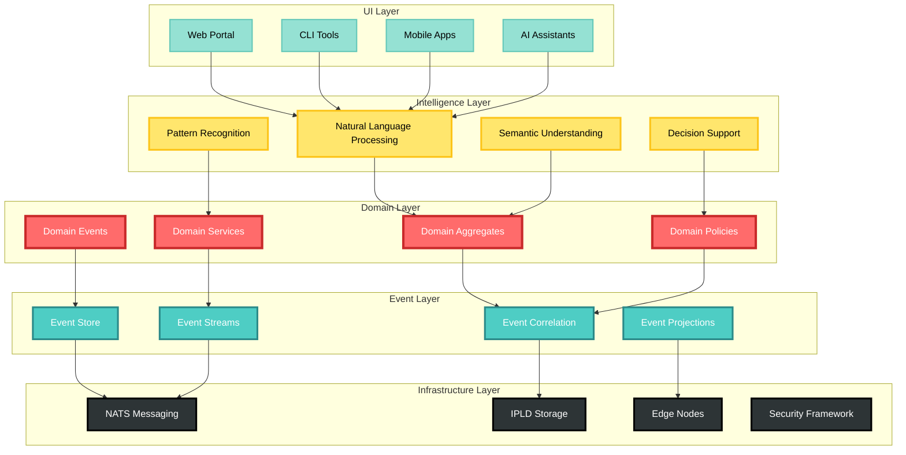
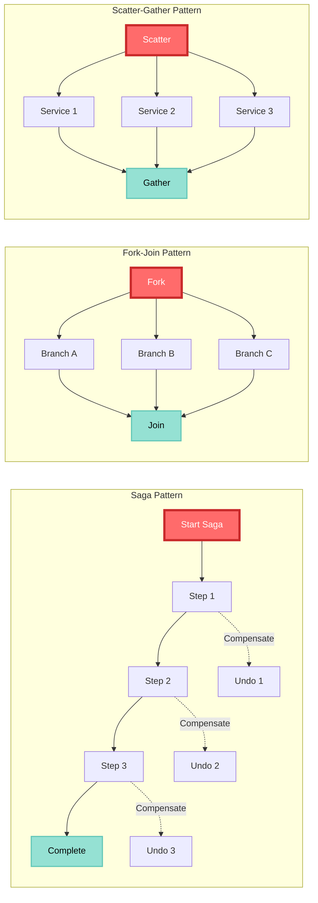
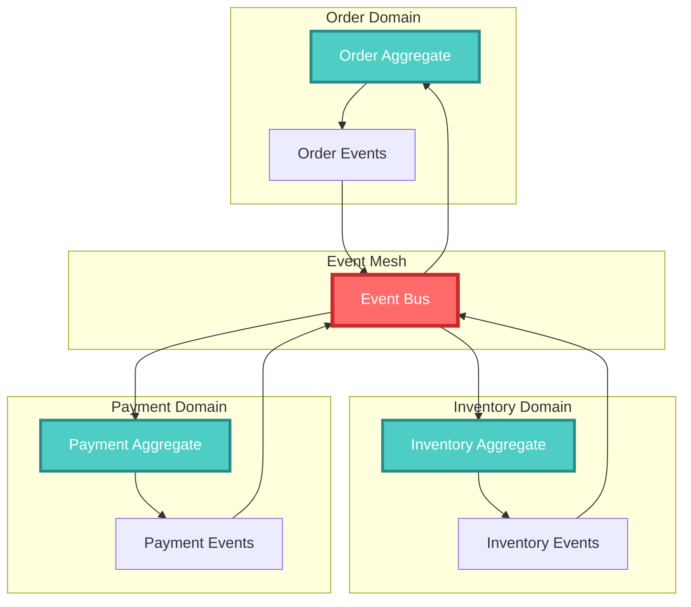
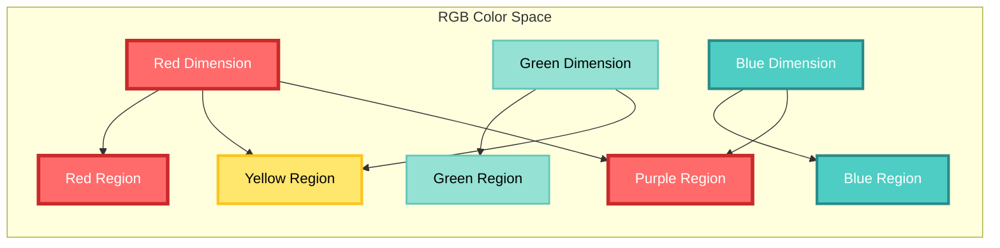
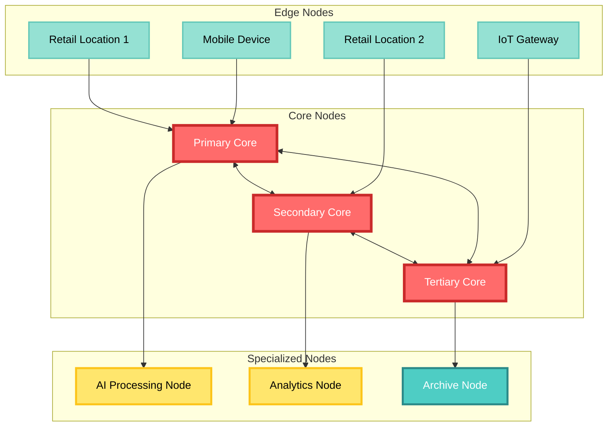
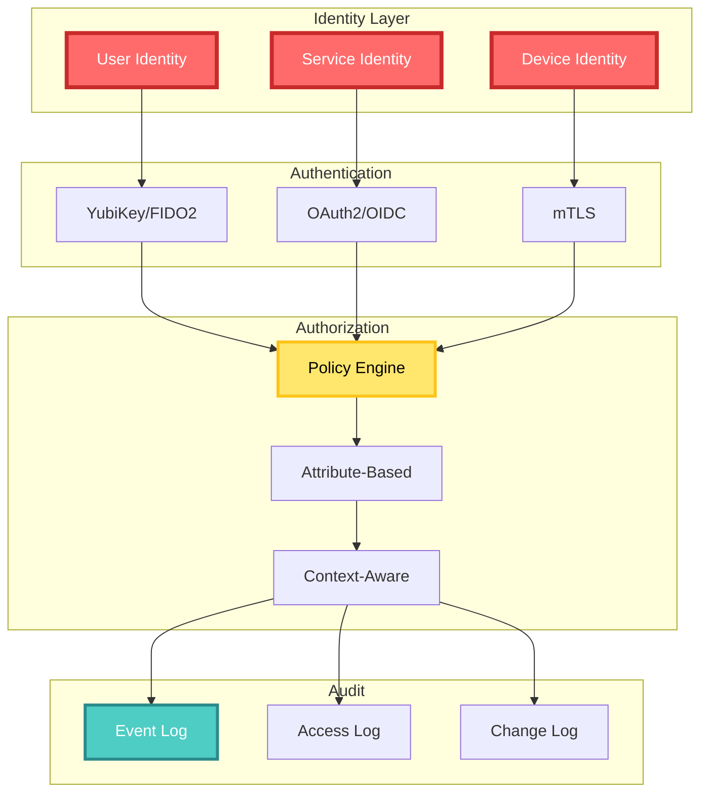

# CIM Architecture Deep Dive

A comprehensive exploration of the Composable Information Machine's architecture, design decisions, and implementation details.

## Table of Contents

1. [Architectural Philosophy](#architectural-philosophy)
2. [Core Architecture Layers](#core-architecture-layers)
3. [Event-Driven Foundation](#event-driven-foundation)
4. [Domain Modeling](#domain-modeling)
5. [Conceptual Spaces](#conceptual-spaces)
6. [Distributed Architecture](#distributed-architecture)
7. [Security Architecture](#security-architecture)
8. [Performance Considerations](#performance-considerations)
9. [Extension Points](#extension-points)

## Architectural Philosophy

CIM's architecture is guided by several key principles:

### 1. Information as First-Class Citizens

Traditional systems treat data as passive records in databases. CIM treats information as active, self-describing entities that:
- Know their own semantics
- Carry their provenance
- Understand their relationships
- Can validate themselves

```rust
pub struct Information<T> {
    pub content: T,
    pub metadata: Metadata,
    pub provenance: Provenance,
    pub relationships: Vec<Relationship>,
    pub trust_level: TrustLevel,
}
```

### 2. Composition Over Integration

Rather than integrating systems through APIs and ETL pipelines, CIM composes capabilities through:
- Event streams
- Shared conceptual models
- Domain boundaries
- Policy-driven behavior

### 3. Edge-First Design

CIM assumes distribution from the ground up:
- No single point of failure
- Local-first processing
- Eventual consistency
- Offline capabilities

## Core Architecture Layers



### Layer Responsibilities

#### UI Layer
- User interaction through multiple modalities
- Natural language understanding via AI assistants
- Visual workflow composition
- Real-time dashboards and monitoring

#### Intelligence Layer
- Semantic understanding of information
- Pattern recognition across domains
- Decision support and recommendations
- Natural language processing

#### Domain Layer
- Business logic encapsulation
- Aggregate root management
- Domain event generation
- Policy enforcement

#### Event Layer
- Event sourcing and storage
- Stream processing
- Event correlation and causation
- Projection generation

#### Infrastructure Layer
- Distributed messaging (NATS)
- Content-addressed storage (IPLD)
- Edge node management
- Security and authentication

## Event-Driven Foundation

### Event Identity Model

Every event in CIM carries three identifiers:

```rust
pub struct EventIdentity {
    pub event_id: EventId,        // Unique event identifier
    pub correlation_id: CorrelationId,  // Groups related events
    pub causation_id: CausationId,      // Links cause and effect
}
```

### Event Correlation Algebra

CIM implements a formal algebra for event relationships:

```rust
// Correlation operations
impl CorrelationId {
    pub fn merge(self, other: Self) -> Self {
        // Creates new correlation encompassing both
    }
    
    pub fn fork(self) -> (Self, Self) {
        // Splits correlation into parallel streams
    }
    
    pub fn join(branches: Vec<Self>) -> Self {
        // Merges parallel streams back together
    }
}
```

### Event Flow Patterns



## Domain Modeling

### Domain-Driven Design in CIM

CIM implements Domain-Driven Design with perfect isolation:

```rust
// Domain boundary definition
pub trait DomainBoundary {
    type Command: Command;
    type Event: Event;
    type Query: Query;
    type ReadModel: ReadModel;
    
    fn handle_command(&self, cmd: Self::Command) -> Result<Vec<Self::Event>>;
    fn apply_event(&mut self, event: Self::Event);
    fn handle_query(&self, query: Self::Query) -> Result<Self::ReadModel>;
}
```

### Aggregate Design

```rust
pub trait Aggregate {
    type State;
    type Command;
    type Event;
    type Error;
    
    fn handle(
        state: &Self::State,
        command: Self::Command,
    ) -> Result<Vec<Self::Event>, Self::Error>;
    
    fn apply(
        state: &mut Self::State,
        event: Self::Event,
    );
    
    fn new() -> Self::State;
}
```

### Cross-Domain Communication

Domains communicate exclusively through events:



## Conceptual Spaces

### Gärdenfors Theory Implementation

CIM implements conceptual spaces for semantic understanding:

```rust
pub struct ConceptualSpace {
    pub dimensions: Vec<QualityDimension>,
    pub regions: Vec<ConvexRegion>,
    pub prototypes: Vec<Prototype>,
}

pub struct QualityDimension {
    pub name: String,
    pub range: Range<f64>,
    pub metric: DistanceMetric,
}

pub struct ConvexRegion {
    pub concept: String,
    pub boundaries: Vec<Hyperplane>,
    pub prototype: Point,
}
```

### Semantic Similarity

```rust
impl ConceptualSpace {
    pub fn similarity(&self, a: &Point, b: &Point) -> f64 {
        // Calculate semantic similarity
        let distance = self.distance(a, b);
        1.0 / (1.0 + distance)
    }
    
    pub fn nearest_concept(&self, point: &Point) -> &str {
        self.regions
            .iter()
            .min_by_key(|r| self.distance(point, &r.prototype))
            .map(|r| &r.concept)
            .unwrap()
    }
}
```

### Example: Color Space



## Distributed Architecture

### Node Types



### Consistency Model

CIM implements eventual consistency with:
- Vector clocks for ordering
- CRDTs for conflict-free updates
- Gossip protocol for state synchronization

```rust
pub struct VectorClock {
    clocks: HashMap<NodeId, u64>,
}

impl VectorClock {
    pub fn happens_before(&self, other: &Self) -> bool {
        self.clocks.iter().all(|(node, &time)| {
            other.clocks.get(node).map_or(false, |&other_time| time <= other_time)
        })
    }
}
```

### Partition Tolerance

Edge nodes can operate offline:

```rust
pub struct EdgeNode {
    local_store: EventStore,
    sync_queue: Vec<Event>,
    
    pub fn process_offline(&mut self, event: Event) {
        self.local_store.append(event.clone());
        self.sync_queue.push(event);
    }
    
    pub async fn sync_when_online(&mut self) -> Result<()> {
        for event in self.sync_queue.drain(..) {
            self.publish_to_mesh(event).await?;
        }
        Ok(())
    }
}
```

## Security Architecture

### Zero-Trust Model



### Encryption Strategy

- **At Rest**: AES-256-GCM
- **In Transit**: TLS 1.3
- **End-to-End**: NaCl Box (Curve25519)

```rust
pub struct EncryptedEvent {
    pub header: EventHeader,
    pub encrypted_payload: Vec<u8>,
    pub nonce: [u8; 24],
    pub recipient_keys: Vec<PublicKey>,
}
```

## Performance Considerations

### Event Processing Pipeline

```rust
pub struct EventPipeline {
    stages: Vec<Box<dyn PipelineStage>>,
}

pub trait PipelineStage {
    fn process(&self, event: Event) -> PipelineResult;
}

// Parallel processing
impl EventPipeline {
    pub async fn process_batch(&self, events: Vec<Event>) {
        let futures: Vec<_> = events
            .into_iter()
            .map(|event| self.process_single(event))
            .collect();
        
        futures::future::join_all(futures).await;
    }
}
```

### Optimization Strategies

1. **Event Batching**: Group events for network efficiency
2. **Projection Caching**: Materialize frequently-queried views
3. **Lazy Loading**: Load aggregate state on-demand
4. **Compression**: Use zstd for event payloads
5. **Connection Pooling**: Reuse NATS connections

### Benchmarks

```
Event Processing:
- Single event: ~50μs
- Batch (1000 events): ~30ms
- Throughput: ~20,000 events/sec per node

Query Performance:
- Simple aggregate query: ~1ms
- Cross-domain query: ~10ms
- Graph traversal: ~50ms
```

## Extension Points

### Custom Domain Implementation

```rust
// 1. Define your domain events
#[derive(Debug, Clone, Serialize, Deserialize)]
pub enum MyDomainEvent {
    Created { id: String, data: MyData },
    Updated { id: String, changes: Changes },
}

// 2. Implement aggregate
pub struct MyAggregate {
    id: String,
    state: MyState,
}

impl Aggregate for MyAggregate {
    type State = MyState;
    type Command = MyCommand;
    type Event = MyDomainEvent;
    type Error = MyError;
    
    // Implementation...
}

// 3. Register with CIM
cim.register_domain::<MyAggregate>("my-domain");
```

### Custom Storage Backend

```rust
pub trait StorageBackend {
    async fn append(&mut self, event: Event) -> Result<()>;
    async fn read_stream(&self, stream: StreamId) -> Result<Vec<Event>>;
    async fn create_snapshot(&self, aggregate: AggregateId) -> Result<()>;
}

// Implement for your storage
impl StorageBackend for MyCustomStorage {
    // Implementation...
}
```

### AI Agent Integration

```rust
pub trait AIAgent {
    async fn process_natural_language(&self, input: &str) -> Result<Intent>;
    async fn generate_response(&self, context: Context) -> Result<String>;
    async fn learn_from_feedback(&mut self, feedback: Feedback) -> Result<()>;
}
```

## Best Practices

### 1. Event Design
- Keep events immutable
- Use past tense naming
- Include all necessary data
- Version events for evolution

### 2. Domain Boundaries
- One aggregate per transaction
- No cross-aggregate transactions
- Use sagas for coordination
- Keep aggregates small

### 3. Performance
- Prefer async operations
- Use streaming for large datasets
- Implement backpressure
- Monitor event lag

### 4. Security
- Encrypt sensitive data
- Audit all operations
- Use least privilege
- Validate at boundaries

## Conclusion

CIM's architecture provides a solid foundation for building distributed, event-driven information systems. By treating information as first-class citizens and using domains as the primary abstraction, CIM enables systems that are:

- **Flexible**: Easy to extend and modify
- **Scalable**: Distributed by design
- **Resilient**: No single point of failure
- **Semantic**: Understanding meaning, not just structure
- **Composable**: Build complex systems from simple parts

The architecture is designed to evolve with your needs, from a single node deployment to a global distributed system.

---

*Next: [Domain Development Guide](./domain-development-guide.md) - Learn how to build custom domains*