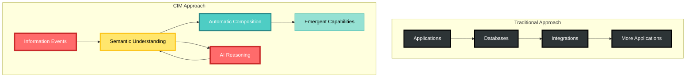
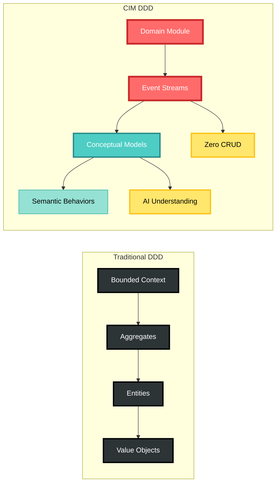
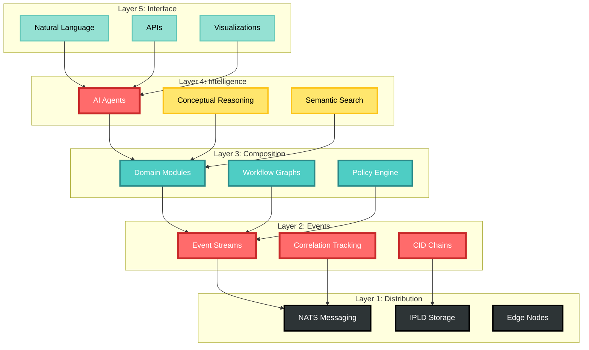
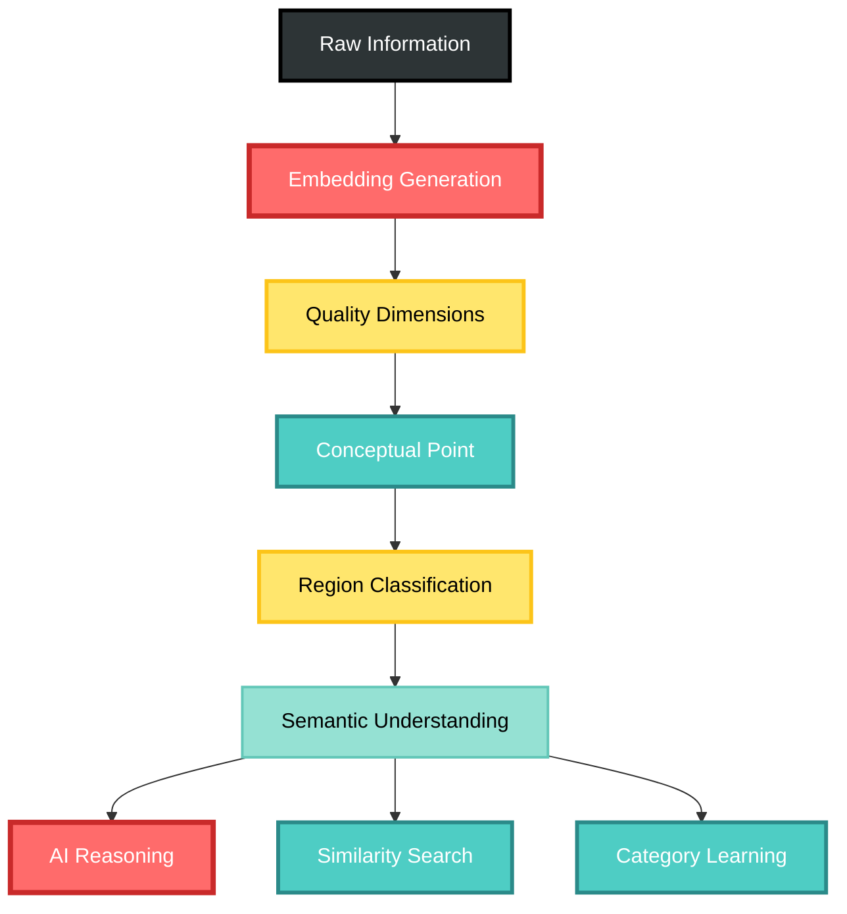
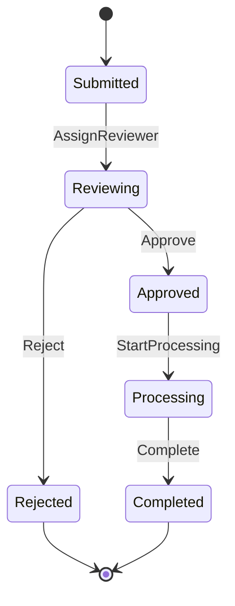

# The Composable Information Machine: A Comprehensive Manual

## Table of Contents
1. [Introduction: What is CIM?](#introduction-what-is-cim)
2. [Core Philosophy & Vision](#core-philosophy--vision)
3. [Theoretical Foundations](#theoretical-foundations)
4. [Architecture Overview](#architecture-overview)
5. [Key Technologies & Patterns](#key-technologies--patterns)
6. [Module Ecosystem](#module-ecosystem)
7. [Implementation Guide](#implementation-guide)
8. [Semantic Deep Dives](#semantic-deep-dives)
9. [Claude Conversation Prompt](#claude-conversation-prompt)

---

## Introduction: What is CIM?

The Composable Information Machine (CIM) represents a paradigm shift in how we conceive, build, and operate information systems. It's not merely another framework or platform – it's a fundamentally new way of thinking about information, computation, and business logic.

### The Core Insight

Traditional systems trap information in applications, databases, and silos. CIM liberates information, making it:
- **Self-describing** through IPLD (InterPlanetary Linked Data)
- **Self-organizing** through conceptual spaces and semantic reasoning
- **Self-governing** through event-driven policies and workflows
- **Self-evolving** through AI-native architecture and continuous learning

### What Makes CIM Revolutionary



## Core Philosophy & Vision

### Information as Living Events

In CIM, information doesn't sit in static databases – it flows as living events through an intelligent mesh. Each event carries:
- **Identity**: Cryptographically secured through CID chains
- **Meaning**: Embedded in conceptual spaces
- **Context**: Correlation and causation tracking
- **Intent**: Business logic and policies attached

### The Three Pillars of CIM

#### 1. **Event-Driven Truth**
Every change is an event. Events are immutable, append-only, and form the single source of truth. This isn't just event sourcing – it's event thinking.

#### 2. **Semantic Intelligence**
Information understands itself through conceptual spaces – geometric representations where distance equals difference, and categories form natural regions.

#### 3. **Composable Domains**
Business capabilities emerge from composing domain modules, not building applications. Domains communicate only through events, maintaining perfect isolation.

## Theoretical Foundations

### Domain-Driven Design (DDD) in CIM

CIM takes DDD to its logical conclusion:



**Key Principles:**
- **Ubiquitous Language**: Enforced through type systems and event schemas
- **Bounded Contexts**: Implemented as isolated domain modules
- **Aggregates**: Exist only to emit events, never store state
- **Value Objects**: Immutable components in the ECS system

### Event Sourcing & CQRS

CIM's event architecture goes beyond traditional event sourcing:

1. **CID Chains**: Every event is cryptographically linked to its predecessors
2. **Correlation Algebra**: Mathematical rules for event relationships
3. **Temporal Semantics**: Events carry meaning through time
4. **Distributed Consensus**: Events achieve consistency without central coordination

### Conceptual Spaces Theory

Based on Gärdenfors' cognitive science work, CIM implements:

```rust
// Semantic similarity as geometric distance
let similarity = 1.0 / (1.0 + concept_a.distance_to(concept_b));

// Categories as convex regions
if category.region.contains(new_concept.point) {
    // Natural classification
}

// Learning as space transformation
space.adapt_from_feedback(user_corrections);
```

### Graph Theory & Workflows

Workflows aren't code – they're graphs that execute:
- **Nodes**: States or operations
- **Edges**: Transitions triggered by events
- **Execution**: Parallel, distributed, fault-tolerant
- **Visualization**: The graph IS the documentation

## Architecture Overview

### The Five Layers



### Key Architectural Patterns

1. **AsyncSyncBridge**: Enables Bevy (sync) and Tokio (async) to communicate
2. **Domain Isolation**: No shared databases, only event communication
3. **CQRS Everywhere**: Separate read/write paths at every level
4. **ECS for Visualization**: Bevy provides real-time 3D graph rendering

## Key Technologies & Patterns

### Event-Driven Architecture

Every business action becomes an event with mandatory correlation:

```rust
pub struct DomainEvent {
    // Identity
    pub event_id: EventId,
    pub aggregate_id: AggregateId,
    
    // CID Chain
    pub event_cid: Cid,
    pub previous_cid: Option<Cid>,
    
    // Correlation (MANDATORY)
    pub correlation_id: CorrelationId,
    pub causation_id: CausationId,
    
    // Business data
    pub payload: serde_json::Value,
}
```

### NATS Messaging

NATS provides the nervous system:
- **Subjects**: Hierarchical event routing
- **JetStream**: Persistent event storage
- **Request-Reply**: Synchronous when needed
- **Pub-Sub**: Broadcast capabilities

### IPLD Storage

Content-addressed storage ensures:
- **Immutability**: Content determines address
- **Verification**: Cryptographic integrity
- **Distribution**: Natural content sharing
- **Versioning**: Git-like capabilities

### Conceptual Spaces Implementation



## Module Ecosystem

### Core Infrastructure (6 modules)
- `cim-core-domain`: Foundation for all domains
- `cim-infrastructure`: NATS and persistence layer
- `cim-bridge`: NATS messaging bridge
- `cim-component`: Core component definitions
- `cim-compose`: Composition utilities
- `cim-start`: Project templates

### AI & Intelligence (4 modules)
- `alchemist`: Core AI reasoning engine
- `cim-agent-alchemist`: Conversational AI interface
- `cim-domain-agent`: Agent management
- `cim-domain-dialog`: Conversation tracking

### Knowledge Systems (4 modules)
- `cim-conceptual-core`: Conceptual space engine
- `cim-domain-conceptualspaces`: Domain implementation
- `cim-conceptgraph`: Visual concept mapping
- `cim-contextgraph`: Context management

### Business Domains (7 modules)
- `cim-domain-identity`: Identity management
- `cim-domain-organization`: Organizational structures
- `cim-domain-person`: People and relationships
- `cim-domain-location`: Spatial information
- `cim-domain-document`: Document lifecycle
- `cim-domain-workflow`: Process automation
- `cim-domain-policy`: Rule enforcement

### Technical Domains (5 modules)
- `cim-domain-git`: Version control integration
- `cim-domain-nix`: Infrastructure as code
- `cim-domain-graph`: Graph operations
- `cim-workflow-graph`: Workflow visualization
- `cim-domain-bevy`: 3D visualization

### Security & Data (6 modules)
- `cim-security`: Security framework
- `cim-keys`: Cryptographic key management
- `cim-ipld`: IPLD implementation
- `cim-ipld-graph`: Graph storage
- `cim-subject`: Event routing
- `cim-persistence`: Storage abstraction

### Edge Computing (4 modules)
- `cim-leaf`: Edge node framework
- `cim-leaf-darwin`: macOS implementation
- `cim-portal`: Web interface
- `cim-stb`: Set-top box integration

## Implementation Guide

### Starting a New CIM Project

1. **Initialize with cim-start**
   ```bash
   cargo generate cim-start-template
   ```

2. **Choose Your Domains**
   ```toml
   [dependencies]
   cim-domain-person = "0.1"
   cim-domain-organization = "0.1"
   cim-domain-workflow = "0.1"
   ```

3. **Define Your Events**
   ```rust
   #[derive(Event)]
   pub struct PersonCreated {
       pub person_id: PersonId,
       pub name: String,
       pub email: Email,
   }
   ```

4. **Implement Handlers**
   ```rust
   impl CommandHandler<CreatePerson> for PersonAggregate {
       type Event = PersonCreated;
       
       fn handle(&self, cmd: CreatePerson) -> Result<PersonCreated> {
           // Business logic here
       }
   }
   ```

### Best Practices

1. **Event-First Thinking**: Design events before entities
2. **Domain Isolation**: Never share databases between domains
3. **Semantic Modeling**: Use conceptual spaces for categories
4. **Test-Driven**: Write tests before implementation
5. **Graph Visualization**: Let workflows self-document

## Semantic Deep Dives

### Conceptual Spaces: The Geometry of Meaning

Conceptual spaces provide semantic understanding through geometry:

```mermaid
graph TB
    subgraph "Color Space Example"
        A[Red] ---|Close| B[Orange]
        B ---|Close| C[Yellow]
        C ---|Far| D[Blue]
        D ---|Close| E[Purple]
        E ---|Close| A
    end
    
    subgraph "Business Concept Space"
        F[Customer] ---|Related| G[Order]
        G ---|Related| H[Product]
        H ---|Related| I[Inventory]
        I ---|Affects| G
    end
    
    %% Styling - color space and business concepts
    style A fill:#FF6B6B,stroke:#C92A2A,stroke-width:4px,color:#FFF
    style B fill:#FFE66D,stroke:#FCC419,stroke-width:3px,color:#000
    style C fill:#FFE66D,stroke:#FCC419,stroke-width:3px,color:#000
    style D fill:#4ECDC4,stroke:#2B8A89,stroke-width:3px,color:#FFF
    style E fill:#4ECDC4,stroke:#2B8A89,stroke-width:3px,color:#FFF
    style F fill:#FF6B6B,stroke:#C92A2A,stroke-width:4px,color:#FFF
    style G fill:#4ECDC4,stroke:#2B8A89,stroke-width:3px,color:#FFF
    style H fill:#4ECDC4,stroke:#2B8A89,stroke-width:3px,color:#FFF
    style I fill:#4ECDC4,stroke:#2B8A89,stroke-width:3px,color:#FFF
```



**Key Properties:**
- **Metric**: Distance = Dissimilarity
- **Convexity**: Natural categories form convex regions
- **Dimensions**: Quality dimensions (size, color, price)
- **Prototypes**: Category centers
- **Learning**: Space adapts from experience

### Event Correlation Algebra

Events form a mathematical structure:

```
Root Event: E₀ where correlation_id = causation_id = event_id
Caused Event: E₁ where correlation_id = E₀.correlation_id, causation_id = E₀.event_id
Chain: E₀ → E₁ → E₂ where correlation preserved, causation chains
```

**Algebraic Properties:**
- **Transitivity**: If A causes B and B causes C, then A transitively causes C
- **Convergence**: Multiple events can have same correlation
- **Divergence**: One event can cause multiple events
- **Cycles**: Detected and prevented

### Graph Workflows: Visual Programming

Workflows are graphs that execute:



**Execution Semantics:**
- **States**: Nodes in the graph
- **Transitions**: Edges triggered by events
- **Guards**: Conditions on transitions
- **Actions**: Effects of transitions
- **Parallel**: Multiple active states

### Domain-Driven Design: Beyond Objects

CIM transcends object-oriented DDD:

| Traditional DDD | CIM DDD |
|----------------|---------|
| Entities have identity | Events have identity |
| Aggregates protect invariants | Events ensure consistency |
| Repositories persist state | Event streams are the state |
| Services orchestrate | Workflows choreograph |
| Value objects are immutable | Everything is immutable |

### CQRS: Reads and Writes as Universes

In CIM, reads and writes inhabit different universes:

**Write Universe:**
- Commands → Aggregates → Events
- Consistency through event ordering
- Business logic enforcement
- No queries allowed

**Read Universe:**
- Events → Projections → Views
- Eventually consistent
- Optimized for queries
- No business logic

## Claude Conversation Prompt

*Note: The complete CIM conversation model and standards are defined in `.rules/cim-conversation-model.mdc`. This ensures consistent, accurate, and philosophically-aligned discussions about CIM.*

### The Ultimate CIM Exploration Prompt

```markdown
I want to explore the Composable Information Machine (CIM) - a revolutionary paradigm that treats information as living events flowing through an intelligent mesh. 

I understand CIM combines:
- Event-driven architecture where everything is an immutable event with CID chains
- Conceptual spaces that give geometric meaning to information  
- Domain-driven design with perfect isolation between bounded contexts
- Graph-based workflows that visualize and execute business processes
- AI-native design with semantic reasoning built into the foundation

Please help me understand CIM by:
1. Explaining how these concepts interconnect
2. Showing practical examples of how information flows
3. Demonstrating the difference from traditional architectures
4. Exploring specific domains like conceptual spaces or event correlation
5. Discussing implementation patterns and best practices

I'm particularly interested in [SPECIFY: conceptual spaces/event sourcing/graph workflows/domain modules/AI integration/etc.]

Let's start with: [YOUR SPECIFIC QUESTION]
```

### Focused Exploration Prompts

#### For Conceptual Spaces:
```markdown
Explain how CIM uses conceptual spaces to create geometric representations of meaning. How do quality dimensions, convex regions, and prototypes work together to enable semantic reasoning? Give examples of how business concepts map to geometric spaces.
```

#### For Event Architecture:
```markdown
Walk me through CIM's event correlation algebra. How do correlation IDs and causation IDs create a mathematical structure? Show examples of event chains, convergence, and divergence. How do CID chains ensure cryptographic integrity?
```

#### For Domain Modules:
```markdown
How does CIM achieve perfect domain isolation while enabling rich interactions? Explain the event-only communication pattern and show how domains compose without coupling. Use examples from person, organization, and workflow domains.
```

#### For Graph Workflows:
```markdown
Demonstrate how CIM workflows are graphs that execute. Show the relationship between states, transitions, events, and parallel execution. How does visual programming emerge from graph representation?
```

#### For AI Integration:
```markdown
Explore how CIM is AI-native by design. How do conceptual spaces provide semantic foundation for AI? How does event history enable learning? Show the interplay between Alchemist, embeddings, and domain reasoning.
```

### Deep Technical Dives

#### Architecture Patterns:
```markdown
Explain CIM's architectural patterns: AsyncSyncBridge for Bevy-Tokio communication, ECS-DDD isomorphism, and CQRS with event sourcing. How do these patterns enable the unique capabilities of CIM?
```

#### Implementation Details:
```markdown
Walk through implementing a new domain in CIM. Show event definition, aggregate implementation, command handlers, projections, and integration with conceptual spaces. Include Rust code examples.
```

#### Theoretical Foundations:
```markdown
Explore the theoretical foundations of CIM: Gärdenfors' conceptual spaces, event sourcing algebra, category theory in domain modeling, and graph theory in workflows. How do these create a coherent system?
```

---

## Conclusion

CIM represents a fundamental reimagining of information systems. By treating information as living events with inherent meaning, enabling geometric reasoning about concepts, and allowing domains to compose naturally, CIM creates possibilities that traditional architectures cannot achieve.

The journey from static databases to living information meshes, from coded logic to visual workflows, from siloed applications to composable domains - this is the transformation CIM enables.

Welcome to the future of information systems. Welcome to CIM.