# CIM Domain Knowledge Graph

> A comprehensive map of all domains within the Composable Information Machine ecosystem

## Overview

This knowledge graph represents the complete domain structure of CIM, compiled from the documentation across 40+ domain folders. Each domain encapsulates specific knowledge and capabilities that can be composed to create powerful information systems.

## Domain Categories

### 📊 Knowledge Domains
Domains that manage information, reasoning, and understanding.

### 💼 Business Domains
Domains that handle business operations and organizational concerns.

### 🔧 Technical Domains
Domains that provide technical infrastructure and capabilities.

### 📝 General Domains
Domains without specific categorization that provide various functionalities.

---

## Complete Domain Directory

### 1. **Accounts**
**Type:** General Domain

Accounts in this context refer to a specific relationship where there is an Identifier between one of these entities: people, agent, organization, operator. These are determined by specific Policies applied to the Account based on Operator and Tenant.

**Key Concepts:** Identity relationships, Policy-driven access, Multi-entity support

---

### 2. **Agents** 🔧
**Type:** Technical Domain

Agents refer to automatons that are operated by a user. These are autonomous entities within the CIM system that interact with models, behaviors, and sources. They operate under human supervision through NATS communication and are mostly implemented as WASM Modules.

**Key Concepts:** Autonomous operations, WASM modules, Human supervision, NATS communication

---

### 3. **AI Integration** 📊
**Type:** Knowledge Domain

Defines and manages AI system integration, capabilities, and interactions within the CIM system. This includes model orchestration, agent coordination, learning management, decision support, and safety protocols.

**Key Concepts:** Model orchestration, Agent coordination, Learning management, Safety protocols

---

### 4. **Arguments** 📊
**Type:** Knowledge Domain

Defines and manages structured arguments, their validation, and logical relationships. Arguments are established definitions for or against certain proposals, with sources that can be weighted for trust level, preference, and accuracy.

**Key Concepts:** Logical validation, Trust weighting, Source tracking, Proposal support

---

### 5. **Axioms** 📊
**Type:** Knowledge Domain

Manages fundamental axioms, self-evident truths, and foundational principles within the CIM system. These are foundational truths that provide the basis for proofs and theories.

**Key Concepts:** Self-evident truths, Foundational principles, Proof basis, Theory foundation

---

### 6. **Behaviors**
**Type:** General Domain

Behaviors are pure functionality that can be applied to a trigger. These are usually reactions to Events and are added to Policies as Capabilities. Capabilities are a structure for behaviors inside of a Module.

**Key Concepts:** Event reactions, Policy capabilities, Trigger-based actions, Module integration

---

### 7. **Business Model** 💼
**Type:** Business Domain

Defines and manages business operations, models, and value propositions using the Business Model Canvas framework with 9 basic concepts: Customer Segments, Value Propositions, Channels, Customer Relationships, Revenue Streams, Key Resources, Key Activities, Key Partnerships, and Cost Structure.

**Key Concepts:** Business Model Canvas, Value propositions, Revenue streams, Strategic planning

---

### 8. **Claims** 📊
**Type:** Knowledge Domain

Manages claims, their assessment, and verification processes. Claims are arguments applied to specific contexts that must be verified by facts. Examples include simple claims like 'john is an active User' or complex claims about environmental impacts.

**Key Concepts:** Fact verification, Context application, Evidence assessment, Truth validation

---

### 9. **Color**
**Type:** General Domain

*No description available - likely manages color-related data or visualizations*

---

### 10. **Distribution** 🔧
**Type:** Technical Domain

Manages the distribution and communication of system components and data, including message routing, data distribution, component deployment, network topology, service discovery, load balancing, and fault tolerance.

**Key Concepts:** Message routing, Load balancing, Service discovery, Fault tolerance

---

### 11. **Environment** 🔧
**Type:** Technical Domain

Defines and manages environmental context and influences within the CIM system, including environmental state tracking, resource monitoring, system constraints, external influences, performance metrics, and health indicators.

**Key Concepts:** State tracking, Resource monitoring, Performance metrics, Health indicators

---

### 12. **Equipment**
**Type:** General Domain

*No description available - likely manages physical or virtual equipment resources*

---

### 13. **Ethics** 📊
**Type:** Knowledge Domain

Defines and manages ethical principles, moral frameworks, and value systems that guide system behavior and decision-making processes.

**Key Concepts:** Moral frameworks, Value systems, Decision guidance, Behavioral principles

---

### 14. **Facts** 📊
**Type:** Knowledge Domain

Manages verified facts, their evidence, and relationships. Facts require rigorous verification with comprehensive evidence from reliable sources, and truth maintenance is ongoing.

**Key Concepts:** Evidence verification, Source reliability, Truth maintenance, Fact relationships

---

### 15. **Funding**
**Type:** General Domain

Funding is the act of providing resources to finance a need, program, or project. While this is usually in the form of money, it can also take the form of effort or time from an organization or company.

**Key Concepts:** Resource allocation, Financial support, Time investment, Project financing

---

### 16. **Goals**
**Type:** General Domain

Where you mark desired achievements and accomplishments for which to strive.

**Key Concepts:** Achievement tracking, Objective setting, Progress monitoring

---

### 17. **Governance** 💼
**Type:** Business Domain

Defines and manages governance policies, compliance, and control mechanisms including policy management, compliance oversight, risk management, control frameworks, audit processes, and decision governance.

**Key Concepts:** Policy management, Compliance oversight, Risk management, Audit processes

---

### 18. **Ideas**
**Type:** General Domain

Ideas are concepts we can define as a whole. Until we have fully defined them, they are just ideas. This serves as an effective list of things the company is thinking about as a whole.

**Key Concepts:** Concept development, Innovation tracking, Ideation management

---

### 19. **Information** 📊
**Type:** Knowledge Domain

Manages information structures, flows, and transformations. Information forms the foundation of knowledge, with quality control being essential for reliability.

**Key Concepts:** Information flow, Quality control, Data transformation, Reliability assurance

---

### 20. **Knowledge** 📊
**Type:** Knowledge Domain

Defines and manages knowledge creation, organization, and utilization through knowledge representation, semantic modeling, ontology management, learning processes, and reasoning systems.

**Key Concepts:** Semantic modeling, Ontology management, Learning processes, Reasoning systems

---

### 21. **Laws** 📊
**Type:** Knowledge Domain

Manages legal frameworks, regulatory compliance, and statutory requirements. Laws provide the regulatory framework where compliance is mandatory, jurisdiction matters, and risk management is essential.

**Key Concepts:** Regulatory compliance, Legal frameworks, Jurisdiction management, Risk assessment

---

### 22. **Location**
**Type:** General Domain

Manages locations based on a center point (Earth's center). Locations are stored as vectors with direction and distance, easily convertible to latitude, longitude, and altitude.

**Key Concepts:** Vector-based positioning, Coordinate conversion, Spatial relationships

---

### 23. **Models** 🔧
**Type:** Technical Domain

Manages computational models and their interactions. Models are digital representations of real-world things, created as statements and refined into various categories. They form the computational foundation of the CIM system.

**Sub-domains:**
- **Automata** - Automated model behaviors
- **Bounded Contexts** - Domain boundary definitions
- **Subdomains** - Hierarchical domain organization

**Key Concepts:** Digital representation, Model interaction, Computational foundation

---

### 24. **Operators**
**Type:** General Domain

*No description available - likely manages system operators and their permissions*

---

### 25. **Organizations** 💼
**Type:** Business Domain

Defines and manages organizational structures, roles, and relationships. Clear roles and responsibilities are essential for effective operation and team collaboration.

**Key Concepts:** Role definition, Team structure, Responsibility mapping, Collaboration patterns

---

### 26. **People**
**Type:** General Domain

*No description available - likely manages person entities and their attributes*

---

### 27. **Persistence** 🔧
**Type:** Technical Domain

Manages data storage, retrieval, and persistence across the CIM system through event sourcing, CQRS implementation, cache management, backup strategies, and recovery procedures.

**Key Concepts:** Event sourcing, CQRS, Cache management, Backup strategies

---

### 28. **Policies**
**Type:** General Domain

Policies are Behaviors applied to specific States. States are defined as collections of Domain Events. When these collections reach a collective value, they can trigger reactions called Policies.

**Key Concepts:** State-based triggers, Event collections, Behavioral rules, Automated reactions

---

### 29. **Politics**
**Type:** General Domain

*No description available - likely manages political or decision-making processes*

---

### 30. **Preferences**
**Type:** General Domain

*No description available - likely manages user or system preferences*

---

### 31. **Proofs** 📊
**Type:** Knowledge Domain

Manages proof systems, verification processes, and validation methods. Proofs are fundamental to system trust, with verification ensuring reliability and validation maintaining integrity.

**Key Concepts:** Verification processes, Validation methods, Trust establishment, Integrity maintenance

---

### 32. **Proposals**
**Type:** General Domain

*No description available - likely manages proposals and their lifecycle*

---

### 33. **Refusals**
**Type:** General Domain

Simply stated as 'I won't do that.' - represents things the system absolutely won't do.

**Key Concepts:** System boundaries, Ethical limits, Operational constraints

---

### 34. **Relationships** 📊
**Type:** Knowledge Domain

Defines and manages relationships between entities within the CIM system. This is a cross-cutting concern that affects all domains, with pattern recognition and impact assessment being critical.

**Key Concepts:** Entity connections, Pattern recognition, Impact assessment, Cross-domain integration

---

### 35. **Secrets**
**Type:** General Domain

These are Objects and Ideas that are secret, not the secrets themselves.

**Key Concepts:** Confidential information, Access control, Secret management

---

### 36. **Security** 🔧
**Type:** Technical Domain

Ensures system security, access control, and data protection across the CIM system using zero trust architecture, defense in depth, least privilege, and continuous compliance monitoring.

**Key Concepts:** Zero trust, Defense in depth, Least privilege, Continuous monitoring

---

### 37. **Solutions**
**Type:** General Domain

*No description available - likely manages solution definitions and implementations*

---

### 38. **Sources** 📊
**Type:** Knowledge Domain

Manages information sources and their provenance, including information origin tracking, verification status, trust levels, update frequency, and access patterns.

**Key Concepts:** Provenance tracking, Trust levels, Source verification, Update management

---

### 39. **Tenants**
**Type:** General Domain

Tenants are Organizations functioning under an Operator. Operators run Equipment, and Tenants use the Resources of an Operator.

**Key Concepts:** Multi-tenancy, Resource sharing, Operator relationships

---

### 40. **Theories** 📊
**Type:** Knowledge Domain

Manages theoretical frameworks, hypotheses, and their evolution. Theories build on validated facts, with hypotheses guiding investigation and experiments validating theories.

**Key Concepts:** Hypothesis testing, Theory evolution, Experimental validation, Framework development

---

### 41. **Things**
**Type:** General Domain

*No description available - likely manages generic entity representations*

---

### 42. **Value Propositions**
**Type:** General Domain

The value a business promises to deliver to customers. This includes addressing customer pains (problems) and gains (solutions), communicated directly through established channels to turn prospects into paying customers.

**Key Concepts:** Customer value, Pain points, Solution delivery, Channel communication

---

## Domain Relationships

```mermaid
graph TB
    subgraph "Knowledge Domains"
        K1[AI Integration]
        K2[Arguments]
        K3[Axioms]
        K4[Claims]
        K5[Ethics]
        K6[Facts]
        K7[Information]
        K8[Knowledge]
        K9[Laws]
        K10[Proofs]
        K11[Relationships]
        K12[Sources]
        K13[Theories]
    end
    
    subgraph "Business Domains"
        B1[Business Model]
        B2[Governance]
        B3[Organizations]
    end
    
    subgraph "Technical Domains"
        T1[Agents]
        T2[Distribution]
        T3[Environment]
        T4[Models]
        T5[Persistence]
        T6[Security]
    end
    
    subgraph "Core Connectors"
        C1[People]
        C2[Policies]
        C3[Workflows]
    end
    
    %% Key relationships
    K8 --> T4
    B3 --> C1
    C2 --> T1
    K6 --> K10
    K3 --> K13
    
    %% Styling
    style K1 fill:#4ECDC4,stroke:#2B8A89,stroke-width:3px,color:#FFF
    style K8 fill:#FF6B6B,stroke:#C92A2A,stroke-width:4px,color:#FFF
    style B3 fill:#FFE66D,stroke:#FCC419,stroke-width:3px,color:#000
    style T1 fill:#4ECDC4,stroke:#2B8A89,stroke-width:3px,color:#FFF
    style T5 fill:#4ECDC4,stroke:#2B8A89,stroke-width:3px,color:#FFF
    style C1 fill:#FF6B6B,stroke:#C92A2A,stroke-width:4px,color:#FFF
    style C2 fill:#FF6B6B,stroke:#C92A2A,stroke-width:4px,color:#FFF
```

## How to Use This Knowledge Graph

1. **Navigation**: Use the domain categories to find related capabilities
2. **Composition**: Combine domains to create complete solutions
3. **Understanding**: Each domain description explains its role in the CIM ecosystem
4. **Integration**: Key concepts show how domains connect and interact

## Summary Statistics

- **Total Domains**: 42
- **Knowledge Domains**: 13 (31%)
- **Business Domains**: 3 (7%)
- **Technical Domains**: 6 (14%)
- **General Domains**: 20 (48%)

This knowledge graph serves as your map to understanding and navigating the rich ecosystem of CIM domains. Each domain is a building block that, when composed with others, creates powerful information systems that understand and adapt to your business needs.