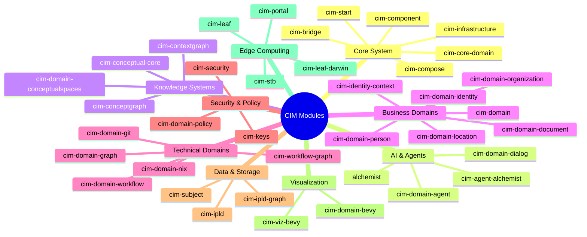
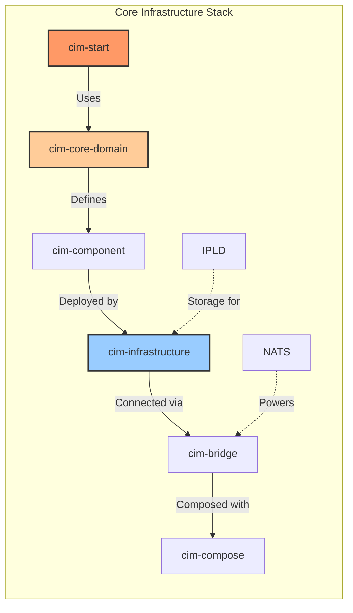
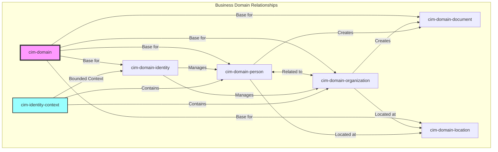
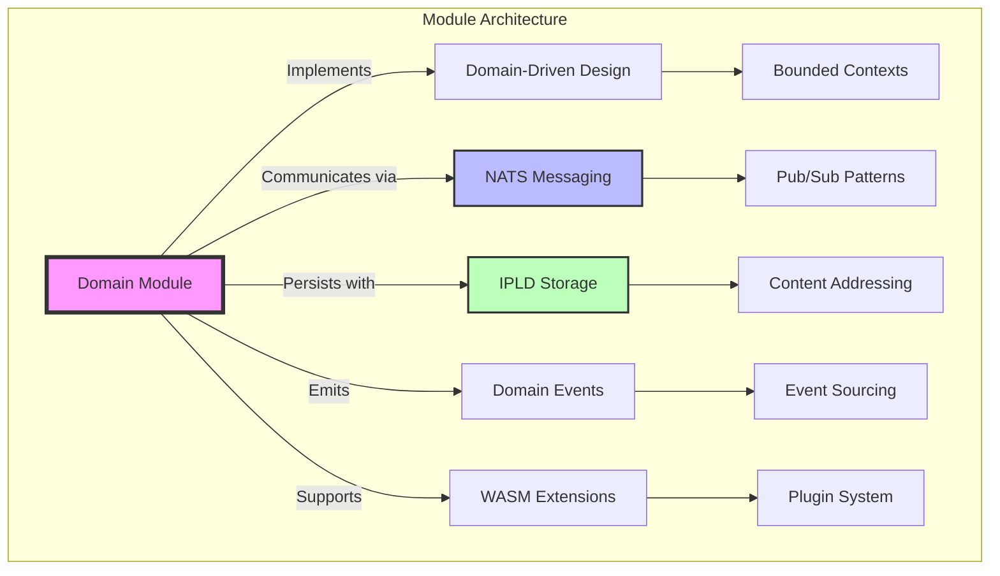

# CIM Modules Catalog

## Overview
This catalog presents all available modules for the Composable Information Machine (CIM) ecosystem, organized by functional categories.

## Module Categories

### 🧠 Core System & Infrastructure

- **cim-core-domain**: Core domain models and abstractions
- **cim-component**: Core component definitions for the Composable Information Machine
- **cim-infrastructure**: Infrastructure layer with NATS integration and persistence
- **cim-bridge**: CIM Bridge to NATS messaging system
- **cim-compose**: Composition utilities and helpers for CIM
- **cim-start**: Starting template for a CIM

### 🤖 AI & Agent Systems
- **alchemist**: Information Alchemy - The core AI reasoning system
- **cim-agent-alchemist**: Agent for conversing about Alchemist
- **cim-domain-agent**: Agent domain for the Composable Information Machine
- **cim-domain-dialog**: CIM Dialog system to manage conversations

### 📊 Knowledge & Conceptual Systems
- **cim-conceptual-core**: Conceptual space core functionality and category theory implementations
- **cim-domain-conceptualspaces**: Conceptual Spaces Domain
- **cim-conceptgraph**: A Graphic way to work with ConceptualSpaces
- **cim-contextgraph**: Base Context Graph module for a CIM

### 🏢 Business Domains

- **cim-domain**: Domain Generics and traits for a CIM
- **cim-domain-identity**: Identity Domain
- **cim-domain-organization**: Organization domain for the Composable Information Machine
- **cim-domain-person**: Person/People domain for the Composable Information Machine
- **cim-identity-context**: Identity bounded context for person and organization management
- **cim-domain-location**: Location Domain
- **cim-domain-document**: Document domain for the Composable Information Machine

### 🔧 Technical Domains
- **cim-domain-git**: Git Domain for CIM
- **cim-domain-nix**: CIM Domain Aggregates for Nix
- **cim-domain-workflow**: Workflow domain for the Composable Information Machine
- **cim-workflow-graph**: CIM Composition of Workflow and Graphs
- **cim-domain-graph**: CIM Specific Graphs

### 🔐 Security & Policy
- **cim-security**: CIM Security Domain
- **cim-domain-policy**: Policy domain for the Composable Information Machine
- **cim-keys**: Offline Key Management for CIM

### 📡 Data & Storage
- **cim-ipld**: CIM library for IPLD (InterPlanetary Linked Data)
- **cim-ipld-graph**: Graph Composition with IPLDs
- **cim-subject**: Subject management and routing utilities

### 🎮 Visualization & UI
- **cim-domain-bevy**: Bevy Domain Specific module
- **cim-viz-bevy**: Bevy-based visualization components for CIM

### 🌿 Edge Computing & Devices
- **cim-leaf**: CIM Leaf Node
- **cim-leaf-darwin**: CIM Leaf node for Darwin/macOS
- **cim-portal**: A portal module
- **cim-stb**: CIM connected Set Top Box

## AI Interaction Module
For AI interaction and questions about CIM, use:
- **cim-agent-alchemist**: This is the existing module that enables conversation with AI systems (like Claude) about the CIM architecture and capabilities.

## Module Integration Pattern

All modules follow a consistent pattern:
1. Domain-driven design principles
2. NATS-based messaging for communication
3. IPLD for data persistence and linking
4. Event-sourced architecture
5. WASM module support for extensibility