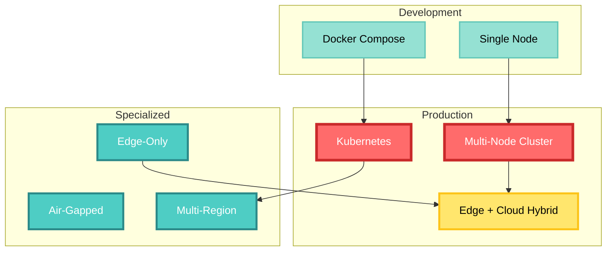
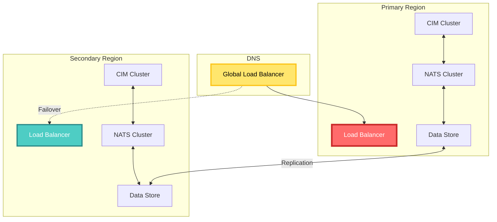

# CIM Deployment Guide

Deploy the Composable Information Machine from development to production, covering various deployment scenarios and best practices.

## Table of Contents

1. [Deployment Overview](#deployment-overview)
2. [Infrastructure Requirements](#infrastructure-requirements)
3. [Single Node Deployment](#single-node-deployment)
4. [Multi-Node Deployment](#multi-node-deployment)
5. [Edge Deployment](#edge-deployment)
6. [Cloud Deployment](#cloud-deployment)
7. [Kubernetes Deployment](#kubernetes-deployment)
8. [Monitoring and Observability](#monitoring-and-observability)
9. [Security Hardening](#security-hardening)
10. [Disaster Recovery](#disaster-recovery)

## Deployment Overview

CIM can be deployed in various configurations:



## Infrastructure Requirements

### Minimum Requirements

| Component | Development | Production | Notes |
|-----------|------------|------------|-------|
| CPU | 2 cores | 8+ cores | Per node |
| Memory | 4 GB | 16+ GB | Per node |
| Storage | 20 GB SSD | 100+ GB NVMe | For event store |
| Network | 100 Mbps | 1+ Gbps | Low latency preferred |
| NATS | 1 instance | 3+ cluster | JetStream enabled |

### Software Dependencies

```bash
# Required
nats-server >= 2.10.0    # Message bus
docker >= 20.10          # Container runtime (optional)
systemd                  # Service management (Linux)

# Optional
prometheus               # Metrics collection
grafana                 # Metrics visualization
elasticsearch           # Log aggregation
jaeger                  # Distributed tracing
```

## Single Node Deployment

### Quick Start with Docker

```bash
# Create docker-compose.yml
cat > docker-compose.yml << 'EOF'
version: '3.8'

services:
  nats:
    image: nats:latest
    command: "-js -sd /data"
    ports:
      - "4222:4222"  # Client port
      - "8222:8222"  # Monitoring port
    volumes:
      - nats-data:/data
    
  cim-core:
    image: ghcr.io/thecowboyai/cim-core:latest
    depends_on:
      - nats
    environment:
      NATS_URL: nats://nats:4222
      LOG_LEVEL: info
    volumes:
      - cim-data:/data
      
  cim-portal:
    image: ghcr.io/thecowboyai/cim-portal:latest
    depends_on:
      - cim-core
    ports:
      - "8080:8080"
    environment:
      CIM_CORE_URL: http://cim-core:9090
      
volumes:
  nats-data:
  cim-data:
EOF

# Start services
docker-compose up -d

# Verify deployment
docker-compose ps
curl http://localhost:8080/health
```

### Systemd Service Installation

```bash
# Install CIM binary
sudo curl -L https://github.com/thecowboyai/cim/releases/latest/download/cim-linux-amd64 \
  -o /usr/local/bin/cim
sudo chmod +x /usr/local/bin/cim

# Create service file
sudo cat > /etc/systemd/system/cim.service << 'EOF'
[Unit]
Description=Composable Information Machine
After=network.target

[Service]
Type=simple
User=cim
Group=cim
ExecStart=/usr/local/bin/cim serve
Restart=always
RestartSec=5
Environment="NATS_URL=nats://localhost:4222"
Environment="DATA_DIR=/var/lib/cim"
Environment="LOG_LEVEL=info"

[Install]
WantedBy=multi-user.target
EOF

# Create user and directories
sudo useradd -r -s /bin/false cim
sudo mkdir -p /var/lib/cim
sudo chown cim:cim /var/lib/cim

# Start service
sudo systemctl enable cim
sudo systemctl start cim
sudo systemctl status cim
```

## Multi-Node Deployment

### NATS Cluster Setup

```bash
# Node 1 configuration
cat > nats-node1.conf << 'EOF'
server_name: nats-1
listen: 0.0.0.0:4222
http: 0.0.0.0:8222

jetstream {
  store_dir: /data/jetstream
  max_memory_store: 1GB
  max_file_store: 10GB
}

cluster {
  name: cim-cluster
  listen: 0.0.0.0:6222
  routes: [
    nats-route://nats-2:6222
    nats-route://nats-3:6222
  ]
}
EOF

# Start NATS cluster (repeat for each node)
docker run -d \
  --name nats-1 \
  -v $(pwd)/nats-node1.conf:/nats.conf \
  -v nats-data-1:/data \
  -p 4222:4222 \
  -p 8222:8222 \
  -p 6222:6222 \
  nats:latest -c /nats.conf
```

### CIM Node Configuration

```yaml
# cim-config.yaml
cluster:
  node_id: cim-node-1
  region: us-east
  zone: zone-a
  
nats:
  urls:
    - nats://nats-1:4222
    - nats://nats-2:4222
    - nats://nats-3:4222
  
storage:
  type: distributed
  ipfs:
    api: /ip4/127.0.0.1/tcp/5001
  s3:
    endpoint: s3.amazonaws.com
    bucket: cim-events
    region: us-east-1
    
domains:
  - name: inventory
    replicas: 3
    placement:
      - region: us-east
      - region: us-west
  - name: orders
    replicas: 2
    placement:
      - zone: zone-a
      - zone: zone-b
```

### Load Balancer Configuration

```nginx
# nginx.conf
upstream cim_api {
    least_conn;
    server cim-node-1:9090 max_fails=3 fail_timeout=30s;
    server cim-node-2:9090 max_fails=3 fail_timeout=30s;
    server cim-node-3:9090 max_fails=3 fail_timeout=30s;
}

server {
    listen 80;
    server_name api.cim.example.com;
    
    location / {
        proxy_pass http://cim_api;
        proxy_set_header Host $host;
        proxy_set_header X-Real-IP $remote_addr;
        proxy_connect_timeout 5s;
        proxy_read_timeout 60s;
    }
    
    location /health {
        access_log off;
        proxy_pass http://cim_api/health;
    }
}
```

## Edge Deployment

### CIM Leaf Node Setup

```bash
# Build for ARM64 (common edge architecture)
cargo build --release --target aarch64-unknown-linux-gnu

# Edge configuration
cat > edge-config.yaml << 'EOF'
edge:
  node_id: store-001
  location: "New York Store #1"
  capabilities:
    - local_processing
    - offline_mode
    - data_collection
    
upstream:
  urls:
    - nats://cloud.cim.example.com:4222
  sync_interval: 60s
  batch_size: 1000
  
local:
  storage:
    type: sqlite
    path: /var/lib/cim/edge.db
  cache:
    size: 100MB
    ttl: 3600s
    
domains:
  - inventory  # Local inventory tracking
  - pos       # Point of sale
  - sensors   # IoT sensors
EOF

# Deploy to edge device
scp target/aarch64-unknown-linux-gnu/release/cim-leaf edge-device:/usr/local/bin/
scp edge-config.yaml edge-device:/etc/cim/
```

### Offline Operation

```rust
// Edge node handles offline mode automatically
pub struct EdgeNode {
    online: Arc<AtomicBool>,
    local_store: SqliteEventStore,
    sync_queue: Arc<Mutex<Vec<Event>>>,
}

impl EdgeNode {
    pub async fn process_event(&self, event: Event) -> Result<()> {
        // Always store locally first
        self.local_store.append(event.clone()).await?;
        
        if self.online.load(Ordering::Relaxed) {
            // Try to sync immediately
            if let Err(_) = self.sync_upstream(vec![event]).await {
                // Queue for later if sync fails
                self.sync_queue.lock().await.push(event);
                self.online.store(false, Ordering::Relaxed);
            }
        } else {
            // Queue for sync when online
            self.sync_queue.lock().await.push(event);
        }
        
        Ok(())
    }
}
```

## Cloud Deployment

### AWS Deployment

```bash
# Create ECS task definition
cat > cim-task-definition.json << 'EOF'
{
  "family": "cim-core",
  "networkMode": "awsvpc",
  "requiresCompatibilities": ["FARGATE"],
  "cpu": "2048",
  "memory": "4096",
  "containerDefinitions": [
    {
      "name": "cim",
      "image": "ghcr.io/thecowboyai/cim-core:latest",
      "essential": true,
      "environment": [
        {
          "name": "NATS_URL",
          "value": "nats://nats.internal:4222"
        },
        {
          "name": "AWS_REGION",
          "value": "us-east-1"
        }
      ],
      "logConfiguration": {
        "logDriver": "awslogs",
        "options": {
          "awslogs-group": "/ecs/cim",
          "awslogs-region": "us-east-1",
          "awslogs-stream-prefix": "ecs"
        }
      }
    }
  ]
}
EOF

# Deploy with Terraform
cat > main.tf << 'EOF'
resource "aws_ecs_service" "cim" {
  name            = "cim-core"
  cluster         = aws_ecs_cluster.main.id
  task_definition = aws_ecs_task_definition.cim.arn
  desired_count   = 3
  
  network_configuration {
    subnets         = aws_subnet.private[*].id
    security_groups = [aws_security_group.cim.id]
  }
  
  load_balancer {
    target_group_arn = aws_lb_target_group.cim.arn
    container_name   = "cim"
    container_port   = 9090
  }
}
EOF
```

### Azure Deployment

```bash
# Deploy to Azure Container Instances
az container create \
  --resource-group cim-rg \
  --name cim-core \
  --image ghcr.io/thecowboyai/cim-core:latest \
  --cpu 2 \
  --memory 4 \
  --environment-variables \
    NATS_URL=nats://nats.internal:4222 \
    AZURE_STORAGE_ACCOUNT=cimevents \
  --secure-environment-variables \
    AZURE_STORAGE_KEY=$STORAGE_KEY
```

## Kubernetes Deployment

### Helm Chart Installation

```bash
# Add CIM Helm repository
helm repo add cim https://charts.cim.io
helm repo update

# Install CIM with custom values
cat > values.yaml << 'EOF'
replicaCount: 3

image:
  repository: ghcr.io/thecowboyai/cim-core
  tag: latest
  pullPolicy: IfNotPresent

service:
  type: ClusterIP
  port: 9090

ingress:
  enabled: true
  className: nginx
  hosts:
    - host: cim.example.com
      paths:
        - path: /
          pathType: Prefix

resources:
  limits:
    cpu: 2000m
    memory: 4Gi
  requests:
    cpu: 1000m
    memory: 2Gi

autoscaling:
  enabled: true
  minReplicas: 3
  maxReplicas: 10
  targetCPUUtilizationPercentage: 70

nats:
  url: nats://nats-cluster:4222
  
persistence:
  enabled: true
  storageClass: fast-ssd
  size: 100Gi
EOF

helm install cim cim/cim-core -f values.yaml
```

### Custom Resource Definitions

```yaml
# cim-domain-crd.yaml
apiVersion: apiextensions.k8s.io/v1
kind: CustomResourceDefinition
metadata:
  name: domains.cim.io
spec:
  group: cim.io
  versions:
  - name: v1
    served: true
    storage: true
    schema:
      openAPIV3Schema:
        type: object
        properties:
          spec:
            type: object
            properties:
              name:
                type: string
              replicas:
                type: integer
              resources:
                type: object
  scope: Namespaced
  names:
    plural: domains
    singular: domain
    kind: Domain
---
# Example domain deployment
apiVersion: cim.io/v1
kind: Domain
metadata:
  name: inventory
spec:
  name: inventory
  replicas: 3
  resources:
    requests:
      memory: "1Gi"
      cpu: "500m"
```

## Monitoring and Observability

### Prometheus Configuration

```yaml
# prometheus.yml
global:
  scrape_interval: 15s

scrape_configs:
  - job_name: 'cim-core'
    static_configs:
      - targets: 
        - 'cim-node-1:9090'
        - 'cim-node-2:9090'
        - 'cim-node-3:9090'
    
  - job_name: 'nats'
    static_configs:
      - targets:
        - 'nats-1:8222'
        - 'nats-2:8222'
        - 'nats-3:8222'

# Alert rules
rule_files:
  - 'alerts.yml'
```

### Grafana Dashboard

```json
{
  "dashboard": {
    "title": "CIM Operations",
    "panels": [
      {
        "title": "Events Per Second",
        "targets": [
          {
            "expr": "rate(cim_events_total[5m])"
          }
        ]
      },
      {
        "title": "Domain Latency",
        "targets": [
          {
            "expr": "histogram_quantile(0.95, cim_domain_duration_seconds_bucket)"
          }
        ]
      },
      {
        "title": "Error Rate",
        "targets": [
          {
            "expr": "rate(cim_errors_total[5m])"
          }
        ]
      }
    ]
  }
}
```

### Distributed Tracing

```yaml
# jaeger-config.yml
apiVersion: v1
kind: ConfigMap
metadata:
  name: jaeger-config
data:
  config.yaml: |
    receivers:
      otlp:
        protocols:
          grpc:
            endpoint: 0.0.0.0:4317
    
    processors:
      batch:
        timeout: 1s
        send_batch_size: 1024
    
    exporters:
      jaeger:
        endpoint: jaeger-collector:14250
    
    service:
      pipelines:
        traces:
          receivers: [otlp]
          processors: [batch]
          exporters: [jaeger]
```

## Security Hardening

### Network Security

```bash
# Firewall rules (iptables)
# Allow NATS cluster communication
iptables -A INPUT -p tcp --dport 4222 -j ACCEPT  # Client
iptables -A INPUT -p tcp --dport 6222 -j ACCEPT  # Cluster
iptables -A INPUT -p tcp --dport 8222 -j ACCEPT  # Monitoring

# Allow CIM API
iptables -A INPUT -p tcp --dport 9090 -j ACCEPT

# Drop all other incoming
iptables -P INPUT DROP
```

### TLS Configuration

```yaml
# tls-config.yaml
tls:
  enabled: true
  cert_file: /etc/cim/tls/cert.pem
  key_file: /etc/cim/tls/key.pem
  ca_file: /etc/cim/tls/ca.pem
  verify_client: true
  
  ciphers:
    - TLS_ECDHE_RSA_WITH_AES_256_GCM_SHA384
    - TLS_ECDHE_RSA_WITH_AES_128_GCM_SHA256
  
  min_version: "1.3"
```

### Secrets Management

```bash
# Using HashiCorp Vault
vault kv put secret/cim/prod \
  nats_password=secure_password \
  encryption_key=base64_encoded_key \
  api_tokens=@tokens.json

# Configure CIM to use Vault
export VAULT_ADDR=https://vault.example.com
export VAULT_TOKEN=s.XXXXXXXXXX
cim serve --secrets-backend=vault
```

## Disaster Recovery

### Backup Strategy

```bash
#!/bin/bash
# backup-cim.sh

# Backup event store
nats stream backup cim-events /backup/events-$(date +%Y%m%d).tar.gz

# Backup IPLD data
ipfs files stat /cim
ipfs files read /cim | gzip > /backup/ipld-$(date +%Y%m%d).tar.gz

# Backup configurations
tar -czf /backup/config-$(date +%Y%m%d).tar.gz /etc/cim

# Upload to S3
aws s3 sync /backup s3://cim-backups/$(date +%Y/%m/%d)/
```

### Recovery Procedures

```bash
# Restore from backup
# 1. Stop CIM services
systemctl stop cim

# 2. Restore NATS streams
nats stream restore cim-events /backup/events-20240129.tar.gz

# 3. Restore IPLD data
gunzip -c /backup/ipld-20240129.tar.gz | ipfs files write --create /cim

# 4. Restore configurations
tar -xzf /backup/config-20240129.tar.gz -C /

# 5. Start services
systemctl start cim

# 6. Verify recovery
cim health check
```

### Multi-Region Failover



## Performance Tuning

### System Configuration

```bash
# /etc/sysctl.conf
# Network optimizations
net.core.somaxconn = 65535
net.ipv4.tcp_max_syn_backlog = 65535
net.ipv4.ip_local_port_range = 1024 65535
net.core.netdev_max_backlog = 65536

# Memory optimizations
vm.max_map_count = 262144
vm.swappiness = 1

# Apply settings
sysctl -p
```

### CIM Performance Settings

```yaml
performance:
  event_batch_size: 1000
  max_concurrent_handlers: 100
  projection_cache_size: 1GB
  
  thread_pool:
    core_threads: 16
    max_threads: 64
    queue_size: 10000
    
  grpc:
    max_message_size: 10MB
    keepalive_time: 30s
    keepalive_timeout: 10s
```

## Deployment Checklist

### Pre-Deployment

- [ ] Infrastructure provisioned
- [ ] Network connectivity verified
- [ ] TLS certificates installed
- [ ] Secrets configured
- [ ] Backup strategy implemented
- [ ] Monitoring configured
- [ ] Load testing completed

### Deployment

- [ ] Deploy NATS cluster
- [ ] Deploy CIM core nodes
- [ ] Configure load balancer
- [ ] Deploy edge nodes
- [ ] Verify health checks
- [ ] Enable monitoring
- [ ] Test failover

### Post-Deployment

- [ ] Verify metrics collection
- [ ] Test backup/restore
- [ ] Document deployment
- [ ] Update runbooks
- [ ] Schedule maintenance
- [ ] Train operations team

## Conclusion

Deploying CIM requires careful planning but provides a flexible, scalable platform for distributed information management. Start with a simple deployment and scale based on your needs.

Key takeaways:
- Always deploy NATS in a cluster for production
- Use monitoring from day one
- Plan for disaster recovery
- Automate deployments with IaC
- Test edge cases and failures

---

*Next: [API Reference](./api-reference.md) - Complete API documentation for CIM*