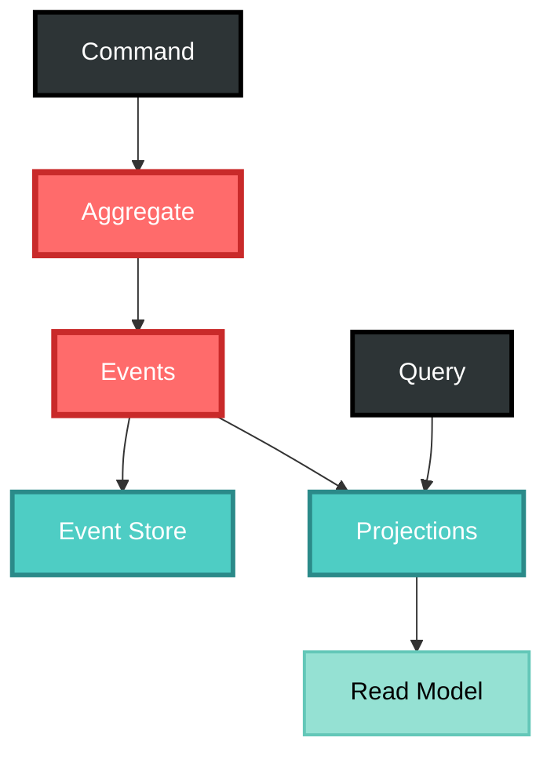
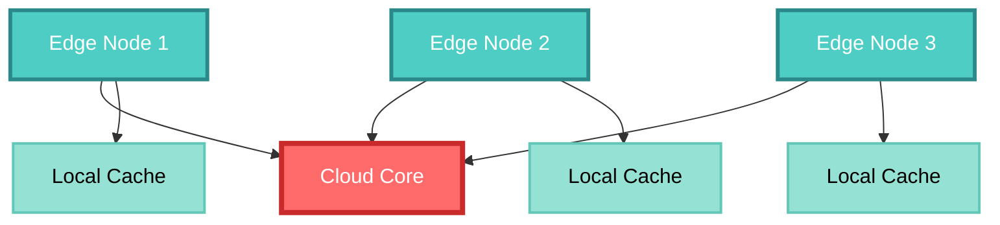

# CIM Core Architecture

## Overview

The Composable Information Machine (CIM) is built on a revolutionary architecture that treats information as living events flowing through an intelligent mesh.

## Architectural Layers

```mermaid
graph TB
    subgraph "Layer 5: User Interface"
        UI1[Natural Language Interface]
        UI2[GraphQL API]
        UI3[3D Visualization]
        UI4[Web Portal]
    end
    
    subgraph "Layer 4: Intelligence"
        AI1[Alchemist AI Engine]
        AI2[Conceptual Reasoning]
        AI3[Semantic Search]
        AI4[Pattern Recognition]
    end
    
    subgraph "Layer 3: Domain Logic"
        D1[Person Domain]
        D2[Organization Domain]
        D3[Workflow Domain]
        D4[Document Domain]
        D5[Policy Domain]
        D6[Custom Domains]
    end
    
    subgraph "Layer 2: Event Processing"
        E1[Event Streams]
        E2[Event Store]
        E3[Correlation Engine]
        E4[Projection Builder]
    end
    
    subgraph "Layer 1: Infrastructure"
        I1[NATS Messaging]
        I2[IPLD Storage]
        I3[Edge Nodes]
        I4[Security Layer]
    end
    
    UI1 --> AI1
    UI2 --> AI3
    UI3 --> D1
    UI4 --> D2
    
    AI1 --> D1
    AI2 --> D3
    AI3 --> E1
    AI4 --> E3
    
    D1 --> E1
    D2 --> E1
    D3 --> E1
    D4 --> E1
    D5 --> E1
    D6 --> E1
    
    E1 --> I1
    E2 --> I2
    E3 --> I1
    E4 --> I2
    
    %% Styling - layered architecture from infrastructure to UI
    style UI1 fill:#95E1D3,stroke:#63C7B8,stroke-width:2px,color:#000
    style UI2 fill:#95E1D3,stroke:#63C7B8,stroke-width:2px,color:#000
    style UI3 fill:#95E1D3,stroke:#63C7B8,stroke-width:2px,color:#000
    style UI4 fill:#95E1D3,stroke:#63C7B8,stroke-width:2px,color:#000
    style AI1 fill:#FF6B6B,stroke:#C92A2A,stroke-width:4px,color:#FFF
    style AI2 fill:#FFE66D,stroke:#FCC419,stroke-width:3px,color:#000
    style AI3 fill:#FFE66D,stroke:#FCC419,stroke-width:3px,color:#000
    style AI4 fill:#FFE66D,stroke:#FCC419,stroke-width:3px,color:#000
    style D1 fill:#4ECDC4,stroke:#2B8A89,stroke-width:3px,color:#FFF
    style D2 fill:#4ECDC4,stroke:#2B8A89,stroke-width:3px,color:#FFF
    style D3 fill:#4ECDC4,stroke:#2B8A89,stroke-width:3px,color:#FFF
    style D4 fill:#4ECDC4,stroke:#2B8A89,stroke-width:3px,color:#FFF
    style D5 fill:#4ECDC4,stroke:#2B8A89,stroke-width:3px,color:#FFF
    style D6 fill:#4ECDC4,stroke:#2B8A89,stroke-width:3px,color:#FFF
    style E1 fill:#FF6B6B,stroke:#C92A2A,stroke-width:4px,color:#FFF
    style E2 fill:#FF6B6B,stroke:#C92A2A,stroke-width:4px,color:#FFF
    style E3 fill:#FF6B6B,stroke:#C92A2A,stroke-width:4px,color:#FFF
    style E4 fill:#4ECDC4,stroke:#2B8A89,stroke-width:3px,color:#FFF
    style I1 fill:#2D3436,stroke:#000,stroke-width:3px,color:#FFF
    style I2 fill:#2D3436,stroke:#000,stroke-width:3px,color:#FFF
    style I3 fill:#2D3436,stroke:#000,stroke-width:3px,color:#FFF
    style I4 fill:#2D3436,stroke:#000,stroke-width:3px,color:#FFF
```



## Core Components

### 1. Event Mesh

The event mesh is the nervous system of CIM:

```rust
pub struct EventMesh {
    pub nats_client: NatsClient,
    pub event_store: EventStore,
    pub correlation_engine: CorrelationEngine,
    pub projection_manager: ProjectionManager,
}

impl EventMesh {
    pub async fn publish(&self, event: DomainEvent) -> Result<()> {
        // Validate correlation/causation
        self.correlation_engine.validate(&event)?;
        
        // Store with CID chain
        let cid = self.event_store.append(event.clone()).await?;
        
        // Publish to NATS
        self.nats_client.publish(event.subject(), event).await?;
        
        // Update projections
        self.projection_manager.handle(event).await?;
        
        Ok(())
    }
}
```

### 2. Domain Modules

Each domain is a self-contained module:

```rust
pub trait Domain {
    type Command;
    type Event;
    type Query;
    type State;
    
    fn handle_command(&self, cmd: Self::Command) -> Result<Vec<Self::Event>>;
    fn apply_event(&mut self, event: Self::Event) -> Result<()>;
    fn handle_query(&self, query: Self::Query) -> Result<Self::State>;
}
```

### 3. Conceptual Space Engine

Provides semantic understanding:

```rust
pub struct ConceptualEngine {
    pub spaces: HashMap<SpaceId, ConceptualSpace>,
    pub embeddings: EmbeddingStore,
    pub reasoner: SemanticReasoner,
}

impl ConceptualEngine {
    pub fn classify(&self, concept: &Concept) -> Result<Category> {
        let point = self.embed(concept)?;
        let space = self.find_space(concept)?;
        space.classify(point)
    }
    
    pub fn similarity(&self, a: &Concept, b: &Concept) -> f32 {
        let point_a = self.embed(a).unwrap();
        let point_b = self.embed(b).unwrap();
        1.0 / (1.0 + point_a.distance_to(&point_b))
    }
}
```

### 4. Workflow Engine

Executes graph-based workflows:

```rust
pub struct WorkflowEngine {
    pub graphs: HashMap<WorkflowId, WorkflowGraph>,
    pub executor: GraphExecutor,
    pub state_manager: StateManager,
}

impl WorkflowEngine {
    pub async fn execute(&self, workflow_id: WorkflowId) -> Result<()> {
        let graph = self.graphs.get(&workflow_id)?;
        let state = self.state_manager.get(workflow_id)?;
        
        // Execute graph transitions based on events
        self.executor.run(graph, state).await
    }
}
```

## Architectural Patterns

### AsyncSyncBridge

Enables Bevy (sync) and Tokio (async) to communicate:

```rust
pub struct AsyncSyncBridge {
    tx: mpsc::Sender<BridgeMessage>,
    rx: mpsc::Receiver<BridgeMessage>,
}
```

### Event-Only Communication

Domains never call each other directly:


### CQRS with Event Sourcing

Complete separation of concerns:



## Security Architecture

### Zero Trust Model

- Every event is authenticated
- Domain boundaries enforce access control
- CID chains prevent tampering
- End-to-end encryption available

### Trust Levels

```rust
pub enum TrustLevel {
    Verified,      // Cryptographically verified
    Trusted,       // From trusted source
    Unverified,    // Needs verification
    Untrusted,     // Explicitly untrusted
}
```

## Performance Considerations

### Event Streaming
- Parallel event processing
- Batching for efficiency
- Backpressure handling
- Configurable buffers

### Caching Strategy
- Projection caching
- Conceptual space indexing
- Event replay optimization
- Edge node caching

## Deployment Architecture

### Edge Nodes


### Scalability
- Horizontal scaling through domain sharding
- Event stream partitioning
- Distributed projections
- Edge computing for locality

## Key Design Decisions

1. **Events Over State**: State is derived from events, never stored directly
2. **Domains Over Services**: Business capabilities, not technical services
3. **Graphs Over Code**: Visual workflows instead of hidden logic
4. **Meaning Over Data**: Semantic understanding built into architecture
5. **Distribution Over Centralization**: No single point of failure

## Anti-Patterns to Avoid

1. **Direct Domain Coupling**: Never allow domains to call each other
2. **Shared Databases**: Each domain owns its projections
3. **Synchronous Operations**: Embrace eventual consistency
4. **CRUD Thinking**: Everything is an event
5. **Ignoring Semantics**: Always consider conceptual meaning