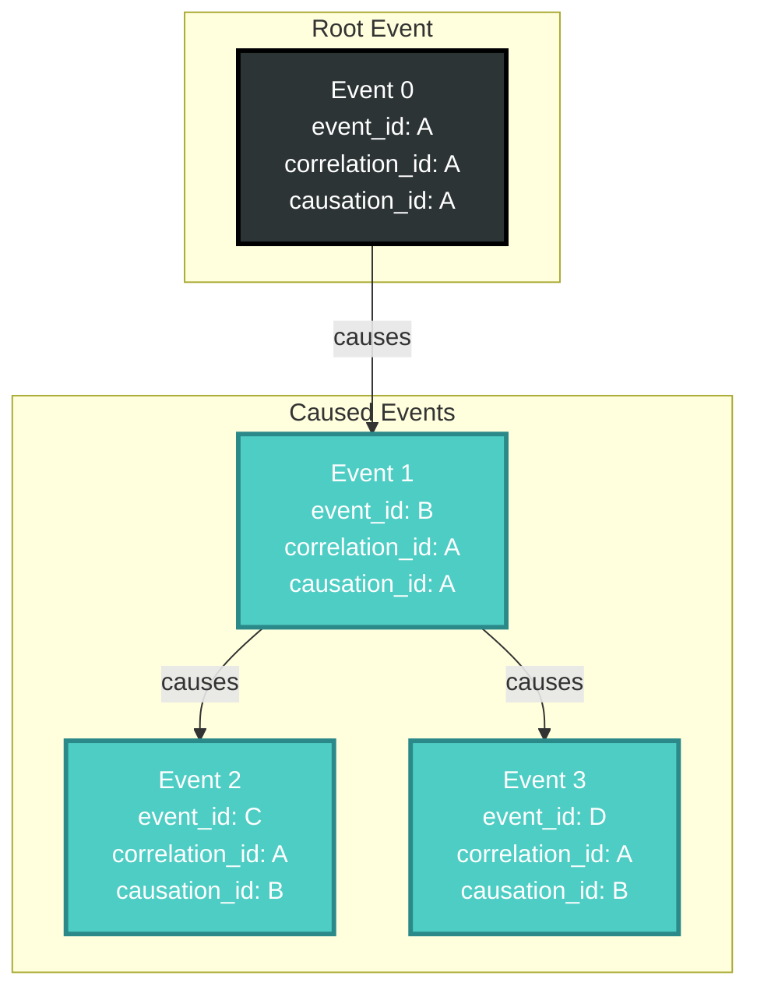
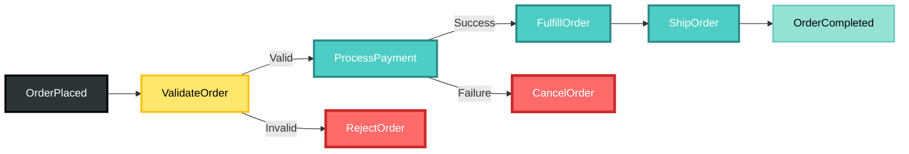
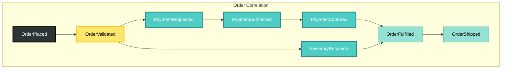

# Event Correlation and Causation Algebra

## Overview

CIM implements a mathematical algebra for event relationships that ensures perfect traceability and prevents cycles while enabling rich event interactions.

## Core Concepts

### Event Identity Trinity

Every event in CIM has three identifiers:

```rust
pub struct EventIdentity {
    pub event_id: EventId,           // Unique identifier for this event
    pub correlation_id: CorrelationId, // Groups related events
    pub causation_id: CausationId,     // What directly caused this event
}
```

### Correlation Rules



### Mathematical Properties

#### 1. Root Event Property
For any root event E₀:
```
E₀.event_id = E₀.correlation_id = E₀.causation_id
```

#### 2. Causation Chain Property
For any caused event Eₙ caused by Eₙ₋₁:
```
Eₙ.correlation_id = E₀.correlation_id
Eₙ.causation_id = Eₙ₋₁.event_id
```

#### 3. Transitivity Property
If A causes B and B causes C, then A transitively causes C:
```
causes(A, B) ∧ causes(B, C) ⟹ transitively_causes(A, C)
```

## Implementation

### Event Factory

```rust
pub struct EventFactory;

impl EventFactory {
    /// Creates a root event (self-correlated)
    pub fn create_root<T: Event>(payload: T) -> DomainEvent {
        let id = EventId::new();
        DomainEvent {
            event_id: id.clone(),
            correlation_id: CorrelationId(id.0.clone()),
            causation_id: CausationId(id.0),
            payload: payload.into(),
            ..Default::default()
        }
    }
    
    /// Creates an event caused by another
    pub fn create_caused_by<T: Event>(
        payload: T, 
        cause: &DomainEvent
    ) -> DomainEvent {
        DomainEvent {
            event_id: EventId::new(),
            correlation_id: cause.correlation_id.clone(),
            causation_id: CausationId(cause.event_id.0.clone()),
            payload: payload.into(),
            ..Default::default()
        }
    }
}
```

### Correlation Engine

```rust
pub struct CorrelationEngine {
    chains: HashMap<CorrelationId, CorrelationChain>,
}

pub struct CorrelationChain {
    pub root: EventId,
    pub events: Vec<EventId>,
    pub graph: DiGraph<EventId, CausationEdge>,
}

impl CorrelationEngine {
    pub fn validate(&self, event: &DomainEvent) -> Result<()> {
        // Check for cycles
        if self.would_create_cycle(event)? {
            return Err(Error::CausalityCycle);
        }
        
        // Validate correlation consistency
        if !self.is_correlation_valid(event)? {
            return Err(Error::InvalidCorrelation);
        }
        
        Ok(())
    }
    
    pub fn trace_causation_chain(&self, event_id: EventId) -> Vec<EventId> {
        // Returns all events that caused this event
        self.chains
            .get(&event.correlation_id)
            .map(|chain| chain.trace_ancestors(event_id))
            .unwrap_or_default()
    }
}
```

## Event Patterns

### 1. Linear Chain
```
A → B → C → D
```
Simple sequential processing where each event causes the next.

### 2. Fan-Out
```
    ┌→ B
A → ┤
    └→ C
```
One event triggers multiple parallel events.

### 3. Fan-In
```
A → ┐
    ├→ D
B → ┘
```
Multiple events converge to trigger a single event.

### 4. Complex Workflow


## CID Chain Integration

Events are cryptographically linked:

```rust
pub struct EventCIDChain {
    pub event_cid: Cid,
    pub previous_cid: Option<Cid>,
    pub correlation_root_cid: Cid,
}

impl EventCIDChain {
    pub fn compute_cid(event: &DomainEvent, previous: Option<Cid>) -> Cid {
        let mut hasher = Blake3::new();
        hasher.update(&event.to_bytes());
        if let Some(prev) = previous {
            hasher.update(&prev.to_bytes());
        }
        Cid::from(hasher.finalize())
    }
}
```

## NATS Integration

Correlation headers in NATS:

```rust
impl NatsPublisher {
    pub async fn publish(&self, event: DomainEvent) -> Result<()> {
        let mut headers = HeaderMap::new();
        headers.insert("X-Event-ID", event.event_id.to_string());
        headers.insert("X-Correlation-ID", event.correlation_id.to_string());
        headers.insert("X-Causation-ID", event.causation_id.to_string());
        headers.insert("X-Event-CID", event.event_cid.to_string());
        
        self.client
            .publish_with_headers(
                event.subject(),
                headers,
                event.to_bytes()
            )
            .await
    }
}
```

## Query Patterns

### Get Correlation Chain
```rust
pub async fn get_correlation_chain(
    correlation_id: CorrelationId
) -> Result<Vec<DomainEvent>> {
    event_store
        .query()
        .filter_by_correlation(correlation_id)
        .order_by_causation()
        .execute()
        .await
}
```

### Get Event Consequences
```rust
pub async fn get_consequences(
    event_id: EventId
) -> Result<Vec<DomainEvent>> {
    event_store
        .query()
        .filter_by_causation(event_id)
        .execute()
        .await
}
```

### Trace Event Lineage
```rust
pub async fn trace_lineage(
    event_id: EventId
) -> Result<EventLineage> {
    let event = event_store.get(event_id).await?;
    let ancestors = trace_ancestors(event).await?;
    let descendants = trace_descendants(event).await?;
    
    Ok(EventLineage {
        event,
        ancestors,
        descendants,
        correlation_chain: get_correlation_chain(event.correlation_id).await?,
    })
}
```

## Best Practices

### 1. Always Use Factory Methods
```rust
// ✅ Good
let event = EventFactory::create_root(OrderPlaced { ... });

// ❌ Bad
let event = DomainEvent { 
    correlation_id: Uuid::new_v4(), // Wrong!
    ...
};
```

### 2. Preserve Correlation Through Workflows
```rust
// ✅ Good - Correlation preserved
let payment_event = EventFactory::create_caused_by(
    PaymentProcessed { ... },
    &order_event
);

// ❌ Bad - New correlation breaks tracing
let payment_event = EventFactory::create_root(PaymentProcessed { ... });
```

### 3. Handle Correlation in Projections
```rust
impl Projection for OrderProjection {
    fn handle(&mut self, event: DomainEvent) {
        // Store correlation for querying
        self.correlations
            .entry(event.correlation_id)
            .or_insert_with(Vec::new)
            .push(event.event_id);
    }
}
```

## Advanced Patterns

### Saga Correlation
```rust
pub struct SagaCoordinator {
    pub saga_id: SagaId,
    pub correlation_id: CorrelationId,
    pub steps: Vec<SagaStep>,
}

impl SagaCoordinator {
    pub fn execute_step(&self, step: SagaStep) -> DomainEvent {
        EventFactory::create_caused_by(
            step.command,
            &self.last_event()
        )
    }
}
```

### Distributed Tracing
```rust
pub struct DistributedTrace {
    pub trace_id: TraceId,
    pub correlation_id: CorrelationId,
    pub spans: Vec<TraceSpan>,
}

impl From<CorrelationChain> for DistributedTrace {
    fn from(chain: CorrelationChain) -> Self {
        // Convert event chain to trace spans
        DistributedTrace {
            trace_id: TraceId::from(chain.correlation_id),
            correlation_id: chain.correlation_id,
            spans: chain.to_spans(),
        }
    }
}
```

## Visualization

### Correlation Graph


This correlation algebra ensures that every event in CIM can be traced to its origins, enabling perfect audit trails, debugging, and understanding of system behavior.