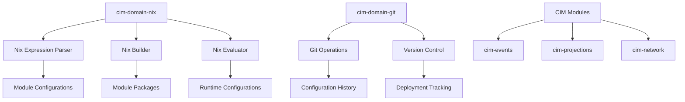

# CIM Nix Integration Design

## Overview

This document outlines the design for integrating Nix throughout the CIM ecosystem using `cim-domain-nix` and `cim-domain-git` from GitHub.

## Goals

1. **Declarative Infrastructure**: Use Nix to declaratively define CIM module deployments
2. **Reproducible Builds**: Ensure all CIM modules can be built reproducibly
3. **Development Environments**: Provide consistent dev environments across all platforms
4. **Configuration Management**: Use Nix for managing CIM configurations
5. **Cross-Platform Support**: Support NixOS, macOS (nix-darwin), and Linux

## Architecture

### Core Components



### Integration Points

1. **Module Packaging**
   - Each CIM module will have a `default.nix` for packaging
   - Modules will be available as Nix packages
   - Dependencies managed through Nix

2. **Configuration Management**
   - Module configurations defined in Nix
   - Environment-specific overrides
   - Secret management integration

3. **Development Environments**
   - Per-module development shells
   - Integrated tooling (rust-analyzer, cargo tools)
   - Service dependencies (NATS, PostgreSQL, Redis)

4. **Deployment**
   - NixOS modules for system services
   - Container images via Nix
   - Kubernetes manifests generation

## Implementation Plan

### Phase 1: Foundation (Days 1-3)

1. **Set up cim-domain-nix integration**
   ```toml
   # In each module's Cargo.toml
   [dependencies]
   cim-domain-nix = { git = "https://github.com/thecowboyai/cim-domain-nix" }
   ```

2. **Create base Nix expressions**
   - `nix/lib/default.nix` - Common functions
   - `nix/modules/default.nix` - Module definitions
   - `nix/packages/default.nix` - Package definitions

3. **Update flake.nix**
   - Add cim-domain-nix as input
   - Define package outputs for each module
   - Create development shells

### Phase 2: Module Integration (Days 4-6)

1. **cim-events Nix Integration**
   ```nix
   # nix/packages/cim-events.nix
   { lib, rustPlatform, pkg-config, openssl, ... }:
   
   rustPlatform.buildRustPackage {
     pname = "cim-events";
     version = "0.1.0";
     
     src = ../../modules/cim-events;
     
     nativeBuildInputs = [ pkg-config ];
     buildInputs = [ openssl ];
     
     cargoSha256 = lib.fakeSha256;
   }
   ```

2. **cim-projections Nix Integration**
   - Similar package definition
   - Additional database dependencies
   - Feature flag support

3. **Service Modules**
   ```nix
   # nix/modules/cim-events.nix
   { config, lib, pkgs, ... }:
   
   with lib;
   
   let
     cfg = config.services.cim-events;
   in {
     options.services.cim-events = {
       enable = mkEnableOption "CIM Events Service";
       
       natsUrl = mkOption {
         type = types.str;
         default = "nats://localhost:4222";
         description = "NATS server URL";
       };
       
       # ... more options
     };
     
     config = mkIf cfg.enable {
       systemd.services.cim-events = {
         description = "CIM Events Service";
         wantedBy = [ "multi-user.target" ];
         
         serviceConfig = {
           ExecStart = "${pkgs.cim-events}/bin/cim-events";
           Environment = [
             "NATS_URL=${cfg.natsUrl}"
           ];
         };
       };
     };
   }
   ```

### Phase 3: Configuration Management (Days 7-9)

1. **Configuration Schema**
   ```nix
   # nix/lib/config-schema.nix
   { lib }:
   
   {
     mkCimConfig = {
       events ? {},
       projections ? {},
       network ? {},
     }: {
       inherit events projections network;
       
       # Validation
       assertions = [
         {
           assertion = events ? natsUrl;
           message = "events.natsUrl must be specified";
         }
       ];
     };
   }
   ```

2. **Environment Configurations**
   ```nix
   # environments/development.nix
   { config, pkgs, ... }:
   
   {
     services.cim-events = {
       enable = true;
       natsUrl = "nats://localhost:4222";
       logLevel = "debug";
     };
     
     services.cim-projections = {
       enable = true;
       eventStore = "cim-events";
       stores = [ "memory" "postgres" ];
     };
   }
   ```

3. **Git Integration**
   - Track configuration changes
   - Deployment history
   - Rollback capabilities

### Phase 4: Deployment (Days 10-12)

1. **Container Images**
   ```nix
   # nix/containers/cim-events.nix
   { pkgs, ... }:
   
   pkgs.dockerTools.buildImage {
     name = "cim-events";
     tag = "latest";
     
     contents = [ pkgs.cim-events ];
     
     config = {
       Cmd = [ "/bin/cim-events" ];
       Env = [
         "RUST_LOG=info"
       ];
       ExposedPorts = {
         "8080/tcp" = {};
       };
     };
   }
   ```

2. **Kubernetes Manifests**
   ```nix
   # nix/k8s/cim-events.nix
   { config, ... }:
   
   {
     apiVersion = "apps/v1";
     kind = "Deployment";
     metadata = {
       name = "cim-events";
       namespace = "cim";
     };
     spec = {
       replicas = 3;
       selector.matchLabels.app = "cim-events";
       template = {
         metadata.labels.app = "cim-events";
         spec.containers = [{
           name = "cim-events";
           image = "cim-events:latest";
           env = [
             {
               name = "NATS_URL";
               value = config.nats.url;
             }
           ];
         }];
       };
     };
   }
   ```

3. **NixOS VM Testing**
   ```nix
   # tests/integration.nix
   { pkgs, ... }:
   
   pkgs.nixosTest {
     name = "cim-integration";
     
     nodes = {
       events = { ... }: {
         imports = [ ../nix/modules/cim-events.nix ];
         services.cim-events.enable = true;
       };
       
       projections = { ... }: {
         imports = [ ../nix/modules/cim-projections.nix ];
         services.cim-projections.enable = true;
       };
     };
     
     testScript = ''
       events.wait_for_unit("cim-events")
       projections.wait_for_unit("cim-projections")
       
       # Test event flow
       events.succeed("cim-events-cli publish test-event")
       projections.succeed("cim-projections-cli verify test-event")
     '';
   }
   ```

## Example Usage

### Development

```bash
# Enter development shell
nix develop

# Run specific module
nix run .#cim-events

# Build all modules
nix build .#cim-all
```

### Deployment

```bash
# Deploy to NixOS
nixos-rebuild switch --flake .#production

# Build container
nix build .#containers.cim-events

# Generate Kubernetes manifests
nix eval .#k8s.cim-events --json | kubectl apply -f -
```

### Configuration

```nix
# flake.nix
{
  outputs = { self, nixpkgs, cim-domain-nix, ... }: {
    # Development environment
    devShells.x86_64-linux.default = cim-domain-nix.lib.mkCimShell {
      modules = [ "events" "projections" ];
      extraPackages = [ pkgs.postgresql ];
    };
    
    # Production configuration
    nixosConfigurations.production = nixpkgs.lib.nixosSystem {
      modules = [
        self.nixosModules.cim-events
        self.nixosModules.cim-projections
        ./environments/production.nix
      ];
    };
  };
}
```

## Benefits

1. **Reproducibility**: All builds and deployments are reproducible
2. **Declarative**: Infrastructure as code with Nix
3. **Unified**: Single tool for development, testing, and deployment
4. **Type-Safe**: Nix provides compile-time configuration validation
5. **Rollback**: Easy rollback with Nix generations
6. **Cross-Platform**: Works on NixOS, macOS, and Linux

## Next Steps

1. Implement base Nix infrastructure
2. Create module-specific Nix expressions
3. Set up CI/CD with Nix
4. Document Nix workflows
5. Create example deployments