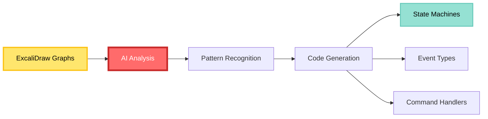

# CIM Domain Development Guide

Build CIM domains using visual design and state machines. This guide shows how to create domains that extend `cim-domain` using a graph-first approach.

## Table of Contents

1. [Domain Development Philosophy](#domain-development-philosophy)
2. [Visual Domain Design](#visual-domain-design)
3. [State Machine Implementation](#state-machine-implementation)
4. [Graph to Code Generation](#graph-to-code-generation)
5. [Testing State Machines](#testing-state-machines)
6. [Domain Composition](#domain-composition)
7. [Publishing Domains](#publishing-domains)

## Domain Development Philosophy

### Graphs First, Code Second

In CIM, domain development follows this flow:

```
1. Event Storming → Discover what happens
2. Context Mapping → Define boundaries
3. State Machine Design → Model behavior
4. Graph Export → Create specifications
5. AI Generation → Produce code
```

### What is a CIM Domain?

A CIM domain is:
- **A state machine collection** that models business behavior
- **An extension of cim-domain** (e.g., `cowboy-ai-inventory`)
- **Visually designed** using graphs before any code
- **Event-driven** with clear state transitions
- **AI-friendly** with graphs as specifications

### Domain Principles

1. **Everything is a state machine** - Aggregates, workflows, policies
2. **Graphs are the source of truth** - Code is generated from graphs
3. **States are complete** - Each state contains all needed data
4. **Transitions are explicit** - Events drive state changes
5. **Invalid states are impossible** - By design, not validation

## Visual Domain Design

### Step 1: Start with Event Storming

Before creating any domain, you MUST complete Event Storming:

```bash
# Required artifacts before proceeding:
✓ events/inventory-event-storm.excalidraw
✓ contexts/inventory-context-map.excalidraw
✓ concepts/inventory-concepts.arrows
✓ workflows/inventory-workflows.excalidraw
```

### Step 2: Design State Machines in ExcaliDraw

Create visual state machines for each aggregate:

```
Inventory Item State Machine
━━━━━━━━━━━━━━━━━━━━━━━━━━

    ○ Start
    │
    ▼
┌─────────────┐
│   Active    │──────Stock Sold────▶┌────────────┐
│ stock > min │                     │  Critical  │
└─────────────┘◀───Stock Added──────│stock < min │
    │                               └────────────┘
    │                                     │
    │Discontinue                          │Out of Stock
    ▼                                     ▼
┌─────────────┐                     ┌────────────┐
│Discontinued │                     │Out of Stock│
└─────────────┘                     └────────────┘
```

### Step 3: Define States with Complete Data

In ExcaliDraw, annotate each state with its data:

```
┌─────────────────────────┐
│       Active            │
├─────────────────────────┤
│ sku: String            │
│ name: String           │
│ stock_level: u32       │
│ reorder_point: u32     │
│ reorder_quantity: u32  │
│ last_updated: DateTime │
└─────────────────────────┘
```

### Step 4: Map Events to Transitions

Create a visual event-transition map:

```
Event                  From State    To State        Conditions
━━━━━━━━━━━━━━━━━━━━━━━━━━━━━━━━━━━━━━━━━━━━━━━━━━━━━━━━━━━━
StockReceived         Any Active    Active          quantity > 0
StockSold            Active        Active/Critical  check level
OutOfStockOccurred   Critical     OutOfStock       stock == 0
Discontinued         Active        Discontinued     admin action
```

### Step 5: Export Graphs for AI Processing

```bash
# Export all design artifacts
excalidraw export states/inventory-item-states.excalidraw --format json
arrows export concepts/inventory-aggregate.arrows --format cypher

# Package for AI generation
tar -czf inventory-domain-design.tar.gz \
  events/ \
  contexts/ \
  concepts/ \
  states/ \
  workflows/
```

## State Machine Implementation

### Creating Your Domain Project

```bash
# Name your domain following the pattern
cargo new --lib cowboy-ai-inventory
cd cowboy-ai-inventory

# Project structure focused on state machines
mkdir -p src/{states,events,commands,policies}
mkdir -p design/{graphs,exports}
```

### Project Structure

```
cowboy-ai-inventory/
├── design/                 # Visual designs (source of truth)
│   ├── graphs/            # ExcaliDraw and Arrows files
│   │   ├── event-storm.excalidraw
│   │   ├── context-map.excalidraw
│   │   ├── state-machines.excalidraw
│   │   └── concepts.arrows
│   └── exports/           # AI-readable exports
│       ├── states.json
│       ├── events.json
│       └── relationships.cypher
├── src/
│   ├── lib.rs            # Domain registration
│   ├── states/           # State machine implementations
│   │   ├── mod.rs
│   │   └── inventory_item.rs
│   ├── events/           # Event definitions
│   ├── commands/         # Command handlers
│   └── policies/         # Policy state machines
└── Cargo.toml
```

### Core Dependencies

```toml
# Cargo.toml
[package]
name = "cowboy-ai-inventory"
version = "0.1.0"
edition = "2021"

[dependencies]
# Essential: extend cim-domain
cim-domain = { git = "https://github.com/thecowboyai/cim-domain" }

# State machine traits
async-trait = "0.1"
serde = { version = "1.0", features = ["derive"] }

[dev-dependencies]
# Property testing for state machines
proptest = "1.0"
```

### Implementing State Machines from Graphs

The AI reads your graphs and generates base implementations:

```rust
// src/states/inventory_item.rs
// Generated from: design/graphs/state-machines.excalidraw

use cim_domain::{State, StateMachine, Event};

#[derive(Debug, Clone, State)]
pub enum InventoryItemState {
    // States from your visual design
    Active {
        sku: String,
        name: String,
        stock_level: u32,
        reorder_point: u32,
        reorder_quantity: u32,
        last_updated: DateTime,
    },
    
    Critical {
        sku: String,
        name: String,
        stock_level: u32,
        reorder_point: u32,
        pending_order: Option<OrderId>,
        entered_critical: DateTime,
    },
    
    OutOfStock {
        sku: String,
        name: String,
        since: DateTime,
        backorders: Vec<BackorderId>,
    },
    
    Discontinued {
        sku: String,
        discontinued_at: DateTime,
        reason: String,
        remaining_stock: u32,
    },
}

impl StateMachine for InventoryItemState {
    type Event = InventoryEvent;
    type Command = InventoryCommand;
    
    fn handle_command(&self, cmd: Self::Command) -> Result<Vec<Self::Event>, Error> {
        // Pattern match on (State, Command) combinations
        match (self, cmd) {
            (Self::Active { stock_level, .. }, InventoryCommand::Sell { quantity }) => {
                if quantity <= *stock_level {
                    Ok(vec![InventoryEvent::StockSold { quantity }])
                } else {
                    Err(Error::InsufficientStock)
                }
            }
            // ... other combinations from your transition map
        }
    }
    
    fn apply_event(&mut self, event: Self::Event) {
        // Transitions from your state diagram
        match (self, event) {
            (Self::Active { stock_level, reorder_point, .. }, 
             InventoryEvent::StockSold { quantity }) => {
                *stock_level -= quantity;
                if *stock_level < *reorder_point {
                    // Transition to Critical
                    *self = Self::Critical {
                        // ... copy needed fields
                    };
                }
            }
            // ... other transitions
        }
    }
}
```

## Graph to Code Generation

### How AI Agents Generate Code

1. **Read Visual Designs**:
   ```bash
   cim ai analyze-domain \
     --graphs design/graphs/ \
     --output generated/
   ```

2. **Generate State Machines**:
   ```bash
   cim ai generate-states \
     --input design/exports/states.json \
     --output src/states/
   ```

3. **Create Event Definitions**:
   ```bash
   cim ai generate-events \
     --storm design/graphs/event-storm.excalidraw \
     --output src/events/
   ```

### AI Generation Process



### Customizing Generated Code

After AI generation, you add domain-specific logic:

```rust
// src/states/inventory_item.rs
// AI-generated base + your business logic

impl InventoryItemState {
    // AI generated the state transitions
    // You add business-specific validations
    
    pub fn validate_stock_level(&self) -> Result<(), DomainError> {
        match self {
            Self::Active { stock_level, reorder_point, .. } => {
                if stock_level < reorder_point / 2 {
                    warn!("Stock critically low: {}", stock_level);
                }
                Ok(())
            }
            Self::OutOfStock { backorders, .. } => {
                if backorders.len() > 10 {
                    Err(DomainError::TooManyBackorders)
                } else {
                    Ok(())
                }
            }
            _ => Ok(())
        }
    }
}
```

## Testing State Machines

### Visual Test Scenarios

Create test scenarios as graphs in ExcaliDraw:

```
Test: Stock Depletion
━━━━━━━━━━━━━━━━━━━━
State: Active (stock=100)
  │
  ├─Sell 50─→ Active (stock=50)
  │
  ├─Sell 30─→ Critical (stock=20)
  │
  └─Sell 25─→ Error: Insufficient Stock
```

### Property-Based State Testing

```rust
use proptest::prelude::*;

proptest! {
    #[test]
    fn state_transitions_are_valid(
        initial_state in arb_inventory_state(),
        events in prop::collection::vec(arb_inventory_event(), 0..100)
    ) {
        let mut state = initial_state.clone();
        let mut previous = initial_state;
        
        for event in events {
            if state.can_handle_event(&event) {
                state.apply_event(event.clone());
                
                // Verify transition was valid
                prop_assert!(previous.valid_transition_to(&state));
                
                // Verify state invariants
                prop_assert!(state.invariants_hold());
                
                previous = state.clone();
            }
        }
    }
}
```

### State Machine Invariants

```rust
impl InventoryItemState {
    pub fn invariants_hold(&self) -> bool {
        match self {
            Self::Active { stock_level, reorder_point, .. } => {
                // Active items must have positive reorder points
                *reorder_point > 0
            }
            Self::Critical { stock_level, reorder_point, .. } => {
                // Critical means below reorder point
                *stock_level < *reorder_point
            }
            Self::OutOfStock { .. } => {
                // Out of stock is always valid
                true
            }
            Self::Discontinued { remaining_stock, .. } => {
                // Can't have negative stock even when discontinued
                *remaining_stock >= 0
            }
        }
    }
}
```

## Domain Composition

### Composing State Machines Across Domains

Domains interact through state machine orchestration:

```
Order Domain          Inventory Domain       Payment Domain
━━━━━━━━━━━━         ━━━━━━━━━━━━━━━━      ━━━━━━━━━━━━━━
OrderState           InventoryState         PaymentState
  │                      │                      │
  ├─PlaceOrder──────────▶├─CheckStock           │
  │                      ├─────────┐            │
  │                      │         ▼            │
  │◀─StockReserved───────┤    [Reserved]        │
  │                      │                      │
  ├─ProcessPayment──────────────────────────────▶│
  │                                             ├──Authorize
  │                                             │
  │◀─PaymentAuthorized──────────────────────────┤
  ▼                                             ▼
[Confirmed]                                 [Captured]
```

### Saga State Machines

Sagas are also state machines that coordinate domains:

```rust
// src/sagas/order_fulfillment.rs
#[derive(Debug, Clone, State)]
pub enum OrderFulfillmentState {
    Started {
        order_id: OrderId,
        items: Vec<LineItem>,
    },
    
    CheckingInventory {
        order_id: OrderId,
        items: Vec<LineItem>,
        checked: Vec<SkuAvailability>,
        remaining: Vec<Sku>,
    },
    
    ReservingStock {
        order_id: OrderId,
        reservations: Vec<ReservationId>,
    },
    
    ProcessingPayment {
        order_id: OrderId,
        amount: Money,
        payment_method: PaymentMethod,
    },
    
    Completed {
        order_id: OrderId,
        transaction_id: TransactionId,
    },
    
    // Compensation states
    CancellingReservations {
        order_id: OrderId,
        reason: String,
        cancelled: Vec<ReservationId>,
        remaining: Vec<ReservationId>,
    },
    
    Failed {
        order_id: OrderId,
        reason: String,
        compensated: bool,
    },
}

impl StateMachine for OrderFulfillmentState {
    type Event = SagaEvent;
    type Command = CrossDomainCommand;
    
    fn handle_event(&mut self, event: Self::Event) {
        match (self, event) {
            // Progress through saga
            (Self::CheckingInventory { remaining, .. }, 
             SagaEvent::StockChecked { available: true, sku }) => {
                remaining.retain(|s| s != &sku);
                if remaining.is_empty() {
                    *self = Self::ReservingStock { /* ... */ };
                }
            }
            
            // Handle failures with compensation
            (Self::ProcessingPayment { .. }, 
             SagaEvent::PaymentFailed { reason }) => {
                *self = Self::CancellingReservations {
                    reason,
                    // ... setup compensation
                };
            }
            
            // ... other transitions
        }
    }
}
```

### Policy State Machines

Policies are state machines that react to events:

```rust
// src/policies/auto_reorder.rs
#[derive(Debug, Clone, State)]
pub enum ReorderPolicyState {
    Monitoring {
        sku: Sku,
        current_level: u32,
        reorder_point: u32,
    },
    
    ReorderPending {
        sku: Sku,
        suggested_quantity: u32,
        waiting_approval: bool,
    },
    
    ReorderApproved {
        sku: Sku,
        quantity: u32,
        purchase_order: Option<PoNumber>,
    },
    
    ReorderInProgress {
        sku: Sku,
        purchase_order: PoNumber,
        expected_delivery: Date,
    },
}

impl PolicyStateMachine for ReorderPolicyState {
    fn evaluate(&mut self, event: DomainEvent) -> Vec<Command> {
        match (self, event) {
            (Self::Monitoring { current_level, reorder_point, .. },
             InventoryEvent::StockSold { quantity }) => {
                *current_level -= quantity;
                if *current_level < *reorder_point {
                    *self = Self::ReorderPending {
                        // ... transition
                    };
                    vec![Command::RequestReorderApproval { /* ... */ }]
                } else {
                    vec![]
                }
            }
            // ... other policy rules
        }
    }
}
```

## Publishing Domains

### Visual Documentation

Your domain MUST include visual artifacts:

```
cowboy-ai-inventory/
├── design/
│   ├── README.md                    # Links to all diagrams
│   ├── event-storm.excalidraw       # Discovery session
│   ├── state-machines.excalidraw    # All state diagrams
│   ├── context-map.excalidraw       # Domain boundaries
│   └── workflows.excalidraw         # Business processes
├── docs/
│   ├── state-catalog.md            # All states documented
│   ├── event-catalog.md            # All events with examples
│   └── integration-guide.md        # How to connect domains
```

### State Machine Documentation

Document each state machine:

```markdown
# Inventory Item State Machine

## States

### Active
- **Purpose**: Normal operating state
- **Data**: sku, name, stock_level, reorder_point
- **Invariants**: stock_level >= 0, reorder_point > 0
- **Transitions**:
  - → Critical (when stock_level < reorder_point)
  - → Discontinued (by admin action)

### Critical
- **Purpose**: Low stock warning state
- **Entry Actions**: Trigger reorder policy
- **Exit Actions**: Cancel pending orders if resolved

## Visual Diagram


## Test Scenarios
See: `design/tests/inventory-state-tests.excalidraw`
```

### Package Metadata

```toml
# Cargo.toml
[package]
name = "cowboy-ai-inventory"  # Must follow pattern
version = "0.1.0"
edition = "2021"
description = "Inventory domain extending cim-domain"
repository = "https://github.com/thecowboyai/cowboy-ai-inventory"
license = "MIT"

[dependencies]
cim-domain = { git = "https://github.com/thecowboyai/cim-domain" }

[package.metadata.cim]
domain_type = "core"
visual_designs = "design/"
state_machines = ["InventoryItem", "ReorderPolicy"]
compatible_with = ["cowboy-ai-orders", "cowboy-ai-warehouse"]
```

### Publishing Checklist

- [ ] Event Storm completed and exported
- [ ] State machines designed visually
- [ ] Context boundaries defined
- [ ] Workflows documented
- [ ] AI can parse all graphs
- [ ] State invariants tested
- [ ] Integration examples provided
- [ ] Visual documentation complete

## Real-World Examples

### Example 1: Multi-Location Retail

Visual state machine for retail inventory across locations:

```
Store Inventory State Machine
━━━━━━━━━━━━━━━━━━━━━━━━━━━━
                ┌─────────────┐
                │  In Transit │
                └─────────────┘
                      │ Received
    ┌─────────────────┼─────────────────┐
    ▼                 ▼                 ▼
┌─────────┐    ┌─────────┐      ┌─────────┐
│ On Floor│    │ In Back │      │ Display │
│  Stock  │◀──▶│  Stock  │      │  Only   │
└─────────┘    └─────────┘      └─────────┘
    │               │                  │
    └───────────────┴──────────────────┘
                    │ Sold
                    ▼
              ┌─────────┐
              │  Sold   │
              └─────────┘
```

State definitions:
```rust
#[derive(State)]
pub enum StoreInventoryState {
    InTransit {
        from_location: LocationId,
        to_location: LocationId,
        expected_arrival: DateTime,
        tracking: TrackingNumber,
    },
    OnFloor {
        location: LocationId,
        aisle: String,
        shelf: String,
        quantity: u32,
        last_counted: DateTime,
    },
    // ... other states
}
```

### Example 2: Perishable Goods

State machine with time-based transitions:

```
Perishable Item Lifecycle
━━━━━━━━━━━━━━━━━━━━━━━
○ Start
    │
    ▼
┌──────────┐  Near Expiry  ┌─────────────┐
│  Fresh   │──────────────▶│  Discount   │
│ 100-70%  │               │   70-30%    │
└──────────┘               └─────────────┘
                                  │
                                  │ Approaching Expiry
                                  ▼
                           ┌─────────────┐
                           │   Donate    │
                           │   30-10%    │
                           └─────────────┘
                                  │
                                  │ Expired
                                  ▼
                           ┌─────────────┐
                           │   Dispose   │
                           └─────────────┘
```

### Example 3: Manufacturing Work-in-Progress

Complex state machine for manufacturing:

```rust
#[derive(State)]
pub enum ManufacturingState {
    Planned {
        bom: BillOfMaterials,
        scheduled_start: DateTime,
    },
    
    MaterialsStaged {
        components: Vec<(ComponentId, Quantity)>,
        staged_at: DateTime,
        staging_location: LocationId,
    },
    
    InProduction {
        workstation: WorkstationId,
        operator: OperatorId,
        started_at: DateTime,
        completion_percentage: f32,
    },
    
    QualityCheck {
        produced_quantity: u32,
        inspector: InspectorId,
        defects_found: Vec<Defect>,
    },
    
    Rework {
        original_batch: BatchId,
        rework_reason: String,
        rework_count: u32,
    },
    
    Complete {
        batch_id: BatchId,
        final_quantity: u32,
        quality_grade: QualityGrade,
    },
}
```

## Best Practices

### 1. Visual Design First
- ✅ Always start with Event Storming
- ✅ Draw state machines before coding
- ✅ Export graphs in AI-readable formats
- ✅ Version control your visual designs
- ❌ Never code without visual design

### 2. State Machine Design
- ✅ Each state contains complete data
- ✅ Transitions are explicit and named
- ✅ Invalid states are impossible by design
- ✅ State invariants are documented
- ❌ No boolean flags instead of states

### 3. Domain Naming
- ✅ Follow pattern: `category-company-purpose`
- ✅ Examples: `cowboy-ai-inventory`, `acme-corp-billing`
- ❌ Generic names like `inventory-domain`
- ❌ Tech-focused names like `rust-inventory`

### 4. Graph Management
```bash
# Organize your graphs
design/
├── working/          # Active design sessions
├── approved/         # Finalized designs
├── archived/         # Old versions
└── exports/          # AI-ready formats
```

### 5. Testing State Machines
- ✅ Test every state transition
- ✅ Property test invariants
- ✅ Visual test scenarios
- ✅ Test impossible transitions
- ❌ Only happy path testing

### 6. Documentation
- ✅ State catalogs with all states
- ✅ Event catalogs with examples
- ✅ Visual diagrams for everything
- ✅ Integration guides for other domains
- ❌ Code-only documentation

## Anti-Patterns to Avoid

### 1. Code-First Development
```
❌ Wrong: Write code → Create diagrams → Document
✅ Right: Event Storm → Draw states → Generate code
```

### 2. Anemic State Machines
```rust
// ❌ Bad: Just data holders
enum State {
    Active,
    Inactive,
}

// ✅ Good: Complete state with data
enum State {
    Active {
        id: Id,
        data: CompleteData,
        entered_at: DateTime,
    },
    Inactive {
        id: Id,
        reason: DeactivationReason,
        deactivated_at: DateTime,
    },
}
```

### 3. Hidden State Machines
```rust
// ❌ Bad: State machine hidden in booleans
struct Order {
    is_placed: bool,
    is_paid: bool,
    is_shipped: bool,
}

// ✅ Good: Explicit state machine
enum OrderState {
    Draft { items: Vec<Item> },
    Placed { order_id: OrderId },
    Paid { payment_id: PaymentId },
    Shipped { tracking: TrackingNumber },
}
```

## Conclusion

CIM domain development is fundamentally different from traditional coding:

1. **Graphs are the source of truth** - Not code
2. **Everything is a state machine** - Not objects with methods
3. **AI generates implementation** - You focus on business logic
4. **Visual design is mandatory** - Not optional documentation

Your role is to:
- Understand the business through Event Storming
- Design state machines that model reality
- Create visual specifications
- Let AI handle the implementation details

Remember: In CIM, if you can't draw it, you don't understand it well enough to build it.

---

*Next: [Deployment Guide](./deployment-guide.md) - Deploy your visual domains to production*