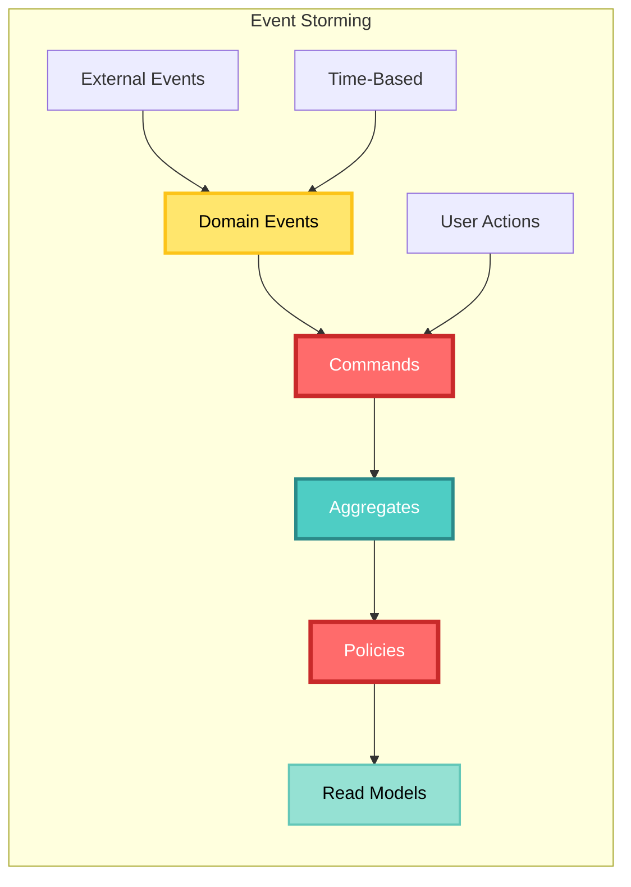

# CIM Domain Development Guide

Learn how to create custom domains for the Composable Information Machine, from concept to deployment.

## Table of Contents

1. [Understanding Domains](#understanding-domains)
2. [Domain Design Process](#domain-design-process)
3. [Implementation Guide](#implementation-guide)
4. [Testing Domains](#testing-domains)
5. [Domain Composition](#domain-composition)
6. [Publishing Domains](#publishing-domains)
7. [Real-World Examples](#real-world-examples)

## Understanding Domains

### What is a Domain?

In CIM, a domain is a bounded context that encapsulates:
- **Business Logic**: Rules and behaviors specific to a business area
- **Data Models**: Entities, value objects, and aggregates
- **Events**: Things that happen within the domain
- **Commands**: Operations that change state
- **Queries**: Ways to retrieve information
- **Policies**: Business rules and constraints

### Domain Principles

1. **Isolation**: Domains don't directly access each other's internals
2. **Event-Driven**: Domains communicate through events only
3. **Self-Contained**: Each domain is independently deployable
4. **Business-Focused**: Technical concerns are secondary to business logic

## Domain Design Process

### Step 1: Identify the Bounded Context

Start with Event Storming to discover your domain:



### Step 2: Define Domain Language

Create a ubiquitous language for your domain:

```yaml
# domain-language.yaml
domain: inventory
terms:
  - name: SKU
    definition: Stock Keeping Unit - unique product identifier
    aliases: [product_code, item_number]
    
  - name: Stock Level
    definition: Current quantity available for sale
    constraints: 
      - Must be non-negative
      - Updates must be atomic
      
  - name: Reorder Point
    definition: Quantity threshold triggering reorder
    related: [Stock Level, Lead Time]
```

### Step 3: Model Domain Events

Events are past-tense facts:

```rust
// events.rs
#[derive(Debug, Clone, Serialize, Deserialize)]
#[serde(tag = "type")]
pub enum InventoryEvent {
    // Item lifecycle
    ItemCreated {
        sku: String,
        name: String,
        initial_quantity: u32,
    },
    ItemDiscontinued {
        sku: String,
        reason: String,
    },
    
    // Stock movements
    StockReceived {
        sku: String,
        quantity: u32,
        batch_id: String,
        supplier: String,
    },
    StockSold {
        sku: String,
        quantity: u32,
        order_id: String,
    },
    StockAdjusted {
        sku: String,
        old_quantity: u32,
        new_quantity: u32,
        reason: String,
    },
    
    // Alerts
    LowStockAlert {
        sku: String,
        current_quantity: u32,
        reorder_point: u32,
    },
}
```

### Step 4: Design Aggregates

Aggregates enforce business rules:

```rust
// aggregates/inventory_item.rs
pub struct InventoryItem {
    sku: String,
    name: String,
    quantity: u32,
    reorder_point: u32,
    reorder_quantity: u32,
    discontinued: bool,
}

impl InventoryItem {
    pub fn receive_stock(&mut self, quantity: u32, batch_id: String) 
        -> Result<Vec<InventoryEvent>, DomainError> {
        if self.discontinued {
            return Err(DomainError::ItemDiscontinued);
        }
        
        let old_quantity = self.quantity;
        self.quantity += quantity;
        
        let mut events = vec![
            InventoryEvent::StockReceived {
                sku: self.sku.clone(),
                quantity,
                batch_id,
                supplier: "".to_string(), // Would come from command
            }
        ];
        
        // Check if we were below reorder point and now above
        if old_quantity < self.reorder_point && 
           self.quantity >= self.reorder_point {
            // Cancel any pending reorders
            events.push(InventoryEvent::ReorderCancelled {
                sku: self.sku.clone(),
            });
        }
        
        Ok(events)
    }
    
    pub fn sell(&mut self, quantity: u32, order_id: String) 
        -> Result<Vec<InventoryEvent>, DomainError> {
        if quantity > self.quantity {
            return Err(DomainError::InsufficientStock {
                requested: quantity,
                available: self.quantity,
            });
        }
        
        self.quantity -= quantity;
        
        let mut events = vec![
            InventoryEvent::StockSold {
                sku: self.sku.clone(),
                quantity,
                order_id,
            }
        ];
        
        // Check if we need to reorder
        if self.quantity < self.reorder_point {
            events.push(InventoryEvent::LowStockAlert {
                sku: self.sku.clone(),
                current_quantity: self.quantity,
                reorder_point: self.reorder_point,
            });
        }
        
        Ok(events)
    }
}
```

## Implementation Guide

### Project Structure

```
cim-domain-inventory/
├── Cargo.toml
├── README.md
├── src/
│   ├── lib.rs              # Public API
│   ├── aggregates/         # Domain aggregates
│   │   ├── mod.rs
│   │   └── inventory_item.rs
│   ├── events/            # Domain events
│   │   ├── mod.rs
│   │   └── inventory.rs
│   ├── commands/          # Command definitions
│   │   ├── mod.rs
│   │   └── inventory.rs
│   ├── queries/           # Query definitions
│   │   ├── mod.rs
│   │   └── inventory.rs
│   ├── policies/          # Business policies
│   │   ├── mod.rs
│   │   └── reorder.rs
│   ├── projections/       # Read models
│   │   ├── mod.rs
│   │   └── stock_levels.rs
│   └── errors.rs          # Domain errors
├── tests/
│   ├── unit/
│   ├── integration/
│   └── fixtures/
└── examples/
    ├── basic_usage.rs
    └── advanced_scenarios.rs
```

### Core Dependencies

```toml
# Cargo.toml
[package]
name = "cim-domain-inventory"
version = "0.1.0"
edition = "2021"

[dependencies]
# Core CIM dependencies
cim-domain = { git = "https://github.com/thecowboyai/cim-domain" }
cim-core = { git = "https://github.com/thecowboyai/cim-core" }

# Async runtime
tokio = { version = "1", features = ["full"] }
async-trait = "0.1"

# Serialization
serde = { version = "1.0", features = ["derive"] }
serde_json = "1.0"

# Error handling
thiserror = "1.0"
anyhow = "1.0"

# Logging
tracing = "0.1"

[dev-dependencies]
# Testing
proptest = "1.0"
fake = "2.5"
tokio-test = "0.4"
```

### Domain Registration

```rust
// lib.rs
use cim_domain::{Domain, DomainBuilder};

pub fn register_inventory_domain() -> Domain {
    DomainBuilder::new("inventory")
        .with_aggregates(vec![
            Box::new(InventoryItemFactory),
        ])
        .with_event_handlers(vec![
            Box::new(StockLevelProjection),
            Box::new(ReorderPolicy),
        ])
        .with_command_handlers(vec![
            Box::new(CreateItemHandler),
            Box::new(ReceiveStockHandler),
            Box::new(SellStockHandler),
        ])
        .with_query_handlers(vec![
            Box::new(GetStockLevelHandler),
            Box::new(LowStockReportHandler),
        ])
        .build()
}
```

### Command Handling

```rust
// commands/handlers.rs
pub struct ReceiveStockHandler;

#[async_trait]
impl CommandHandler for ReceiveStockHandler {
    type Command = ReceiveStock;
    type Aggregate = InventoryItem;
    type Event = InventoryEvent;
    type Error = DomainError;
    
    async fn handle(
        &self,
        command: Self::Command,
        store: &dyn EventStore,
    ) -> Result<Vec<Self::Event>, Self::Error> {
        // Load aggregate
        let mut item = store
            .load_aggregate::<InventoryItem>(&command.sku)
            .await?;
        
        // Apply business logic
        let events = item.receive_stock(
            command.quantity,
            command.batch_id,
        )?;
        
        // Save events
        store.save_events(&command.sku, &events).await?;
        
        Ok(events)
    }
}
```

### Query Implementation

```rust
// queries/handlers.rs
pub struct LowStockReportHandler;

#[async_trait]
impl QueryHandler for LowStockReportHandler {
    type Query = GetLowStockItems;
    type Result = Vec<LowStockItem>;
    type Error = QueryError;
    
    async fn handle(
        &self,
        query: Self::Query,
        read_store: &dyn ReadModelStore,
    ) -> Result<Self::Result, Self::Error> {
        let items = read_store
            .query("stock_levels")
            .filter("quantity", "<", query.threshold)
            .order_by("quantity", Ascending)
            .limit(query.limit.unwrap_or(100))
            .execute()
            .await?;
        
        Ok(items)
    }
}
```

## Testing Domains

### Unit Testing Aggregates

```rust
#[cfg(test)]
mod tests {
    use super::*;
    
    #[test]
    fn test_stock_sale_reduces_quantity() {
        let mut item = InventoryItem::new("SKU123", "Widget", 100);
        
        let events = item.sell(10, "ORDER123").unwrap();
        
        assert_eq!(item.quantity(), 90);
        assert_eq!(events.len(), 1);
        matches!(events[0], InventoryEvent::StockSold { quantity: 10, .. });
    }
    
    #[test]
    fn test_insufficient_stock_returns_error() {
        let mut item = InventoryItem::new("SKU123", "Widget", 5);
        
        let result = item.sell(10, "ORDER123");
        
        assert!(matches!(
            result,
            Err(DomainError::InsufficientStock { requested: 10, available: 5 })
        ));
    }
}
```

### Property-Based Testing

```rust
use proptest::prelude::*;

proptest! {
    #[test]
    fn stock_never_negative(
        initial in 0u32..1000,
        operations in prop::collection::vec(
            (bool::ANY, 1u32..100),
            0..50
        )
    ) {
        let mut item = InventoryItem::new("SKU", "Item", initial);
        
        for (is_receive, quantity) in operations {
            if is_receive {
                item.receive_stock(quantity, "BATCH").ok();
            } else {
                item.sell(quantity, "ORDER").ok();
            }
        }
        
        // Invariant: stock is never negative
        // (enforced by domain logic)
        prop_assert!(item.quantity() >= 0);
    }
}
```

### Integration Testing

```rust
#[tokio::test]
async fn test_inventory_workflow() {
    let cim = CIM::new()
        .with_domain(register_inventory_domain())
        .start()
        .await
        .unwrap();
    
    // Create item
    let create_result = cim
        .send_command(CreateItem {
            sku: "WIDGET-001".to_string(),
            name: "Super Widget".to_string(),
            initial_quantity: 50,
            reorder_point: 20,
        })
        .await
        .unwrap();
    
    // Sell some stock
    let sell_result = cim
        .send_command(SellStock {
            sku: "WIDGET-001".to_string(),
            quantity: 35,
            order_id: "ORDER-123".to_string(),
        })
        .await
        .unwrap();
    
    // Should trigger low stock alert
    let events = cim
        .query_events()
        .for_aggregate("WIDGET-001")
        .event_type("LowStockAlert")
        .execute()
        .await
        .unwrap();
    
    assert_eq!(events.len(), 1);
}
```

## Domain Composition

### Cross-Domain Sagas

```rust
// Saga: Order fulfillment across multiple domains
pub struct OrderFulfillmentSaga {
    order_id: String,
    state: SagaState,
}

impl Saga for OrderFulfillmentSaga {
    async fn handle_event(&mut self, event: DomainEvent) -> Result<Vec<Command>> {
        match (&self.state, event) {
            // Order placed - check inventory
            (SagaState::Started, OrderEvent::Placed { items, .. }) => {
                self.state = SagaState::CheckingInventory;
                Ok(items.into_iter().map(|item| {
                    Command::Inventory(CheckAvailability {
                        sku: item.sku,
                        quantity: item.quantity,
                    })
                }).collect())
            },
            
            // Inventory checked - reserve stock
            (SagaState::CheckingInventory, InventoryEvent::Available { .. }) => {
                self.state = SagaState::ReservingStock;
                Ok(vec![Command::Inventory(ReserveStock {
                    order_id: self.order_id.clone(),
                    items: vec![], // Would include items
                })])
            },
            
            // Stock reserved - charge payment
            (SagaState::ReservingStock, InventoryEvent::Reserved { .. }) => {
                self.state = SagaState::ProcessingPayment;
                Ok(vec![Command::Payment(ChargeCard {
                    order_id: self.order_id.clone(),
                    amount: 0.0, // Would calculate
                })])
            },
            
            // Handle compensations
            (_, InventoryEvent::InsufficientStock { .. }) => {
                self.state = SagaState::Cancelling;
                Ok(vec![Command::Order(CancelOrder {
                    order_id: self.order_id.clone(),
                    reason: "Insufficient inventory".to_string(),
                })])
            },
            
            _ => Ok(vec![]),
        }
    }
}
```

### Policy Coordination

```rust
// Policy: Automatic reordering
pub struct AutoReorderPolicy;

impl Policy for AutoReorderPolicy {
    async fn evaluate(&self, event: DomainEvent) -> Result<Vec<Command>> {
        match event {
            InventoryEvent::LowStockAlert { sku, current_quantity, reorder_point } => {
                // Check supplier domain for availability
                let supplier_check = Command::Supplier(CheckAvailability {
                    sku: sku.clone(),
                });
                
                // Create purchase order if available
                let create_po = Command::Purchasing(CreatePurchaseOrder {
                    sku,
                    quantity: reorder_point * 2, // Simple reorder formula
                });
                
                Ok(vec![supplier_check, create_po])
            },
            _ => Ok(vec![]),
        }
    }
}
```

## Publishing Domains

### Documentation Requirements

Create comprehensive documentation:

```markdown
# CIM Domain: Inventory

## Overview
This domain manages inventory levels, stock movements, and reordering.

## Events
- `ItemCreated`: New inventory item added
- `StockReceived`: Stock received from supplier
- `StockSold`: Stock sold to customer
- `LowStockAlert`: Stock below reorder point

## Commands
- `CreateItem`: Add new inventory item
- `ReceiveStock`: Record stock receipt
- `SellStock`: Record stock sale
- `AdjustStock`: Manual stock adjustment

## Queries
- `GetStockLevel`: Current stock for SKU
- `GetLowStockItems`: Items below reorder point
- `GetStockMovements`: Stock movement history

## Integration Points
- **Order Domain**: Responds to order events
- **Supplier Domain**: Triggers purchase orders
- **Warehouse Domain**: Coordinates with physical stock

## Configuration
```yaml
inventory:
  reorder_policy: automatic
  low_stock_threshold: 0.2
  safety_stock_days: 7
```
```

### Package Metadata

```toml
# Cargo.toml
[package]
name = "cim-domain-inventory"
version = "0.1.0"
authors = ["Your Name <you@example.com>"]
edition = "2021"
description = "Inventory management domain for CIM"
documentation = "https://docs.rs/cim-domain-inventory"
repository = "https://github.com/yourusername/cim-domain-inventory"
license = "MIT OR Apache-2.0"
keywords = ["cim", "domain", "inventory", "ddd", "event-sourcing"]
categories = ["business", "event-driven"]

[badges]
maintenance = { status = "actively-developed" }
```

### Publishing Checklist

- [ ] All tests pass
- [ ] Documentation complete
- [ ] Examples provided
- [ ] README with quick start
- [ ] CHANGELOG updated
- [ ] Version bumped
- [ ] License specified
- [ ] CI/CD configured

## Real-World Examples

### Example 1: E-Commerce Inventory

```rust
// Complex inventory with variants
pub struct ProductVariant {
    sku: String,
    parent_sku: String,
    attributes: HashMap<String, String>, // size, color, etc.
    stock: u32,
}

// Events for variant management
pub enum VariantEvent {
    VariantCreated {
        sku: String,
        parent_sku: String,
        attributes: HashMap<String, String>,
    },
    StockTransferred {
        from_sku: String,
        to_sku: String,
        quantity: u32,
    },
}
```

### Example 2: Warehouse Management

```rust
// Location-aware inventory
pub struct WarehouseLocation {
    warehouse_id: String,
    zone: String,
    rack: String,
    shelf: String,
    bin: String,
}

pub struct LocationInventory {
    sku: String,
    location: WarehouseLocation,
    quantity: u32,
    lot_number: Option<String>,
    expiration: Option<DateTime<Utc>>,
}
```

### Example 3: Manufacturing

```rust
// Bill of Materials
pub struct BillOfMaterials {
    finished_good_sku: String,
    components: Vec<Component>,
}

pub struct Component {
    sku: String,
    quantity_required: f64,
    unit_of_measure: String,
}

// Manufacturing events
pub enum ManufacturingEvent {
    ProductionOrderCreated {
        order_id: String,
        finished_good_sku: String,
        quantity: u32,
    },
    ComponentsConsumed {
        order_id: String,
        components: Vec<(String, f64)>,
    },
    FinishedGoodsProduced {
        order_id: String,
        sku: String,
        quantity: u32,
    },
}
```

## Best Practices

### 1. Domain Boundaries
- Keep domains focused on a single business capability
- Don't mix concerns (e.g., inventory and pricing)
- Use events for cross-domain communication

### 2. Event Design
- Make events self-contained
- Include all necessary data
- Use domain language in event names
- Version events for evolution

### 3. Testing Strategy
- Test business rules extensively
- Use property-based testing for invariants
- Test saga compensations
- Verify event ordering

### 4. Performance
- Keep aggregates small
- Use projections for queries
- Implement snapshotting for large event streams
- Consider event archiving

### 5. Evolution
- Plan for change from the start
- Use event versioning
- Maintain backward compatibility
- Document breaking changes

## Conclusion

Building domains for CIM is about capturing business logic in a way that's:
- **Maintainable**: Clear separation of concerns
- **Testable**: Easy to verify business rules
- **Composable**: Works well with other domains
- **Evolvable**: Can adapt to changing requirements

Start with a clear understanding of your business domain, implement incrementally, and let the domain model evolve with your understanding.

---

*Next: [Deployment Guide](./deployment-guide.md) - Learn how to deploy CIM domains to production*