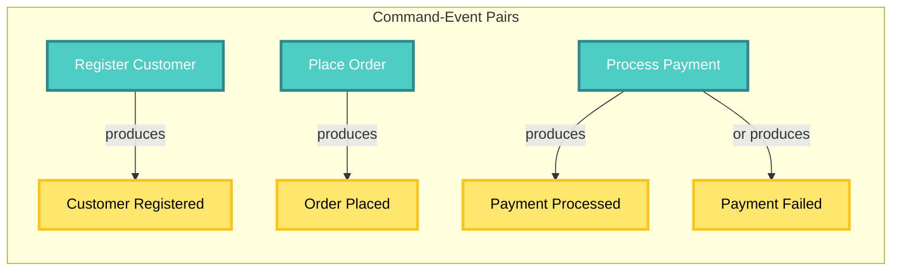
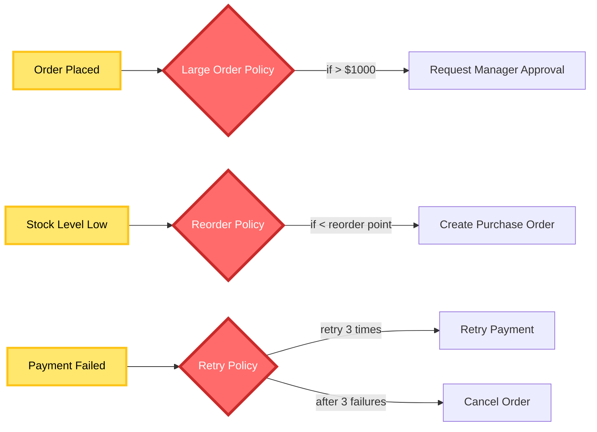
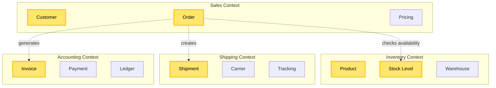

# Event Storming Guide for CIM

Event Storming is the **mandatory first step** in creating any CIM domain. It's a workshop technique that helps you discover the true nature of your business domain by focusing on what happens (events) rather than data structures.

## Why Event Storming First?

Without Event Storming, you risk:
- Building the wrong system
- Missing critical business rules
- Creating domains that don't reflect reality
- Wasting time on features nobody needs

With Event Storming, you gain:
- Deep understanding of the business domain
- Shared language between technical and business people
- Discovery of hidden complexity and rules
- Clear boundaries between domains

## Tools for Visual Design

CIM uses visual graphs as the primary design artifact. AI agents then generate code from these graphs.

### Primary Tools

#### Traditional Event Storming (Recommended)
- **Why**: Traditional Approach, No technology needed just Butcher Paper and Sticky Notes
- **Use for**: Event Storming, Context Maps, Concept Diagrams
- **Export**: Photo (preserves all data), PNG (for documentation), Extract to CIM Graph using AI.

#### ExcaliDraw (Recommended)
- **Why**: Open source, local-first, excellent export formats
- **Use for**: Event Storming, Context Maps, Concept Diagrams
- **Export**: JSON (preserves all data), SVG (for documentation)
- **Library**: https://libraries.excalidraw.com - CIM component library

#### Arrows.app (For Graph Databases)
- **Why**: Designed for property graphs, exports Cypher
- **Use for**: Domain relationships, Knowledge graphs
- **Export**: Cypher queries, JSON, SVG
- **Integration**: Direct to Neo4j or CIM Knowledge Graph

### Tool Setup

```bash
# Unlimited roll of Paper
1. Use multi-colored notes with large, hand written text
2. Arrange as required
3. Take a picture
4. Import into CIM - Alchemist

# ExcaliDraw with CIM Libraries
1. Visit https://excalidraw.com
2. Menu → Libraries → Browse Libraries
3. Search "CIM Event Storm"
4. Add: Events, Commands, Aggregates, Policies

# Arrows.app for Relationships
1. Visit https://arrows.app
2. Create New Diagram
3. Use CIM naming conventions:
   - Nodes: PascalCase (Order, Customer)
   - Relationships: UPPER_SNAKE (PLACED_BY, CONTAINS)
   - Properties: camelCase (orderId, totalAmount)
```

### Why Visual First?

1. **Graphs are executable specifications** - AI agents read these directly
2. **No ambiguity** - Visual relationships are explicit
3. **Collaborative** - Business and tech speak the same language
4. **Version controlled** - JSON exports go in git

## Event Storming with ExcaliDraw

### Phase 1: Chaotic Exploration (45-60 minutes)

#### Setting Up ExcaliDraw

```json
// ExcaliDraw Event Storm Template
{
  "elements": {
    "event": {
      "type": "rectangle",
      "backgroundColor": "#ff9f43",  // Orange for events
      "strokeWidth": 2,
      "roughness": 1,
      "fontSize": 16,
      "fontFamily": "Cascadia",
      "textAlign": "center",
      "verticalAlign": "middle"
    }
  }
}
```

#### Creating Events in ExcaliDraw

1. **Create Event Cards**:
   - Rectangle tool (R)
   - Orange background (#ff9f43)
   - Past tense text: "Order Placed", "Payment Received"
   - Group (Ctrl+G) text with rectangle

2. **Organize Spatially**:
   - Left to right = timeline
   - Top to bottom = different flows
   - Clusters = related events

3. **Export for AI Processing**:
   ```bash
   # Export as JSON to preserve all metadata
   ExcaliDraw → Menu → Export → JSON
   
   # File: event-storm-2024-01-29.excalidraw
   git add event-storm-2024-01-29.excalidraw
   git commit -m "Event storm session: Order fulfillment domain"
   ```

**Example ExcaliDraw Event Storm**:
```
┌─────────────────┐    ┌─────────────────┐    ┌─────────────────┐
│    Customer     │    │     Order       │    │    Payment      │
│   Registered    │───▶│    Placed       │───▶│   Processed     │
└─────────────────┘    └─────────────────┘    └─────────────────┘
                              │                        │
                              ▼                        ▼
                       ┌─────────────────┐    ┌─────────────────┐
                       │   Inventory     │    │    Payment      │
                       │    Checked      │    │     Failed      │
                       └─────────────────┘    └─────────────────┘
```

### Phase 2: Enforce Timeline (30-45 minutes)

Arrange events in chronological order.

```
[Customer Registered] → [Order Placed] → [Payment Processed] → [Order Confirmed] → [Items Picked] → [Order Shipped]
                              ↓
                    [Payment Failed] → [Order Cancelled]
```

**Key Questions:**
- What happens first?
- What triggers what?
- Are there parallel flows?
- Where are the decision points?

### Phase 3: Find Commands (30 minutes)

Add blue sticky notes for commands that cause events.



**Commands represent:**
- User intentions
- System triggers
- Time-based actions
- External system calls

### Phase 4: Identify Aggregates (30 minutes)

Group commands and events around yellow aggregates.

```yaml
Customer Aggregate:
  commands:
    - Register Customer
    - Update Profile
    - Change Password
  events:
    - Customer Registered
    - Profile Updated
    - Password Changed
  state:
    - Customer ID
    - Email
    - Profile Info
    - Preferences

Order Aggregate:
  commands:
    - Place Order
    - Cancel Order
    - Update Shipping Address
  events:
    - Order Placed
    - Order Cancelled
    - Shipping Address Updated
  state:
    - Order ID
    - Customer ID
    - Line Items
    - Status
    - Total Amount
```

### Phase 5: Discover Policies (20 minutes)

Add pink sticky notes for automated policies.



**Policies are:**
- Business rules that trigger automatically
- "When X happens, then Y should happen"
- Often time-based or threshold-based
- The "smart" part of your system

### Phase 6: Define Bounded Contexts (20 minutes)

Draw boundaries around related aggregates.



## Documenting Results

### Event Catalog

Create a structured catalog of discovered events:

```yaml
# events-catalog.yaml
domain: E-Commerce
contexts:
  - name: Sales
    events:
      - name: Customer Registered
        triggers:
          - command: Register Customer
          - source: Registration Form
        data:
          - customer_id: UUID
          - email: Email
          - name: String
          - registered_at: Timestamp
        produces:
          - Welcome Email Sent
          - Customer Profile Created
          
      - name: Order Placed
        triggers:
          - command: Place Order
          - source: Shopping Cart
        data:
          - order_id: UUID
          - customer_id: UUID
          - line_items: Array<LineItem>
          - total_amount: Money
          - placed_at: Timestamp
        policies:
          - Large Order Approval (if > $1000)
          - Inventory Reservation
          - Fraud Check
```

### State Machine Discovery

From events, derive state machines:

```rust
// Discovered Order States
pub enum OrderState {
    // Initial state
    Draft {
        items: Vec<LineItem>,
        customer_id: CustomerId,
    },
    
    // After "Order Placed" event
    Placed {
        order_id: OrderId,
        items: Vec<LineItem>,
        total: Money,
    },
    
    // After "Payment Processed" event
    Paid {
        order_id: OrderId,
        payment_id: PaymentId,
    },
    
    // After "Items Shipped" event
    Shipped {
        order_id: OrderId,
        tracking_number: String,
    },
    
    // Terminal states
    Delivered {
        order_id: OrderId,
        delivered_at: Timestamp,
    },
    
    Cancelled {
        order_id: OrderId,
        reason: String,
    },
}
```

### Policy Documentation

```yaml
# policies.yaml
policies:
  - name: Automatic Reorder Policy
    trigger: Stock Level Low
    conditions:
      - current_stock < reorder_point
      - supplier_available = true
      - pending_orders = 0
    actions:
      - Create Purchase Order
      - Notify Purchasing Manager
    implementation: |
      When Stock Level Low event received:
        1. Check current stock against reorder point
        2. Verify no pending orders exist
        3. Check supplier availability
        4. Calculate order quantity (reorder_quantity)
        5. Create and submit purchase order
        6. Update pending orders
```

## Common Patterns

### 1. Saga Pattern
Long-running business processes:

```
[Order Placed] → [Inventory Reserved] → [Payment Processed] → [Items Picked] → [Order Shipped]
       ↓                ↓                      ↓                    ↓
[Insufficient]   [Payment Failed]     [Picking Failed]    [Shipping Failed]
       ↓                ↓                      ↓                    ↓
[Order Failed]   [Inventory Released]  [Order On Hold]    [Retry Shipping]
```

### 2. Event Sourcing Pattern
State changes through events:

```
Initial State: {}
+ Customer Registered → {customer_id, email, name}
+ Address Added → {customer_id, email, name, address}
+ Order Placed → {customer_id, email, name, address, orders: [order1]}
```

### 3. CQRS Pattern
Commands separate from queries:

```yaml
Commands (Write Side):
  - Register Customer
  - Place Order
  - Update Inventory

Events:
  - Customer Registered
  - Order Placed
  - Inventory Updated

Read Models (Query Side):
  - Customer Profile View
  - Order History View
  - Available Inventory View
```

## Tips for Successful Event Storming

### Do's:
- ✅ Include real domain experts
- ✅ Use business language, not technical terms
- ✅ Focus on what happens, not how
- ✅ Embrace chaos in the beginning
- ✅ Ask "what happens next?"
- ✅ Look for temporal triggers ("every Monday", "end of month")
- ✅ Identify external system interactions

### Don'ts:
- ❌ Design the database
- ❌ Discuss implementation details
- ❌ Skip events because they seem "obvious"
- ❌ Let one person dominate
- ❌ Stop at happy paths only
- ❌ Ignore edge cases
- ❌ Rush the process

## From Event Storm to CIM Domain

### 1. Create Domain Structure

```bash
# Based on your event storm
cargo new --lib my-sales-domain
cd my-sales-domain

# Create structure matching discovered contexts
mkdir -p src/{aggregates,commands,events,policies,state_machines}
```

### 2. Implement Events First

```rust
// src/events.rs
// Direct translation from orange sticky notes
#[derive(Debug, Clone, Event)]
pub enum SalesEvent {
    CustomerRegistered {
        customer_id: CustomerId,
        email: String,
        name: String,
    },
    OrderPlaced {
        order_id: OrderId,
        customer_id: CustomerId,
        items: Vec<LineItem>,
        total: Money,
    },
    PaymentProcessed {
        order_id: OrderId,
        payment_id: PaymentId,
        amount: Money,
    },
}
```

### 3. Create State Machines

```rust
// src/state_machines/order.rs
// Based on discovered state transitions
impl StateMachine for OrderState {
    type Event = OrderEvent;
    
    fn apply_event(&mut self, event: Self::Event) {
        match (self, event) {
            (Self::Draft { .. }, OrderEvent::Placed { order_id, .. }) => {
                *self = Self::Placed { order_id, .. };
            }
            // More transitions...
        }
    }
}
```

## Continuous Event Storming

Event Storming isn't a one-time activity:

1. **Regular Reviews**: Every sprint/month
2. **New Feature Discovery**: Before adding features
3. **Problem Investigation**: When issues arise
4. **Domain Evolution**: As business changes

## Tools and Resources

### Digital Tools
- [Miro Event Storming Template](https://miro.com/templates/event-storming/)
- [EventStorming.com](https://www.eventstorming.com/)
- [Domain Storytelling](https://domainstorytelling.org/)

### Books
- "Event Storming" by Alberto Brandolini
- "Domain-Driven Design" by Eric Evans
- "Implementing Domain-Driven Design" by Vaughn Vernon

### Next Steps
- [Context Mapping Guide](./context-mapping-guide.md)
- [State Machine Patterns](./state-machine-patterns.md)
- [Domain Development Guide](./domain-development-guide.md)

---

**Remember**: Event Storming reveals the true complexity of your domain. If it seems simple, you haven't dug deep enough. The messier the wall, the better your understanding.