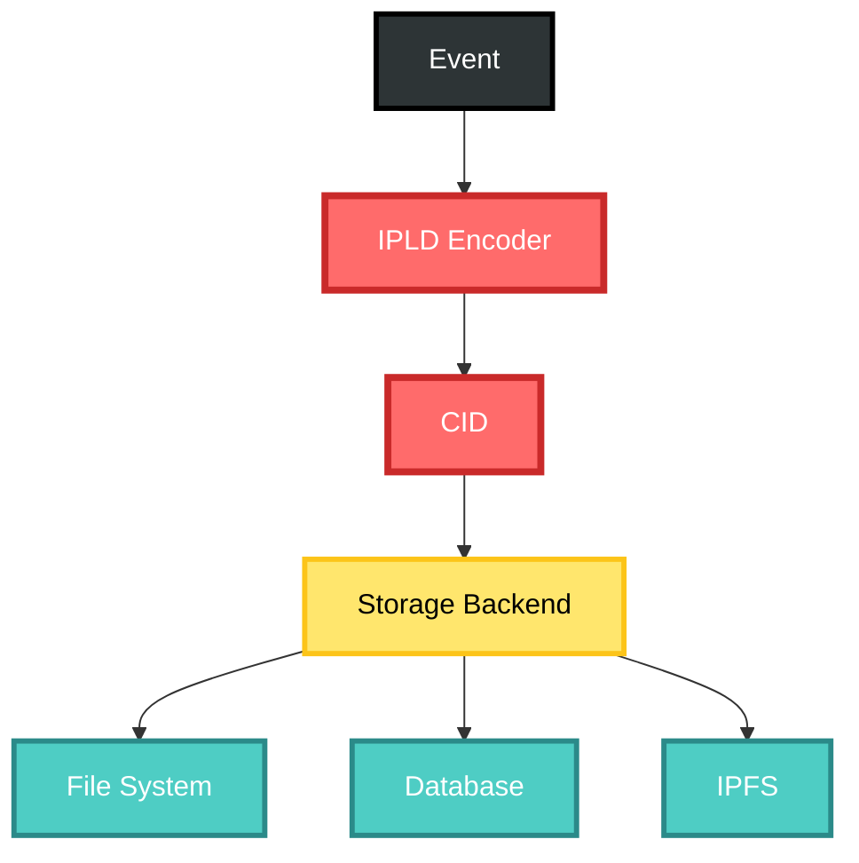
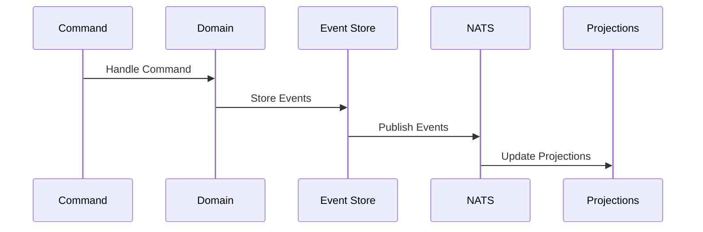

# Phase 1: Foundation Implementation

## Overview

Phase 1 establishes the core infrastructure that all other components will build upon. This is the critical foundation for the entire CIM system.

## Timeline: Months 1-2

### Month 1: Core Event System

#### Week 1-2: Event Infrastructure


**Deliverables:**
- [ ] Event struct with correlation/causation
- [ ] CID chain implementation
- [ ] Event factory patterns
- [ ] Unit tests with 100% coverage

**Code Structure:**
```rust
// cim-core/src/event.rs
pub struct DomainEvent {
    pub event_id: EventId,
    pub correlation_id: CorrelationId,
    pub causation_id: CausationId,
    pub event_cid: Cid,
    pub previous_cid: Option<Cid>,
    pub payload: serde_json::Value,
    pub metadata: EventMetadata,
}

// cim-core/src/correlation.rs
pub struct CorrelationEngine {
    chains: HashMap<CorrelationId, CorrelationChain>,
}
```

#### Week 3-4: NATS Integration
**Deliverables:**
- [ ] NATS client wrapper
- [ ] JetStream configuration
- [ ] Event publishing with headers
- [ ] Event subscription patterns
- [ ] Connection resilience

**Integration Points:**
```rust
// cim-infrastructure/src/nats.rs
pub struct NatsEventBus {
    client: async_nats::Client,
    jetstream: async_nats::jetstream::Context,
}

impl EventBus for NatsEventBus {
    async fn publish(&self, event: DomainEvent) -> Result<()>;
    async fn subscribe(&self, subject: &str) -> Result<EventStream>;
}
```

### Month 2: Storage and Domain Framework

#### Week 5-6: IPLD Storage Layer
**Deliverables:**
- [ ] IPLD encoding for events
- [ ] Content-addressed storage
- [ ] Storage abstraction layer
- [ ] Retrieval by CID
- [ ] Batch operations

**Architecture:**


#### Week 7-8: Domain Framework
**Deliverables:**
- [ ] Domain trait definition
- [ ] Command handler pattern
- [ ] Event handler pattern
- [ ] Query handler pattern
- [ ] Domain registration

**Framework Structure:**
```rust
// cim-domain/src/lib.rs
pub trait Domain: Send + Sync {
    type Command: Command;
    type Event: Event;
    type Query: Query;
    type Error: Error;
    
    fn handle_command(&self, cmd: Self::Command) -> Result<Vec<Self::Event>>;
    fn handle_query(&self, query: Self::Query) -> Result<QueryResponse>;
}

// cim-domain/src/registry.rs
pub struct DomainRegistry {
    domains: HashMap<DomainId, Box<dyn Domain>>,
}
```

## Technical Specifications

### Event Flow Architecture


### Performance Requirements
- Event creation: >100,000/second
- Event publishing: >10,000/second  
- Event retrieval: <10ms by ID
- Correlation query: <50ms

### Testing Strategy

#### Unit Tests
```rust
#[test]
fn test_event_correlation() {
    let root = EventFactory::create_root(TestEvent {});
    let child = EventFactory::create_caused_by(TestEvent {}, &root);
    
    assert_eq!(child.correlation_id, root.correlation_id);
    assert_eq!(child.causation_id.0, root.event_id.0);
}
```

#### Integration Tests
```rust
#[tokio::test]
async fn test_event_flow() {
    let bus = NatsEventBus::new().await.unwrap();
    let store = IpldEventStore::new();
    
    let event = create_test_event();
    store.append(&event).await.unwrap();
    bus.publish(event).await.unwrap();
    
    // Verify event in store and bus
}
```

## Dependencies

### External Crates
```toml
[dependencies]
async-nats = "0.33"
ipld = "0.16"
cid = "0.11"
serde = { version = "1.0", features = ["derive"] }
serde_json = "1.0"
tokio = { version = "1.35", features = ["full"] }
uuid = { version = "1.6", features = ["v4", "serde"] }
```

### Internal Dependencies
- `cim-core`: Core types and traits
- `cim-infrastructure`: NATS and storage implementations

## Success Criteria

### Must Have
- [x] Events with correlation/causation
- [x] CID chain integrity
- [x] NATS publishing/subscribing
- [x] IPLD storage working
- [x] Domain framework established
- [x] 100% test coverage on critical paths

### Nice to Have
- [ ] Event replay functionality
- [ ] Compression for large events
- [ ] Metrics collection
- [ ] Admin UI for monitoring

## Risk Mitigation

### Technical Risks
1. **NATS Performance**: Benchmark early and often
2. **Storage Scalability**: Design for sharding from start
3. **Memory Usage**: Implement event pooling

### Mitigation Actions
- Daily performance tests
- Memory profiling
- Load testing framework
- Fallback strategies

## Deliverable Checklist

### Week 1-2 Checklist
- [ ] Event types defined
- [ ] Correlation engine working
- [ ] CID chains implemented
- [ ] Factory patterns tested
- [ ] Documentation complete

### Week 3-4 Checklist
- [ ] NATS wrapper complete
- [ ] JetStream configured
- [ ] Publishing working
- [ ] Subscribing working
- [ ] Resilience tested

### Week 5-6 Checklist
- [ ] IPLD encoding working
- [ ] Storage abstraction done
- [ ] CID retrieval working
- [ ] Batch operations tested
- [ ] Performance benchmarked

### Week 7-8 Checklist
- [ ] Domain trait finalized
- [ ] Handler patterns done
- [ ] Registry working
- [ ] Example domain created
- [ ] Integration tested

## Next Phase Preparation

By the end of Phase 1, we should have:
1. A working event system with correlation
2. NATS messaging infrastructure
3. IPLD storage capabilities
4. Domain framework ready for implementation
5. Comprehensive test suite

This foundation enables Phase 2 to focus purely on domain implementation without worrying about infrastructure.