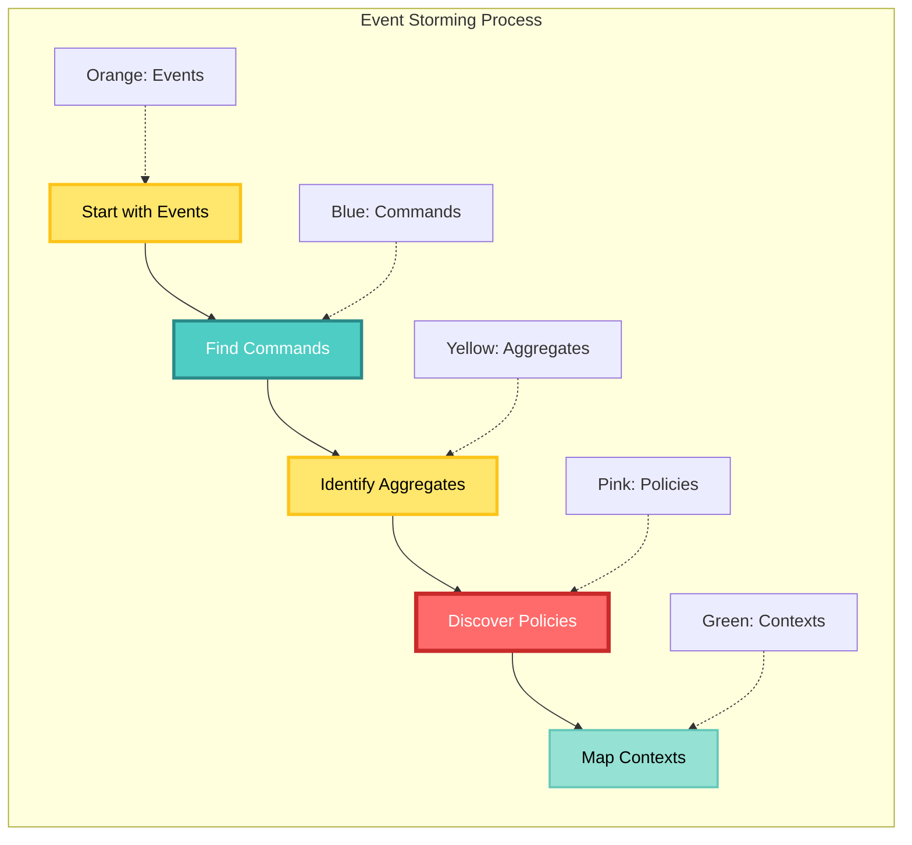

# CIM Quick Start Guide

Build your first Composable Information Machine by understanding your business domain first.

## What is a CIM?

A CIM is a living system that understands and manages your business information through:
- **Event Storming** - Discovering what happens in your business
- **Domain Modeling** - Creating state machines that reflect reality
- **Context Mapping** - Understanding relationships between concepts
- **Workflow Graphs** - Visual representation of business processes

## Prerequisites

- Git installed
- Rust toolchain (for building domains)
- Docker or Podman (for NATS)
- A clear business problem to solve
- Stakeholders who understand the domain

## Step 1: Event Storming (Essential First Step!)

Before writing any code, you MUST understand your domain through Event Storming.

### Gather Your Team

```bash
# You need:
# - Domain experts (people who do the work)
# - Developers
# - Business stakeholders
# - A large wall or whiteboard
# - Lots of sticky notes (orange for events)
```

### Run an Event Storming Session



### Example: Inventory Management Domain

Let's discover an inventory domain:

```yaml
# event-storm-results.yaml
events:
  - name: "Item Received from Supplier"
    triggers: "Delivery arrival"
    data: "SKU, quantity, supplier, batch"
    
  - name: "Stock Count Adjusted"
    triggers: "Physical count mismatch"
    data: "SKU, old_count, new_count, reason"
    
  - name: "Item Sold"
    triggers: "Customer purchase"
    data: "SKU, quantity, order_id"
    
  - name: "Low Stock Alert Triggered"
    triggers: "Stock below threshold"
    data: "SKU, current_level, reorder_point"

commands:
  - name: "Receive Stock"
    actor: "Warehouse Staff"
    produces: "Item Received from Supplier"
    
  - name: "Sell Item"
    actor: "Sales System"
    produces: "Item Sold"
    
  - name: "Adjust Stock Count"
    actor: "Inventory Manager"
    produces: "Stock Count Adjusted"

aggregates:
  - name: "Inventory Item"
    commands: ["Receive Stock", "Sell Item", "Adjust Stock Count"]
    state: "Current stock level, reorder point, location"

policies:
  - name: "Reorder Policy"
    trigger: "Low Stock Alert Triggered"
    action: "Create Purchase Order"
```

## Step 2: Define Your Domain Purpose

Now create your domain extension:

```bash
# Create your domain project
cargo new --lib cowboy-ai-inventory
cd cowboy-ai-inventory

# Add CIM domain dependency
cat >> Cargo.toml << 'EOF'
[dependencies]
cim-domain = { git = "https://github.com/thecowboyai/cim-domain" }
async-trait = "0.1"
serde = { version = "1.0", features = ["derive"] }
EOF
```

### Define Domain Intent

```rust
// src/lib.rs
//! # Cowboy AI Inventory Domain
//! 
//! Purpose: Manage inventory levels and automate reordering
//! 
//! Core Concepts:
//! - Inventory Items (SKUs)
//! - Stock Levels
//! - Reorder Points
//! - Supplier Relationships
//! 
//! Business Goals:
//! - Never run out of stock
//! - Minimize carrying costs
//! - Automate reordering

use cim_domain::prelude::*;

pub const DOMAIN_NAME: &str = "cowboy-ai-inventory";
pub const DOMAIN_VERSION: &str = "0.1.0";
```

## Step 3: Model Your State Machines

Every aggregate in CIM is a state machine:

```rust
// src/aggregates/inventory_item.rs
use cim_domain::{Aggregate, StateMachine, State, Transition};

#[derive(Debug, Clone, State)]
pub enum InventoryItemState {
    // Initial state when item is created
    Active {
        sku: String,
        name: String,
        stock_level: u32,
        reorder_point: u32,
        reorder_quantity: u32,
    },
    // When stock is critically low
    Critical {
        sku: String,
        name: String,
        stock_level: u32,
        pending_order: Option<String>,
    },
    // Item no longer carried
    Discontinued {
        sku: String,
        reason: String,
    },
}

impl StateMachine for InventoryItemState {
    type Command = InventoryCommand;
    type Event = InventoryEvent;
    
    fn apply_event(&mut self, event: Self::Event) {
        match (self, event) {
            // State transitions based on events
            (Self::Active { stock_level, reorder_point, .. }, 
             InventoryEvent::StockSold { quantity, .. }) => {
                *stock_level -= quantity;
                if *stock_level < *reorder_point {
                    // Transition to Critical state
                    *self = Self::Critical {
                        // ... copy fields
                    };
                }
            },
            // ... more transitions
        }
    }
}
```

## Step 4: Create Context and Concept Maps

Understanding relationships is crucial:

```yaml
# contexts/inventory-context.yaml
context: Inventory Management
concepts:
  - name: SKU
    type: ValueObject
    description: "Unique product identifier"
    relationships:
      - has_many: StockMovements
      - belongs_to: ProductCatalog
      
  - name: StockLevel
    type: ValueObject
    properties:
      - current: Integer
      - available: Integer  # current - reserved
      - reserved: Integer
      
  - name: ReorderPoint
    type: ValueObject
    calculated_by: "lead_time * daily_usage + safety_stock"
    
  - name: Supplier
    type: Entity
    context: "Supplier Management"  # External context
    
relationships:
  - InventoryItem supplies Product
  - Supplier provides InventoryItem
  - PurchaseOrder requests InventoryItem from Supplier
```

## Step 5: Design Workflow Graphs

Visualize your business processes:

```rust
// src/workflows/reorder_workflow.rs
use cim_domain::{Workflow, WorkflowBuilder};

pub fn build_reorder_workflow() -> Workflow {
    WorkflowBuilder::new("Automatic Reorder")
        .start_with("Low Stock Detected")
        .then("Check Supplier Availability")
        .decision("Supplier Has Stock?")
            .yes("Create Purchase Order")
            .no("Find Alternative Supplier")
        .merge()
        .then("Send Order to Supplier")
        .then("Await Confirmation")
        .end_with("Update Pending Orders")
        .build()
}
```

## Step 6: Implement Your First Domain

Now that you understand your domain:

```bash
# Install NATS for event messaging
docker run -d --name nats -p 4222:4222 nats:latest -js

# Create domain structure
mkdir -p src/{aggregates,commands,events,policies,workflows,projections}
```

### Core Domain Implementation

```rust
// src/events.rs
#[derive(Debug, Clone, Event)]
pub enum InventoryEvent {
    ItemCreated {
        sku: String,
        name: String,
        initial_stock: u32,
        reorder_point: u32,
    },
    StockReceived {
        sku: String,
        quantity: u32,
        supplier: String,
        batch_id: String,
    },
    StockSold {
        sku: String,
        quantity: u32,
        order_id: String,
    },
    LowStockAlertTriggered {
        sku: String,
        current_level: u32,
        reorder_point: u32,
    },
}
```

## Step 7: Test Your Domain Logic

```rust
#[cfg(test)]
mod tests {
    use super::*;
    
    #[test]
    fn test_stock_depletion_triggers_alert() {
        let mut item = InventoryItemState::Active {
            sku: "WIDGET-001".to_string(),
            name: "Super Widget".to_string(),
            stock_level: 25,
            reorder_point: 20,
            reorder_quantity: 100,
        };
        
        // Sell 10 units
        item.apply_event(InventoryEvent::StockSold {
            sku: "WIDGET-001".to_string(),
            quantity: 10,
            order_id: "ORDER-123".to_string(),
        });
        
        // Should transition to Critical state
        matches!(item, InventoryItemState::Critical { .. });
    }
}
```

## Step 8: Deploy Your Domain

```bash
# Build your domain
cargo build --release

# Package for distribution
cargo package

# Deploy locally for testing
export CIM_DOMAIN_PATH=./target/release
cim domains load cowboy-ai-inventory
```

## What You've Accomplished

1. ✅ **Discovered your domain** through Event Storming
2. ✅ **Mapped contexts and concepts** to understand relationships
3. ✅ **Designed state machines** that reflect business reality
4. ✅ **Created workflow graphs** for business processes
5. ✅ **Implemented a domain** that extends cim-domain

## Next Steps

### 1. Create More Domains

Your business likely needs multiple domains:

```bash
# Examples of domains you might need:
cargo new --lib cowboy-ai-customers     # Customer management
cargo new --lib cowboy-ai-orders        # Order processing
cargo new --lib cowboy-ai-shipping      # Shipping & logistics
cargo new --lib cowboy-ai-accounting    # Financial tracking
```

### 2. Connect Domains with Context Maps

```yaml
# context-map.yaml
contexts:
  - name: Inventory
    type: Core
    domains: [cowboy-ai-inventory]
    
  - name: Sales
    type: Core
    domains: [cowboy-ai-orders, cowboy-ai-customers]
    
  - name: Fulfillment
    type: Supporting
    domains: [cowboy-ai-shipping]
    
relationships:
  - type: Customer-Supplier
    upstream: Sales
    downstream: Inventory
    interface: "Order places demand on Inventory"
    
  - type: Conformist
    upstream: Inventory
    downstream: Fulfillment
    interface: "Fulfillment conforms to Inventory availability"
```

### 3. Design Cross-Domain Workflows

```rust
// Complex workflow spanning multiple domains
pub fn order_fulfillment_workflow() -> Workflow {
    WorkflowBuilder::new("Order to Delivery")
        .start_with("Order Received")             // Orders domain
        .then("Check Inventory Availability")      // Inventory domain
        .decision("All Items Available?")
            .yes("Reserve Inventory")
            .no("Backorder Unavailable Items")
        .merge()
        .then("Process Payment")                   // Accounting domain
        .then("Create Shipping Label")             // Shipping domain
        .then("Pick and Pack Items")               // Warehouse domain
        .then("Ship to Customer")                  // Shipping domain
        .end_with("Order Complete")
        .build()
}
```

### 4. Add Intelligence with Alchemist

```bash
# Configure Alchemist to understand your domain
cat > alchemist-config.yaml << 'EOF'
domains:
  - name: cowboy-ai-inventory
    concepts:
      - SKU: "Product identifier"
      - StockLevel: "Current inventory count"
      - ReorderPoint: "When to order more"
    
    intents:
      - "What items are low on stock?"
      - "Show me inventory for {sku}"
      - "When should we reorder {product}?"
      - "What's our total inventory value?"
EOF
```

## Common Pitfalls to Avoid

### 1. Starting with Technology
❌ "Let's use Rust and NATS"
✅ "Let's understand our inventory problem"

### 2. Skipping Event Storming
❌ "I know the domain, let's code"
✅ "Let's discover the domain with experts"

### 3. Creating Anemic Domains
❌ Simple data structures with getters/setters
✅ Rich state machines with behavior

### 4. Ignoring Context Boundaries
❌ One big domain for everything
✅ Multiple focused domains with clear boundaries

## Resources

### Essential Reading
- **[Event Storming Guide](./event-storming-guide.md)** - Deep dive into discovery
- **[State Machine Patterns](./state-machine-patterns.md)** - CIM state machine design
- **[Context Mapping Guide](./context-mapping-guide.md)** - Understanding boundaries

### Example Domains
- [cowboy-ai-inventory](https://github.com/thecowboyai/cowboy-ai-inventory)
- [cowboy-ai-warehouse](https://github.com/thecowboyai/cowboy-ai-warehouse)
- [cowboy-ai-logistics](https://github.com/thecowboyai/cowboy-ai-logistics)

### Tools
- [CIM Domain Generator](https://github.com/thecowboyai/cim-domain-generator)
- [Event Storm Facilitator](https://github.com/thecowboyai/event-storm-tool)
- [Workflow Designer](https://github.com/thecowboyai/cim-workflow-designer)

## Get Help

- 📖 Documentation: [CIM Docs](https://docs.cim.io)
- 🎯 Examples: [CIM Examples](https://github.com/thecowboyai/cim-examples)
- 💬 Community: [Discord](https://discord.gg/cim)
- 🐛 Issues: [GitHub](https://github.com/thecowboyai/cim/issues)

---

**Remember:** CIM is about understanding your business first, then expressing that understanding as living, reactive systems. Every domain you create should solve a real business problem.

*"A CIM doesn't just process information - it understands it."*