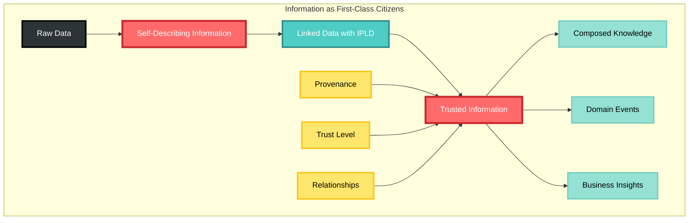
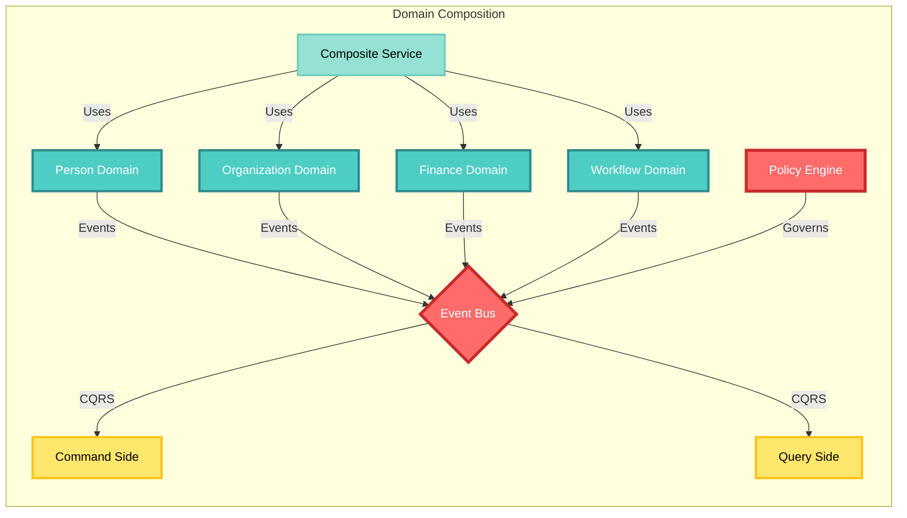
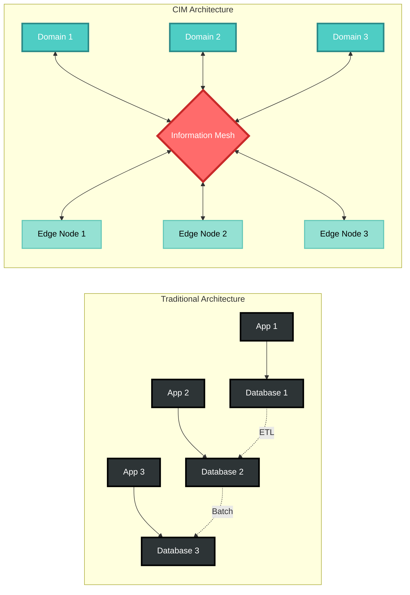
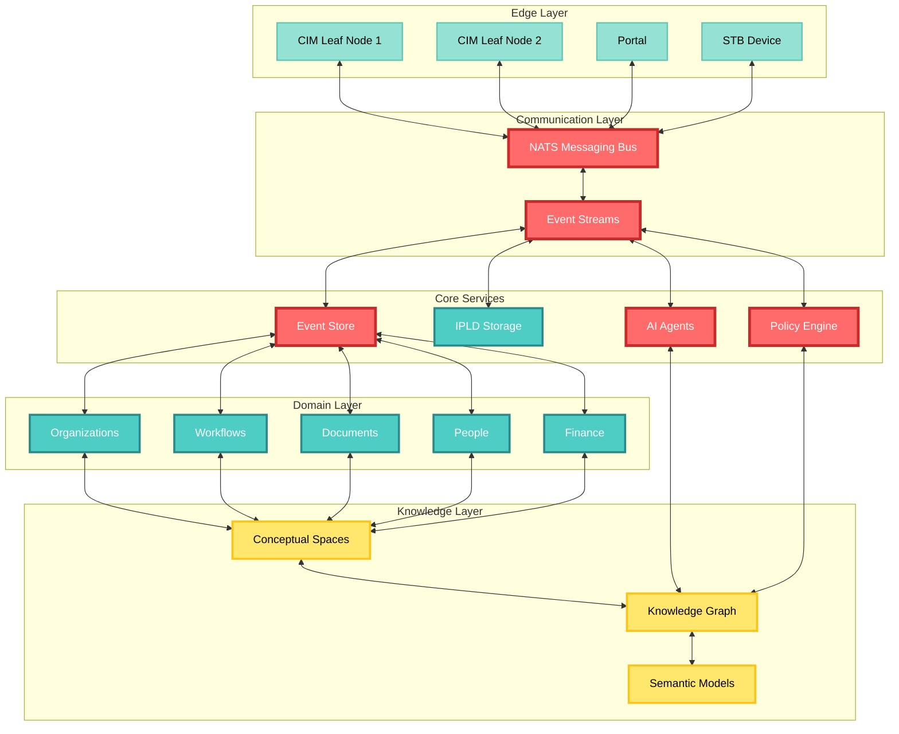

# Composable Information Machine (CIM)

## What is CIM?

The Composable Information Machine (CIM) is a revolutionary distributed platform for building line-of-business information systems. It represents a paradigm shift from traditional monolithic architectures to a truly composable, event-driven, and knowledge-centric approach to enterprise computing.

## Core Philosophy

CIM operates on the principle that **information is the fundamental building block** of all business systems. Rather than focusing on applications or services, CIM treats information as first-class citizens that can be composed, transformed, and distributed across a network of intelligent agents.

## Key Innovations

### 1. **Information-Centric Architecture**

- Information exists independently of applications
- Data is self-describing through IPLD (InterPlanetary Linked Data)
- Every piece of information has provenance and trust levels
- Information can be composed into higher-order structures

### 2. **Distributed by Design**
- No central point of failure
- Peer-to-peer information exchange via NATS messaging
- Edge computing with CIM Leaf nodes
- Offline-first capabilities with eventual consistency

### 3. **AI-Native Platform**
- Built-in AI agents (Alchemist) for information reasoning
- Natural language interfaces for business users
- Automated information classification and routing
- Machine learning at the edge of the network

### 4. **Domain-Driven Composition**

- Business domains as first-class constructs
- Composable domain modules (40+ available)
- Event-sourced architecture with CQRS
- Policy-driven behavior and governance

## How CIM Creates a New Platform

### Traditional vs CIM Approach

**Traditional Systems:**
- Application-centric
- Database-bound
- Centralized processing
- Fixed schemas
- Siloed information

**CIM Systems:**
- Information-centric
- Distributed knowledge graph
- Edge processing
- Flexible conceptual spaces
- Interconnected information mesh

### The CIM Advantage

1. **Radical Flexibility**: Compose new business capabilities by combining existing domains without writing code
2. **True Distribution**: Information flows naturally between nodes without central coordination
3. **Semantic Understanding**: AI agents understand the meaning of information, not just its structure
4. **Evolution-Ready**: Systems can evolve as business needs change without major rewrites
5. **Trust Built-In**: Every piece of information carries its provenance and trust level

## Architecture Overview

## Getting Started

### For Business Users
- Interact with CIM through natural language via the **cim-agent-alchemist**
- Define your business domains using the domain modeling tools
- Compose workflows without coding

### For Developers
- Start with **cim-start** template
- Choose domain modules relevant to your business
- Deploy edge nodes with **cim-leaf**
- Extend with custom WASM modules

### For Architects
- Design distributed topologies with **cim-infrastructure**
- Implement governance with **cim-domain-policy**
- Ensure security with **cim-security** and **cim-keys**

## Use Cases

1. **Distributed Enterprise Systems**: Replace monolithic ERP with composable domain modules
2. **Edge Computing**: Deploy business logic at the edge with CIM Leaf nodes
3. **Knowledge Management**: Build semantic knowledge graphs with conceptual spaces
4. **Workflow Automation**: Create event-driven workflows across distributed systems
5. **Multi-Organization Collaboration**: Share information securely across organizational boundaries

## Why CIM Matters

CIM addresses fundamental limitations of current enterprise systems:
- **Information Silos**: CIM creates an information mesh where data flows freely
- **Vendor Lock-in**: Open-source, standards-based approach
- **Scalability Limits**: True horizontal scaling through distribution
- **Integration Complexity**: Information naturally composes without complex APIs
- **Change Resistance**: Evolution is built into the architecture

## Next Steps

1. Explore the [CIM Modules Catalog](./cim_modules_catalog.md)
2. Review the [Domain Knowledge Graph](./cim_domain_knowledge_graph.md)
3. Interact with the AI assistant using **cim-agent-alchemist**
4. Join the CIM community and contribute to the ecosystem

---

*CIM: Where Information Becomes Intelligence*