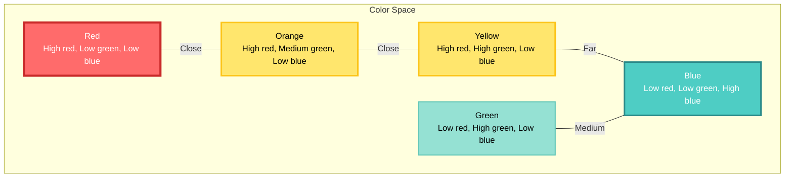
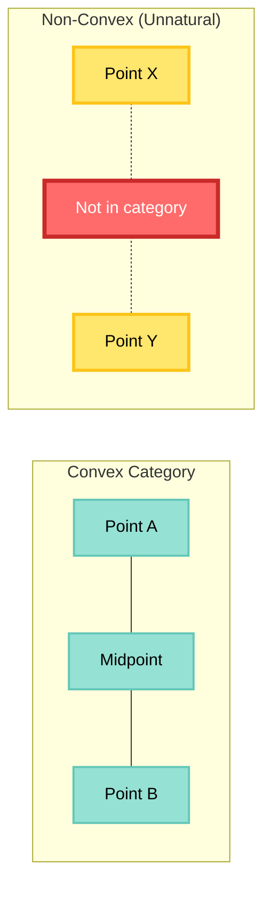
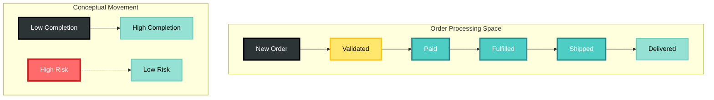

# Conceptual Spaces Theory in CIM

## Introduction

Conceptual Spaces theory, developed by Peter Gärdenfors, provides a geometric framework for representing knowledge and meaning. In CIM, this theory forms the foundation for semantic understanding and AI reasoning.

## Core Principles

### 1. Geometric Representation of Meaning

In conceptual spaces, meanings are points in a multi-dimensional geometric space:



### 2. Quality Dimensions

Each conceptual space consists of quality dimensions representing fundamental features:

```rust
pub struct QualityDimension {
    pub name: String,
    pub dimension_type: DimensionType,
    pub metric: DistanceMetric,
    pub range: Range<f32>,
}

pub enum DimensionType {
    Linear,      // Temperature, size, weight
    Circular,    // Hue, direction, time-of-day
    Categorical, // Discrete categories
    Ordinal,     // Ranked but not metric
}
```

### 3. Natural Categories as Convex Regions

A fundamental insight: natural categories form convex regions in conceptual spaces.

**Convexity Criterion**: If points A and B are in category C, then any point between A and B is also in C.



## Mathematical Framework

### Distance Metrics

Different dimensions use different metrics:

```rust
pub enum DistanceMetric {
    Euclidean,    // Standard geometric distance
    Manhattan,    // City-block distance
    Minkowski(f32), // Generalized metric
    Angular,      // For circular dimensions
    Custom(Box<dyn Fn(f32, f32) -> f32>),
}

impl DistanceMetric {
    pub fn compute(&self, a: f32, b: f32) -> f32 {
        match self {
            Self::Euclidean => (a - b).abs(),
            Self::Manhattan => (a - b).abs(),
            Self::Angular => {
                let diff = (a - b).abs();
                diff.min(360.0 - diff) // Wrap around
            }
            // ...
        }
    }
}
```

### Similarity and Distance

Similarity is inversely related to distance:

```rust
pub fn similarity(a: &ConceptualPoint, b: &ConceptualPoint) -> f32 {
    let distance = a.weighted_distance_to(b);
    1.0 / (1.0 + distance)
}

pub fn exponential_similarity(a: &ConceptualPoint, b: &ConceptualPoint, c: f32) -> f32 {
    let distance = a.weighted_distance_to(b);
    (-c * distance).exp()
}
```

## Application in CIM

### 1. Domain Concept Spaces

Each domain has its conceptual space:

```rust
pub struct DomainConceptSpace {
    pub domain_id: DomainId,
    pub dimensions: Vec<QualityDimension>,
    pub categories: HashMap<CategoryId, ConvexRegion>,
    pub prototypes: HashMap<CategoryId, ConceptualPoint>,
}

// Example: Customer domain
let customer_space = DomainConceptSpace {
    dimensions: vec![
        QualityDimension::new("satisfaction", Linear, 0.0..10.0),
        QualityDimension::new("loyalty", Linear, 0.0..1.0),
        QualityDimension::new("value", Linear, 0.0..1000000.0),
        QualityDimension::new("engagement", Linear, 0.0..100.0),
    ],
    // ...
};
```

### 2. Event Semantics

Events have positions in conceptual space:

```rust
pub struct SemanticEvent {
    pub event: DomainEvent,
    pub conceptual_position: ConceptualPoint,
    pub semantic_category: CategoryId,
}

impl SemanticEvent {
    pub fn semantic_distance_to(&self, other: &SemanticEvent) -> f32 {
        self.conceptual_position.distance_to(&other.conceptual_position)
    }
}
```

### 3. Workflow Understanding

Workflows traverse conceptual spaces:



## Learning and Adaptation

### 1. Dynamic Dimension Adjustment

Dimensions can be learned and adjusted:

```rust
pub struct AdaptiveSpace {
    pub space: ConceptualSpace,
    pub learning_rate: f32,
}

impl AdaptiveSpace {
    pub fn learn_from_examples(&mut self, examples: Vec<(Concept, Category)>) {
        // Adjust dimension weights
        for (concept, category) in examples {
            let point = self.embed(concept);
            let prototype = self.space.prototypes[category];
            
            // Move prototype towards example
            prototype.move_towards(point, self.learning_rate);
            
            // Adjust dimension importance
            self.update_dimension_weights(point, prototype);
        }
    }
}
```

### 2. Category Formation

New categories emerge from clusters:

```rust
pub fn discover_categories(points: Vec<ConceptualPoint>) -> Vec<ConvexRegion> {
    // Clustering algorithm
    let clusters = dbscan(&points, epsilon, min_points);
    
    // Form convex hulls
    clusters.into_iter()
        .map(|cluster| ConvexRegion::from_points(cluster))
        .collect()
}
```

## Integration with AI

### 1. Embedding Alignment

Align neural embeddings with conceptual dimensions:

```rust
pub struct EmbeddingAligner {
    pub embedding_dim: usize,
    pub conceptual_dim: usize,
    pub projection_matrix: Matrix,
}

impl EmbeddingAligner {
    pub fn align(&self, embedding: &[f32]) -> ConceptualPoint {
        let projected = self.projection_matrix.multiply(embedding);
        ConceptualPoint::from_vector(projected)
    }
}
```

### 2. Semantic Reasoning

Reasoning operations in conceptual space:

```rust
pub trait ConceptualReasoner {
    // Interpolation: Find concepts between A and B
    fn interpolate(&self, a: &Concept, b: &Concept, steps: usize) -> Vec<Concept>;
    
    // Extrapolation: Extend beyond known concepts
    fn extrapolate(&self, from: &Concept, direction: &Vector, distance: f32) -> Concept;
    
    // Analogy: A is to B as C is to ?
    fn analogy(&self, a: &Concept, b: &Concept, c: &Concept) -> Concept;
}
```

## Practical Examples

### 1. Customer Satisfaction Space

```rust
// Define dimensions
let dimensions = vec![
    QualityDimension::new("response_time", Linear, 0.0..3600.0), // seconds
    QualityDimension::new("resolution_quality", Ordinal, 1.0..5.0),
    QualityDimension::new("communication_clarity", Linear, 0.0..10.0),
];

// Define categories
let satisfied_region = ConvexRegion::new(
    center: Point::new([300.0, 4.0, 8.0]), // Fast, good, clear
    radius: [600.0, 1.0, 2.0],
);

let dissatisfied_region = ConvexRegion::new(
    center: Point::new([2400.0, 2.0, 4.0]), // Slow, poor, unclear
    radius: [1200.0, 1.0, 3.0],
);
```

### 2. Document Similarity Space

```rust
// Semantic dimensions for documents
let doc_space = ConceptualSpace::new(vec![
    QualityDimension::new("technicality", Linear, 0.0..1.0),
    QualityDimension::new("formality", Linear, 0.0..1.0),
    QualityDimension::new("specificity", Linear, 0.0..1.0),
    QualityDimension::new("length", Logarithmic, 1.0..100000.0),
]);

// Find similar documents
let similar_docs = doc_space.find_nearest_neighbors(
    target_doc.position(),
    k: 10,
    max_distance: 0.2,
);
```

## Theoretical Implications

### 1. Cognitive Plausibility

Conceptual spaces align with human cognition:
- Prototype effects in categorization
- Graded membership in categories
- Similarity judgments
- Conceptual combination

### 2. Computational Efficiency

Geometric operations are efficient:
- O(d) distance computation (d = dimensions)
- Spatial indexing for fast search
- Natural parallelization
- GPU acceleration possible

### 3. Explainability

Decisions are interpretable:
- "Too far from prototype"
- "Between categories A and B"
- "Moving towards goal state"
- "Similar on dimensions X, Y"

## Future Directions

### 1. Hierarchical Spaces
Spaces within spaces for complex domains

### 2. Dynamic Spaces
Dimensions that change over time

### 3. Quantum Conceptual Spaces
Superposition and entanglement of concepts

### 4. Social Conceptual Spaces
Shared understanding across agents

## Conclusion

Conceptual Spaces theory provides CIM with:
- A principled approach to meaning
- Geometric tools for reasoning
- Natural integration with AI
- Human-interpretable representations

This foundation enables CIM to understand not just data, but meaning—transforming information processing into semantic understanding.