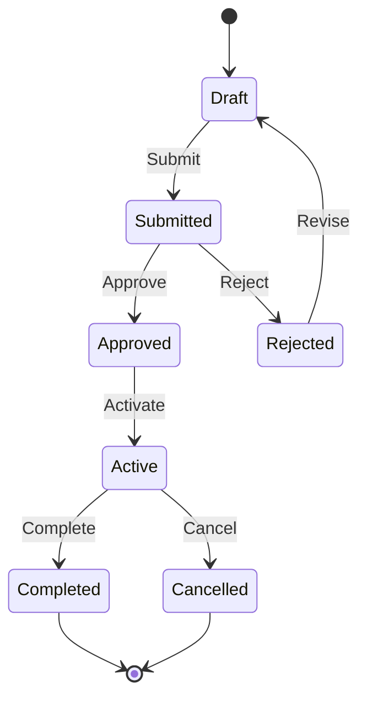

# State Machine Patterns in CIM

In CIM, **everything is a state machine**. Aggregates, workflows, policies, and even entire domains are modeled as state machines that transition based on events. This guide explains the patterns and best practices for designing state machines in CIM.

## Core Concepts

### What is a State Machine in CIM?

A state machine in CIM:
- Has a finite set of states
- Transitions between states based on events
- Enforces business rules through state transitions
- Maintains consistency through immutable events
- Provides clear audit trails



## Basic State Machine Pattern

### 1. Define States as Enums

```rust
use cim_domain::{State, StateMachine};

#[derive(Debug, Clone, State)]
pub enum OrderState {
    // Each variant represents a distinct state
    // Include all data needed for that state
    Draft {
        customer_id: CustomerId,
        items: Vec<LineItem>,
        created_at: Timestamp,
    },
    
    Submitted {
        order_id: OrderId,
        customer_id: CustomerId,
        items: Vec<LineItem>,
        total: Money,
        submitted_at: Timestamp,
    },
    
    Paid {
        order_id: OrderId,
        payment_id: PaymentId,
        paid_at: Timestamp,
    },
    
    Shipped {
        order_id: OrderId,
        tracking_number: TrackingNumber,
        shipped_at: Timestamp,
    },
    
    Delivered {
        order_id: OrderId,
        delivered_at: Timestamp,
        signature: Option<String>,
    },
    
    Cancelled {
        order_id: OrderId,
        reason: CancellationReason,
        cancelled_at: Timestamp,
    },
}
```

### 2. Define Valid Transitions

```rust
impl OrderState {
    pub fn can_transition_to(&self, target: &OrderState) -> bool {
        matches!(
            (self, target),
            (Self::Draft { .. }, Self::Submitted { .. }) |
            (Self::Submitted { .. }, Self::Paid { .. }) |
            (Self::Submitted { .. }, Self::Cancelled { .. }) |
            (Self::Paid { .. }, Self::Shipped { .. }) |
            (Self::Paid { .. }, Self::Cancelled { .. }) |
            (Self::Shipped { .. }, Self::Delivered { .. }) |
            (Self::Shipped { .. }, Self::Cancelled { .. })
        )
    }
}
```

### 3. Implement State Machine Trait

```rust
impl StateMachine for OrderState {
    type Command = OrderCommand;
    type Event = OrderEvent;
    type Error = OrderError;
    
    fn handle_command(
        &self,
        command: Self::Command,
    ) -> Result<Vec<Self::Event>, Self::Error> {
        match (self, command) {
            // Draft state can handle Submit command
            (Self::Draft { customer_id, items, .. }, OrderCommand::Submit) => {
                // Validate business rules
                if items.is_empty() {
                    return Err(OrderError::EmptyOrder);
                }
                
                let total = calculate_total(items);
                let order_id = OrderId::new();
                
                Ok(vec![OrderEvent::Submitted {
                    order_id,
                    customer_id: customer_id.clone(),
                    items: items.clone(),
                    total,
                }])
            }
            
            // Invalid command for current state
            (Self::Delivered { .. }, OrderCommand::Submit) => {
                Err(OrderError::InvalidStateTransition)
            }
            
            // ... handle other state/command combinations
        }
    }
    
    fn apply_event(&mut self, event: Self::Event) {
        match (self, event) {
            // Transition from Draft to Submitted
            (state @ Self::Draft { .. }, OrderEvent::Submitted { order_id, customer_id, items, total }) => {
                *state = Self::Submitted {
                    order_id,
                    customer_id,
                    items,
                    total,
                    submitted_at: Timestamp::now(),
                };
            }
            
            // ... handle other state/event combinations
        }
    }
}
```

## Advanced Patterns

### 1. Hierarchical State Machines

For complex domains, use nested state machines:

```rust
#[derive(Debug, Clone, State)]
pub enum FulfillmentState {
    Pending {
        order_id: OrderId,
    },
    
    Processing {
        order_id: OrderId,
        substates: ProcessingSubstate,
    },
    
    Completed {
        order_id: OrderId,
        completed_at: Timestamp,
    },
}

#[derive(Debug, Clone, State)]
pub enum ProcessingSubstate {
    PickingItems {
        picker_id: EmployeeId,
        items_picked: Vec<ItemId>,
        items_remaining: Vec<ItemId>,
    },
    
    QualityCheck {
        checker_id: EmployeeId,
        issues: Vec<QualityIssue>,
    },
    
    Packing {
        packer_id: EmployeeId,
        box_size: BoxSize,
    },
    
    ReadyToShip {
        weight: Weight,
        dimensions: Dimensions,
    },
}
```

### 2. Parallel State Machines

Sometimes multiple state machines run in parallel:

```rust
pub struct Order {
    // Main order state
    pub state: OrderState,
    
    // Payment can be processed in parallel
    pub payment_state: PaymentState,
    
    // Fulfillment runs independently
    pub fulfillment_state: FulfillmentState,
    
    // Customer communication state
    pub notification_state: NotificationState,
}

impl Order {
    pub fn handle_event(&mut self, event: DomainEvent) {
        match event {
            DomainEvent::Order(e) => self.state.apply_event(e),
            DomainEvent::Payment(e) => self.payment_state.apply_event(e),
            DomainEvent::Fulfillment(e) => self.fulfillment_state.apply_event(e),
            DomainEvent::Notification(e) => self.notification_state.apply_event(e),
        }
    }
}
```

### 3. State Machine Composition

Compose smaller state machines into larger ones:

```rust
pub struct CheckoutProcess {
    cart: CartState,
    payment: PaymentState,
    shipping: ShippingState,
}

impl CheckoutProcess {
    pub fn can_complete(&self) -> bool {
        matches!(self.cart, CartState::Validated { .. }) &&
        matches!(self.payment, PaymentState::Authorized { .. }) &&
        matches!(self.shipping, ShippingState::AddressVerified { .. })
    }
}
```

### 4. Temporal State Machines

States that change based on time:

```rust
#[derive(Debug, Clone, State)]
pub enum SubscriptionState {
    Trial {
        started_at: Timestamp,
        ends_at: Timestamp,
    },
    
    Active {
        renewed_at: Timestamp,
        expires_at: Timestamp,
        auto_renew: bool,
    },
    
    GracePeriod {
        expired_at: Timestamp,
        grace_ends_at: Timestamp,
    },
    
    Suspended {
        suspended_at: Timestamp,
        reason: SuspensionReason,
    },
    
    Cancelled {
        cancelled_at: Timestamp,
    },
}

impl SubscriptionState {
    pub fn check_temporal_transitions(&self, now: Timestamp) -> Option<SubscriptionEvent> {
        match self {
            Self::Trial { ends_at, .. } if now > *ends_at => {
                Some(SubscriptionEvent::TrialEnded)
            }
            
            Self::Active { expires_at, auto_renew: false, .. } if now > *expires_at => {
                Some(SubscriptionEvent::Expired)
            }
            
            Self::GracePeriod { grace_ends_at, .. } if now > *grace_ends_at => {
                Some(SubscriptionEvent::Suspended)
            }
            
            _ => None,
        }
    }
}
```

## State Machine Best Practices

### 1. State Data Completeness

Each state should contain all data needed for that state:

```rust
// ❌ Bad: Missing critical data
pub enum BadOrderState {
    Submitted,  // Where's the order data?
    Paid,       // How much was paid?
    Shipped,    // What's the tracking number?
}

// ✅ Good: Complete state data
pub enum GoodOrderState {
    Submitted {
        order_id: OrderId,
        items: Vec<LineItem>,
        total: Money,
        customer: CustomerInfo,
    },
    // ... complete data for each state
}
```

### 2. Invalid States Should Be Unrepresentable

```rust
// ❌ Bad: Invalid states possible
pub struct BadOrder {
    pub status: String,  // Could be anything!
    pub payment_id: Option<PaymentId>,  // Might be None when it shouldn't
    pub shipped: bool,  // Could be true even if not paid
}

// ✅ Good: Invalid states impossible
pub enum GoodOrderState {
    Draft { items: NonEmptyVec<LineItem> },  // Can't have empty order
    Paid { payment_id: PaymentId },  // Always has payment if paid
    Shipped { tracking: TrackingNumber },  // Always has tracking if shipped
}
```

### 3. Explicit State Transitions

```rust
// ❌ Bad: Implicit transitions
impl Order {
    pub fn set_status(&mut self, status: String) {
        self.status = status;  // No validation!
    }
}

// ✅ Good: Explicit, validated transitions
impl OrderState {
    pub fn submit(self) -> Result<Self, OrderError> {
        match self {
            Self::Draft { items, .. } => {
                // Validate and transition
                Ok(Self::Submitted { /* ... */ })
            }
            _ => Err(OrderError::InvalidTransition),
        }
    }
}
```

### 4. State Transition Audit Trail

Always emit events for state transitions:

```rust
impl StateMachine for OrderState {
    fn transition(&mut self, event: OrderEvent) -> TransitionResult {
        let from_state = self.clone();
        self.apply_event(event.clone());
        let to_state = self.clone();
        
        TransitionResult {
            from: from_state,
            to: to_state,
            event,
            timestamp: Timestamp::now(),
        }
    }
}
```

## Common State Machine Patterns

### 1. Approval Workflow

```rust
#[derive(Debug, Clone, State)]
pub enum ApprovalState {
    Draft {
        content: Document,
        author: UserId,
    },
    
    Submitted {
        content: Document,
        submitted_by: UserId,
        submitted_at: Timestamp,
    },
    
    UnderReview {
        content: Document,
        reviewer: UserId,
        review_started: Timestamp,
    },
    
    Approved {
        content: Document,
        approved_by: UserId,
        approved_at: Timestamp,
        comments: Option<String>,
    },
    
    Rejected {
        content: Document,
        rejected_by: UserId,
        rejected_at: Timestamp,
        reason: String,
        can_resubmit: bool,
    },
}
```

### 2. Manufacturing Process

```rust
#[derive(Debug, Clone, State)]
pub enum ManufacturingState {
    Planned {
        product_id: ProductId,
        quantity: Quantity,
        due_date: Date,
    },
    
    MaterialsReady {
        product_id: ProductId,
        materials: Vec<Material>,
        workstation: WorkstationId,
    },
    
    InProduction {
        product_id: ProductId,
        operator: OperatorId,
        started_at: Timestamp,
        estimated_completion: Timestamp,
    },
    
    QualityControl {
        product_id: ProductId,
        inspector: InspectorId,
        defects: Vec<Defect>,
    },
    
    Completed {
        product_id: ProductId,
        quantity_produced: Quantity,
        quantity_passed: Quantity,
        completed_at: Timestamp,
    },
}
```

### 3. Reservation System

```rust
#[derive(Debug, Clone, State)]
pub enum ReservationState {
    Available {
        resource_id: ResourceId,
        time_slots: Vec<TimeSlot>,
    },
    
    Held {
        resource_id: ResourceId,
        held_for: CustomerId,
        held_until: Timestamp,
        time_slot: TimeSlot,
    },
    
    Confirmed {
        reservation_id: ReservationId,
        resource_id: ResourceId,
        customer_id: CustomerId,
        time_slot: TimeSlot,
        confirmation_code: String,
    },
    
    CheckedIn {
        reservation_id: ReservationId,
        checked_in_at: Timestamp,
        checked_in_by: StaffId,
    },
    
    Completed {
        reservation_id: ReservationId,
        completed_at: Timestamp,
        feedback: Option<Feedback>,
    },
    
    NoShow {
        reservation_id: ReservationId,
        marked_at: Timestamp,
        charge_applicable: bool,
    },
}
```

## Testing State Machines

### 1. Property-Based Testing

```rust
#[cfg(test)]
mod tests {
    use proptest::prelude::*;
    
    proptest! {
        #[test]
        fn state_machine_never_loses_data(
            initial_state: OrderState,
            events: Vec<OrderEvent>
        ) {
            let mut state = initial_state.clone();
            
            for event in events {
                if state.can_handle_event(&event) {
                    let before_id = state.order_id();
                    state.apply_event(event);
                    let after_id = state.order_id();
                    
                    // Order ID should never change
                    prop_assert_eq!(before_id, after_id);
                }
            }
        }
    }
}
```

### 2. State Transition Testing

```rust
#[test]
fn test_valid_transitions() {
    let transitions = vec![
        (OrderState::draft(), OrderCommand::Submit, OrderState::submitted()),
        (OrderState::submitted(), OrderCommand::Pay, OrderState::paid()),
        (OrderState::paid(), OrderCommand::Ship, OrderState::shipped()),
    ];
    
    for (from, command, expected_to) in transitions {
        let events = from.handle_command(command).unwrap();
        let mut actual_to = from.clone();
        
        for event in events {
            actual_to.apply_event(event);
        }
        
        assert_eq!(actual_to, expected_to);
    }
}
```

### 3. Invariant Testing

```rust
#[test]
fn test_state_invariants() {
    let state = OrderState::Paid {
        order_id: OrderId::new(),
        payment_id: PaymentId::new(),
        amount: Money::from(100.0),
    };
    
    // Invariant: Paid orders always have a payment_id
    match state {
        OrderState::Paid { payment_id, .. } => {
            assert!(!payment_id.is_empty());
        }
        _ => {}
    }
}
```

## Visualization

### Generate State Diagrams

```rust
impl OrderState {
    pub fn to_mermaid() -> String {
        r#"
        stateDiagram-v2
            [*] --> Draft: Create
            Draft --> Submitted: Submit
            Submitted --> Paid: Process Payment
            Submitted --> Cancelled: Cancel
            Paid --> Shipped: Ship Items
            Paid --> Refunded: Refund
            Shipped --> Delivered: Deliver
            Delivered --> [*]
            Cancelled --> [*]
            Refunded --> [*]
        "#.to_string()
    }
}
```

## Anti-Patterns to Avoid

### 1. Boolean Flags Instead of States

```rust
// ❌ Bad: Boolean explosion
pub struct BadOrder {
    is_submitted: bool,
    is_paid: bool,
    is_shipped: bool,
    is_delivered: bool,
    is_cancelled: bool,
}

// ✅ Good: Explicit states
pub enum GoodOrderState {
    Submitted,
    Paid,
    Shipped,
    Delivered,
    Cancelled,
}
```

### 2. Stringly-Typed States

```rust
// ❌ Bad: String states
pub struct BadState {
    status: String,  // "draft", "submitted", "paid", etc.
}

// ✅ Good: Type-safe states
pub enum GoodState {
    Draft,
    Submitted,
    Paid,
}
```

### 3. Mutable State Without Events

```rust
// ❌ Bad: Direct mutation
impl Order {
    pub fn ship(&mut self) {
        self.status = "shipped";  // No event!
    }
}

// ✅ Good: Event-driven transitions
impl Order {
    pub fn ship(&mut self) -> Result<ShippedEvent, Error> {
        let event = ShippedEvent::new();
        self.apply_event(event.clone());
        Ok(event)
    }
}
```

## Integration with CIM

### Domain Registration

```rust
use cim_domain::{DomainBuilder, StateMachineAggregate};

pub fn register_domain() -> Domain {
    DomainBuilder::new("orders")
        .with_aggregate::<OrderState>("Order")
        .with_state_machine::<OrderState>()
        .with_events::<OrderEvent>()
        .with_commands::<OrderCommand>()
        .build()
}
```

### Event Store Integration

```rust
impl EventSourced for OrderState {
    fn replay(events: Vec<OrderEvent>) -> Self {
        let mut state = Self::default();
        
        for event in events {
            state.apply_event(event);
        }
        
        state
    }
}
```

## Conclusion

State machines in CIM provide:
- **Clarity**: Business logic is explicit
- **Safety**: Invalid states are impossible
- **Auditability**: Every transition is recorded
- **Testability**: States and transitions are easily tested
- **Maintainability**: Changes are localized to states

Remember: If you can't draw it as a state diagram, it's too complex. Break it down into smaller, composable state machines.

---

**Next Steps:**
- [Event Storming Guide](./event-storming-guide.md) - Discover your state machines
- [Domain Development Guide](./domain-development-guide.md) - Implement your domains
- [Workflow Graph Guide](./workflow-graph-guide.md) - Visual state machines