# CIM Project Dashboard

## Project Status Overview

```mermaid
gantt
    title CIM Development Progress
    dateFormat YYYY-MM-DD
    
    Foundation :milestone, m1, 2024-03-29, 0d
    Vocabulary Structure :done, vocab, 2024-03-29, 1d
    Domain Organization :done, domain, after vocab, 1d
    Project Setup :done, setup, after domain, 1d
    
    Knowledge Management :active, knowledge, after setup, 7d
    Domain Implementation :active, impl, after knowledge, 14d
    Agent Development :active, agent, after impl, 21d
    
    Integration Layer :wait, integration, after agent, 14d
    Security Framework :wait, security, after integration, 14d
    Distribution System :wait, dist, after security, 21d
```

## Domain Completion Status


## Critical Metrics

### Knowledge Base Health
- **Vocabulary Terms**: 45/100 defined
- **Relationships**: 30/50 mapped
- **Documentation**: 60% coverage
- **Validation**: 40% verified

### System Components
- **Core Services**: 3/10 implemented
- **Integration Points**: 2/8 established
- **Agent Capabilities**: 1/5 developed
- **Security Controls**: 2/12 implemented

### Quality Metrics
- **Code Coverage**: N/A (implementation pending)
- **Documentation Quality**: 75%
- **Architecture Compliance**: 85%
- **Security Compliance**: 40%

## Decision Points

### Immediate Actions Required
1. **Knowledge Management**
   - [ ] Define knowledge acquisition process
   - [ ] Implement fact validation system
   - [ ] Establish theory-building framework

2. **Domain Implementation**
   - [ ] Complete core domain models
   - [ ] Define inter-domain boundaries
   - [ ] Implement domain services

3. **Agent Framework**
   - [ ] Define agent interaction protocols
   - [ ] Implement basic agent capabilities
   - [ ] Establish agent governance rules

### Upcoming Decisions
1. **Integration Strategy**
   - Options:
     - Event-driven architecture
     - Service mesh
     - Hybrid approach
   - Decision needed by: 2024-04-15

2. **Security Architecture**
   - Options:
     - Zero-trust model
     - Role-based access control
     - Attribute-based access control
   - Decision needed by: 2024-04-30

3. **Distribution Model**
   - Options:
     - Fully distributed
     - Hub-and-spoke
     - Hierarchical
   - Decision needed by: 2024-05-15

## Risk Assessment

```mermaid
graph LR
    subgraph High-Impact-High-Probability
        KI["🔴 Knowledge Integration<br/>Impact: High<br/>Probability: High"]
        AC["🔴 Agent Coordination<br/>Impact: High<br/>Probability: High"]
    end
    
    subgraph High-Impact-Low-Probability
        SI["🟡 Security Implementation<br/>Impact: High<br/>Probability: Low"]
    end
    
    subgraph Low-Impact-High-Probability
        DC["🟡 Data Consistency<br/>Impact: Low<br/>Probability: High"]
    end
    
    subgraph Low-Impact-Low-Probability
        RA["🟢 Resource Allocation<br/>Impact: Low<br/>Probability: Low"]
    end

    style High-Impact-High-Probability fill:#ffcccc,stroke:#ff0000
    style High-Impact-Low-Probability fill:#ffffcc,stroke:#ffcc00
    style Low-Impact-High-Probability fill:#ffffcc,stroke:#ffcc00
    style Low-Impact-Low-Probability fill:#ccffcc,stroke:#00ff00
```



## Resource Allocation


## Next Steps

### Short Term (1-2 weeks)
1. Complete knowledge management framework
   - Priority: High
   - Dependencies: Vocabulary structure
   - Resources needed: Knowledge engineers

2. Implement core domain services
   - Priority: High
   - Dependencies: Domain models
   - Resources needed: Domain experts, developers

3. Develop basic agent capabilities
   - Priority: Medium
   - Dependencies: Agent framework
   - Resources needed: AI engineers

### Medium Term (1-2 months)
1. Integration layer development
   - Start date: 2024-04-15
   - Key deliverables:
     - Event system
     - Service mesh
     - API gateway

2. Security framework implementation
   - Start date: 2024-04-30
   - Key deliverables:
     - Authentication system
     - Authorization framework
     - Audit logging

### Long Term (3+ months)
1. Distribution system
   - Start date: 2024-05-15
   - Key deliverables:
     - Node management
     - Network topology
     - Data synchronization

## Action Items

### This Week
- [ ] Complete vocabulary relationship mapping
- [ ] Define initial agent protocols
- [ ] Set up development environment
- [ ] Create test framework

### Next Week
- [ ] Start knowledge management implementation
- [ ] Begin domain service development
- [ ] Design agent interaction patterns
- [ ] Plan security architecture

## Updates and Reviews

Last Updated: 2024-03-29
Next Review: 2024-04-05

### Review Schedule
- Daily: Progress metrics
- Weekly: Risk assessment
- Bi-weekly: Resource allocation
- Monthly: Strategic alignment 