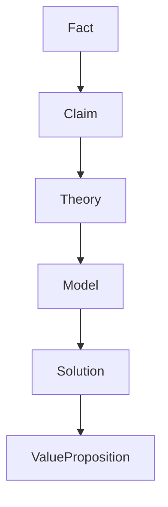
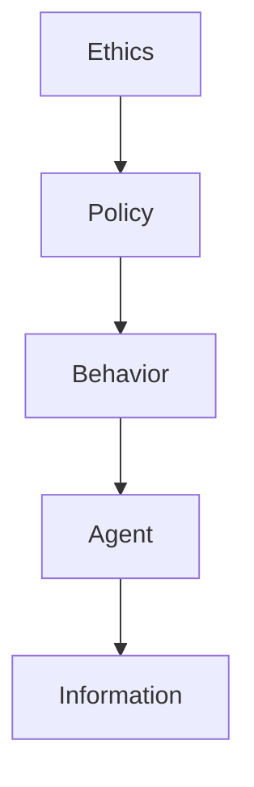
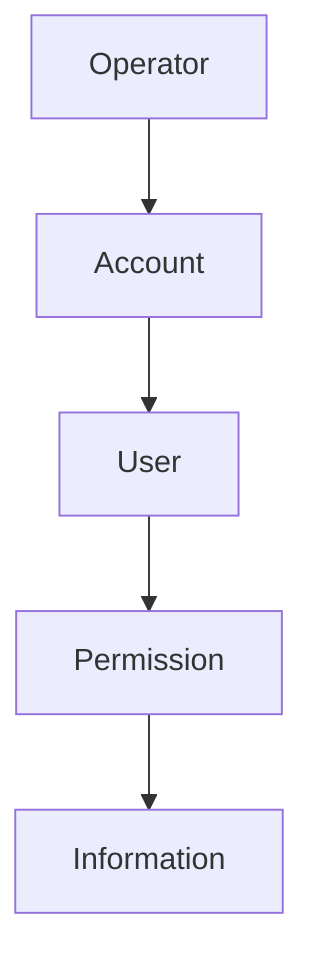

# CIM Vocabulary Index

This document serves as the central reference point for CIM's ubiquitous language, linking both technical and domain-specific vocabularies.

## Technical Domains
See [Technical Vocabulary](vocabulary.md) for detailed definitions of:

### Information Domain
- Information Entity
- Information State
- Composable Unit

### Security Domain
- Authorization Context
- Information Integrity

### Distribution Domain
- Distribution Node
- Distribution Network

### AI Integration Domain
- AI Tool
- Information Capability

### Persistence Domain
- Persistence Layer
- Information Storage

## Business & Knowledge Domains
See [Domain Vocabulary](../notes/vocabulary.md) for detailed definitions of:

### Knowledge Domain
- Fact
- Claim
- Theory

### Organization Domain
- Operator
- Account

### Agent Domain
- Agent
- Behavior

### Business Domain
- Value Proposition
- Solution

### Environment Domain
- Equipment
- Location

### Governance Domain
- Policy
- Ethics

## Cross-Domain Relationships

### Information Flow

### Governance Structure

### Organization Hierarchy

## Usage Guidelines

1. **Technical Implementation**
   - Use technical vocabulary for system design and implementation
   - Reference information and persistence terms in code
   - Follow security and distribution patterns

2. **Domain Modeling**
   - Use knowledge domain terms for information organization
   - Apply business domain terms for solution design
   - Follow governance terms for policy implementation

3. **Cross-Cutting Concerns**
   - Security spans both technical and domain vocabularies
   - Ethics influences both governance and implementation
   - Information flows through all domains

## Maintenance

This vocabulary is maintained following the rules in @vocabulary.mdc:

1. **Term Addition Process**
   - Check existing taxonomies
   - Use standard definition format
   - Define clear relationships
   - Document usage context
   - Update related terms
   - Verify knowledge graph

2. **Term Update Process**
   - Review existing relationships
   - Update affected terms
   - Maintain consistency
   - Document changes
   - Update knowledge graph

3. **Term Removal Process**
   - Document reason
   - Update related terms
   - Maintain graph integrity
   - Archive definition
   - Update documentation 