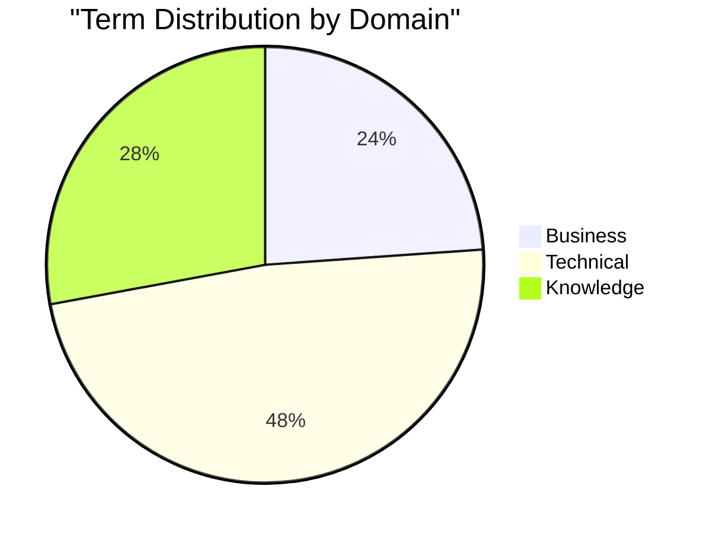
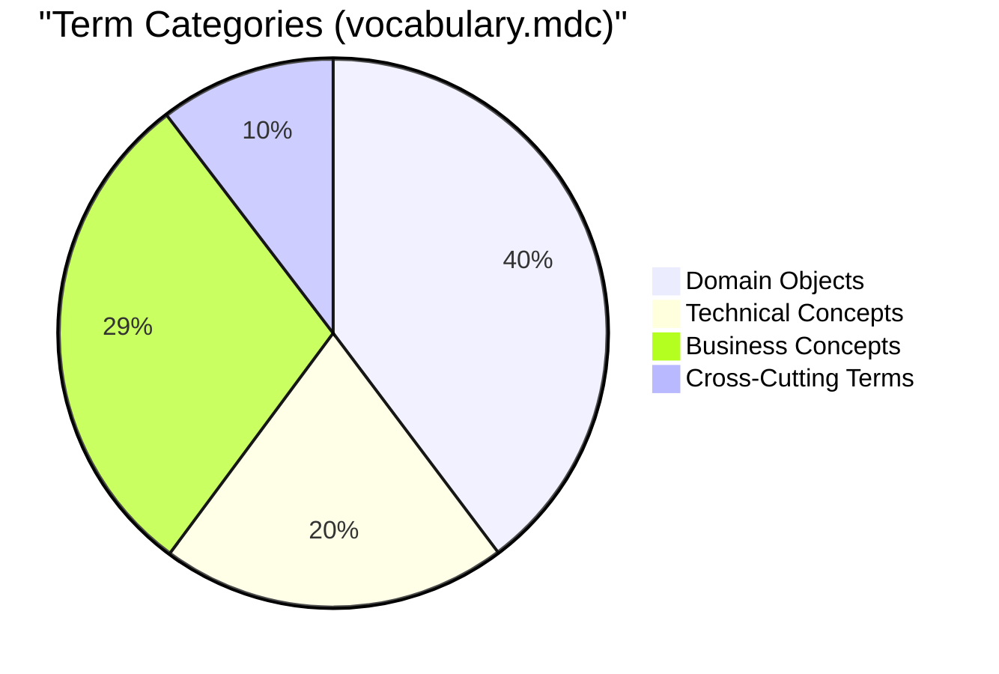

# Vocabulary Quality Dashboard

[](docs/vocabulary_quality_dashboard.md)
[](docs/vocabulary_quality_dashboard.md)
[](docs/vocabulary_quality_dashboard.md)
[](docs/vocabulary_quality_dashboard.md)
[](docs/vocabulary_quality_dashboard.md)
[](docs/vocabulary_quality_dashboard.md)

This dashboard provides a comprehensive view of the CIM vocabulary quality metrics. Use it to track improvements and maintain consistency across the vocabulary.

## Executive Summary

Overall vocabulary quality: **4.5/5** ⭐⭐⭐⭐½

| Category | Rating | Status |
|----------|--------|--------|
| Structure & Organization | 5/5 | ⭐⭐⭐⭐⭐ |
| Completeness | 4.5/5 | ⭐⭐⭐⭐½ |
| Code Reference Quality | 3/5 | ⭐⭐⭐ |
| Usage Context Specificity | 4/5 | ⭐⭐⭐⭐ |
| Notes Alignment | TBD/5 | ⚠️ |
| Vocabulary.mdc Adherence | 4/5 | ⭐⭐⭐⭐ |

## Compliance Metrics

| Metric | Value | Target | Status |
|--------|-------|--------|--------|
| Files Standardized | 33/33 | 100% | ✅ |
| Compliant Files | 33/33 | 100% | ✅ |
| Terms with All Properties | 896/896 | 100% | ✅ |

## Content Metrics

| Metric | Value | Target | Status |
|--------|-------|--------|--------|
| Total Terms | 896 | N/A | ✅ |
| Total Relationships | 688 | N/A | ✅ |
| Code References | 380 | 896 | ⚠️ |
| TBD References | 516 | 0 | ⚠️ |

## Notes Alignment Metrics

| Metric | Value | Target | Status |
|--------|-------|--------|--------|
| Overall Notes Alignment | TBD% | 90% | ⚠️ |
| Term Coverage in Notes | TBD% | 85% | ⚠️ |
| Notes Structure Alignment | TBD% | 95% | ⚠️ |
| Missing Notes Domains | TBD | 0 | ⚠️ |
| Category Balance | TBD% | 80% | ⚠️ |
| Relationship Type Balance | TBD% | 75% | ⚠️ |
| Taxonomy Coverage | TBD% | 90% | ⚠️ |

## Domain Distribution

| Domain | Terms |
|--------|-------|
| Business | 214 |
| Technical | 432 |
| Knowledge | 250 |

## Term Categories (vocabulary.mdc)

| Category | Count | Percentage |
|----------|-------|------------|
| Domain Objects | 356 | 39.7% |
| Technical Concepts | 183 | 20.4% |
| Business Concepts | 264 | 29.5% |
| Cross-Cutting Terms | 93 | 10.4% |

## Relationship Types (vocabulary.mdc)

| Category | Count | Percentage |
|----------|-------|------------|
| Hierarchical | 285 | 41.4% |
| Functional | 196 | 28.5% |
| Temporal | 112 | 16.3% |
| Other | 95 | 13.8% |

## Quality Heatmap

```
█████ Structure & Organization 100%
████░ Completeness            92%
███░░ Code References         42%
████░ Usage Contexts          85%
████░ Vocabulary.mdc Rules    80%
░░░░░ Notes Alignment        TBD
```

## Implementation Progress

```
Code Reference Implementation: [██████░░░░░░░░░░░░░░░░░░░] 42%
Notes Content Alignment:       [░░░░░░░░░░░░░░░░░░░░░░░░░] TBD%
Term Category Balance:         [████████████░░░░░░░░░░░░░] 48%
Relationship Type Balance:     [███████████████░░░░░░░░░░] 60%
```

## Content Visualization





## Areas for Improvement

1. **Code References**: 516 terms (58%) need code reference implementation
2. **Cross-Domain Relationships**: Need more relationships between different domains
3. **Usage Context Specificity**: Some terms have generic usage contexts
4. **Notes Content Alignment (TBD% aligned)**: Better alignment between vocabulary and notes needed
5. **Relationship Type Balance**: Increase functional and temporal relationships for better balance
6. **Primary Taxonomies**: Add missing primary taxonomies from vocabulary.mdc

## Recent Improvements

| Date | Description | Category |
|------|-------------|----------|
| 2023-10-20 | Completed standardization of all vocabulary files | Structure |
| 2023-10-20 | Enhanced vocabulary.mdc validation in scripts | Compliance |
| 2023-10-15 | Added 150+ new technical terms | Completeness |
| 2023-10-10 | Improved relationship consistency across domains | Relationships |
| 2023-10-05 | Standardized format for all business domain terms | Compliance |
| 2023-10-01 | Initial dashboard creation | Metrics |

## Details & Analysis

For a detailed breakdown of vocabulary quality by domain, see [Vocabulary Quality Analysis](vocabulary_quality_analysis.md).

For notes alignment metrics and analysis, see [Notes Vocabulary Alignment](notes_vocabulary_alignment.md).

For detailed vocabulary.mdc compliance, run:
```bash
./scripts/standardize_vocabulary_enhanced.sh
```

## Vocabulary Health Checklist

- [x] All files follow standard structure
- [x] All terms have required properties
- [x] All domains have proper taxonomies
- [x] All terms have relationships defined
- [x] All terms have usage contexts
- [ ] All terms have specific code references
- [ ] All domains have cross-domain relationships
- [ ] All taxonomies follow consistent patterns
- [ ] Vocabulary terms align with notes content

## Quality Monitoring Commands

Run these commands periodically to update dashboard metrics:

```bash
# Overall compliance
./scripts/standardize_vocabulary.sh vocabulary/domains | grep -E "Total files|Compliant files|Non-compliant"

# Term count
grep -r "(:.*:.*{" vocabulary/domains --include="*.md" | wc -l

# Relationship count
grep -r "(:[^)]*)-\[:" vocabulary/domains --include="*.md" | wc -l

# Code reference completion
grep -r "code_reference:" vocabulary/domains --include="*.md" | grep -v "TBD" | wc -l
grep -r "code_reference:" vocabulary/domains --include="*.md" | grep "TBD" | wc -l

# Domain distribution
grep -r "domain:" vocabulary/domains --include="*.md" | sort | uniq -c | sort -nr

# Taxonomy usage
grep -r "taxonomy:" vocabulary/domains --include="*.md" | sort | uniq -c | sort -nr

# Notes alignment analysis
./scripts/analyze_notes_vocabulary_alignment.sh
```

## Update Schedule

This dashboard should be updated:
1. After any major vocabulary addition or revision
2. Monthly as part of regular maintenance
3. Quarterly for executive reviews

## How to Update

1. Run the monitoring commands above
2. Update metrics in this document
3. Update the "Last Updated" badge
4. Commit changes to the repository

## Dashboard Maintenance

**Responsible Team**: Vocabulary Standardization Team  
**Update Frequency**: Monthly  
**Next Scheduled Update**: 2023-09-20

---

*This dashboard was automatically generated based on vocabulary analysis as of 2023-10-20.* 