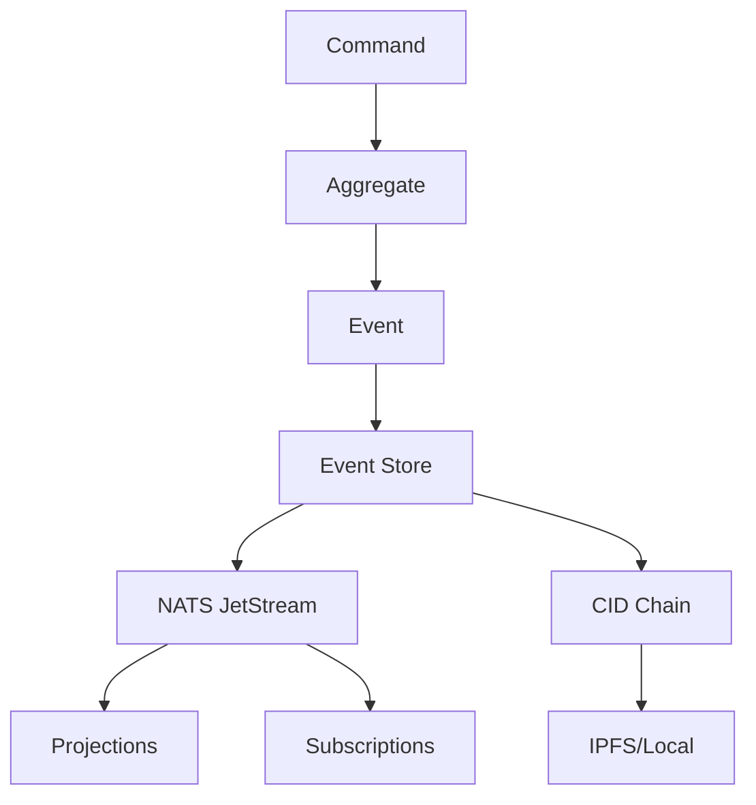

# cim-events

Event store implementation with CID chains using NATS JetStream for the Composable Information Machine (CIM).

## Features

- **NATS JetStream Persistence**: Reliable event storage with built-in persistence and replay capabilities
- **CID Chain Validation**: Every event is linked to its parent using Content-Addressed Identifiers (CIDs)
- **Correlation & Causation Tracking**: Full event lineage tracking for distributed systems
- **Real-time Subscriptions**: Subscribe to event streams for CQRS projections
- **Optimistic Concurrency Control**: Prevent lost updates with version checking
- **IPFS Integration** (optional): Store event data in IPFS for decentralized persistence

## Architecture



## Usage

### Basic Event Storage

```rust
use cim_events::{Event, EventStore, JetStreamEventStore};
use serde::{Serialize, Deserialize};

#[derive(Debug, Clone, Serialize, Deserialize)]
struct AccountCreated {
    account_id: String,
    owner: String,
}

impl Event for AccountCreated {
    fn event_type(&self) -> &str {
        "AccountCreated"
    }
    
    fn aggregate_id(&self) -> &str {
        &self.account_id
    }
}

#[tokio::main]
async fn main() -> Result<(), Box<dyn std::error::Error>> {
    // Connect to NATS
    let client = async_nats::connect("nats://localhost:4222").await?;
    let jetstream = async_nats::jetstream::new(client);
    
    // Create event store
    let store = JetStreamEventStore::new(jetstream, "accounts").await?;
    
    // Store event
    let event = AccountCreated {
        account_id: "acc-123".to_string(),
        owner: "Alice".to_string(),
    };
    
    let metadata = store.append_event("acc-123", event, None).await?;
    println!("Event stored at sequence: {}", metadata.sequence);
    
    Ok(())
}
```

### Event Correlation and Causation

```rust
use cim_events::{EventHeader, EventStore};
use uuid::Uuid;

// Create correlated events
let correlation_id = Uuid::new_v4().to_string();

let header = EventHeader::with_causation(
    correlation_id.clone(),
    previous_event_id,
);

let metadata = store.append_event_with_header(
    aggregate_id,
    event,
    header,
    Some(previous_cid),
).await?;
```

### CID Chain Validation

```rust
// Validate the integrity of an event chain
let is_valid = store.validate_cid_chain(aggregate_id).await?;
if !is_valid {
    panic!("Event chain corruption detected!");
}
```

### Real-time Subscriptions

```rust
use futures::StreamExt;

// Subscribe to events
let mut subscription = store.subscribe_to_events(aggregate_id).await?;

while let Some(event) = subscription.next().await {
    println!("Received event: {:?}", event);
    // Update projections, send notifications, etc.
}
```

## Integration with cim-subject

The event store uses `cim-subject` for proper NATS subject routing:

```rust
// Events are published to subjects like:
// events.{aggregate_id}.{event_type}
// 
// This allows flexible subscription patterns:
// - events.> (all events)
// - events.order-123.> (all events for specific aggregate)
// - events.*.OrderCreated (all OrderCreated events)
```

## Testing

The module includes comprehensive tests following TDD principles:

```bash
# Run all tests
cargo test

# Run with NATS server
docker run -d -p 4222:4222 nats:latest -js
cargo test --features integration
```

## Performance Considerations

- **Event Replay**: JetStream provides efficient replay from any sequence number
- **CID Generation**: Local CID generation avoids IPFS roundtrips in testing
- **Batching**: Events can be batched for better throughput
- **Indexing**: Use projections for query optimization

## Security

- All events include cryptographic CIDs for integrity
- NATS authentication and TLS supported
- Event streams can be encrypted before storage
- Access control via NATS subject permissions

## License

Apache-2.0