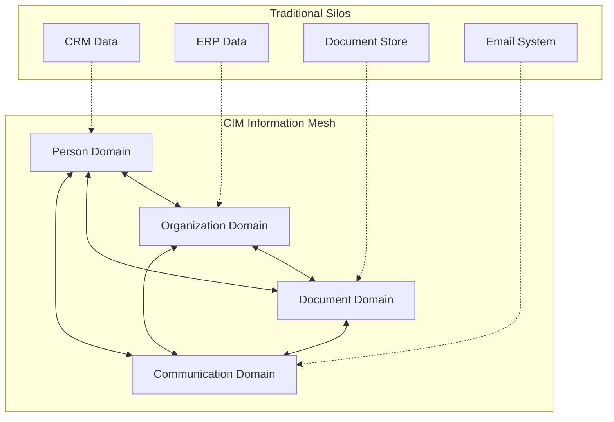
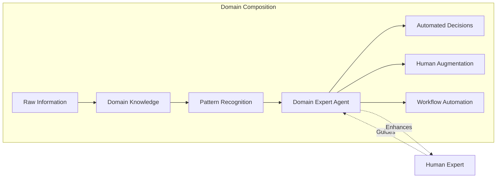
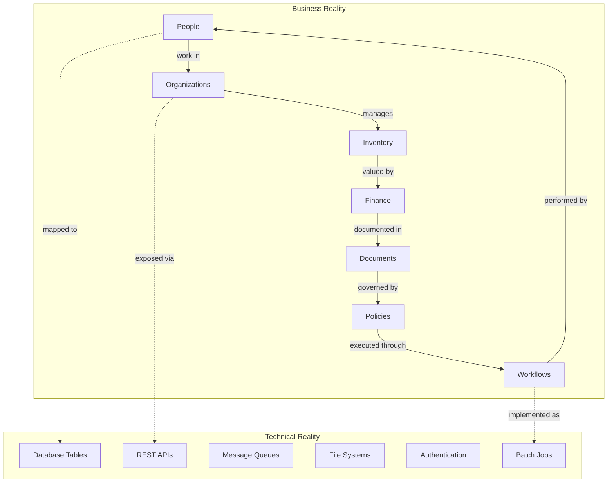
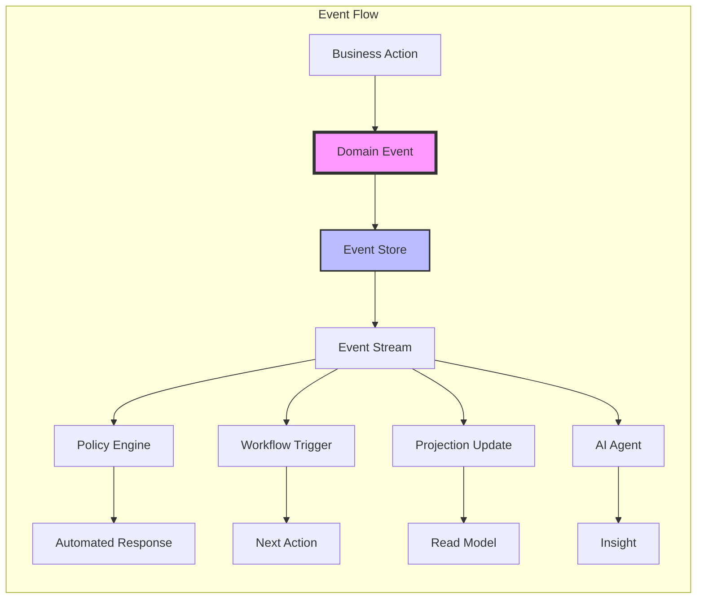
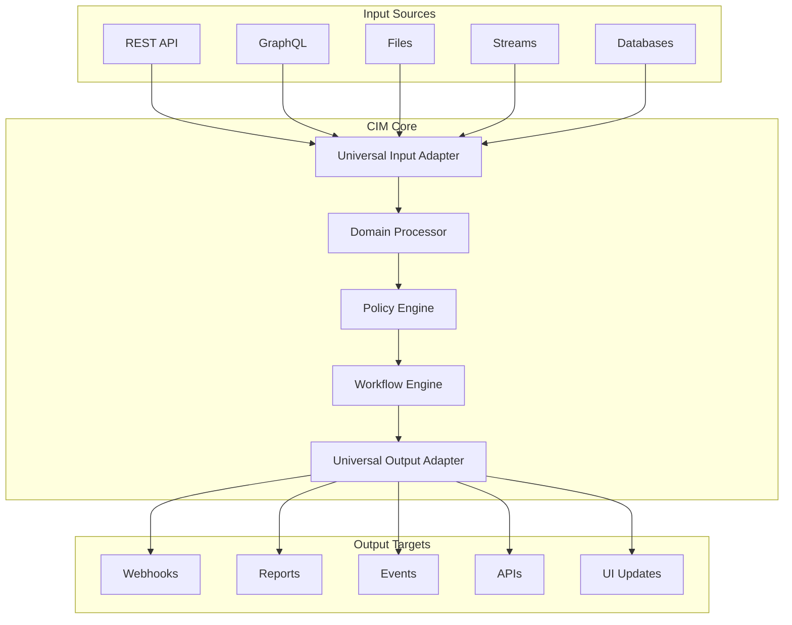
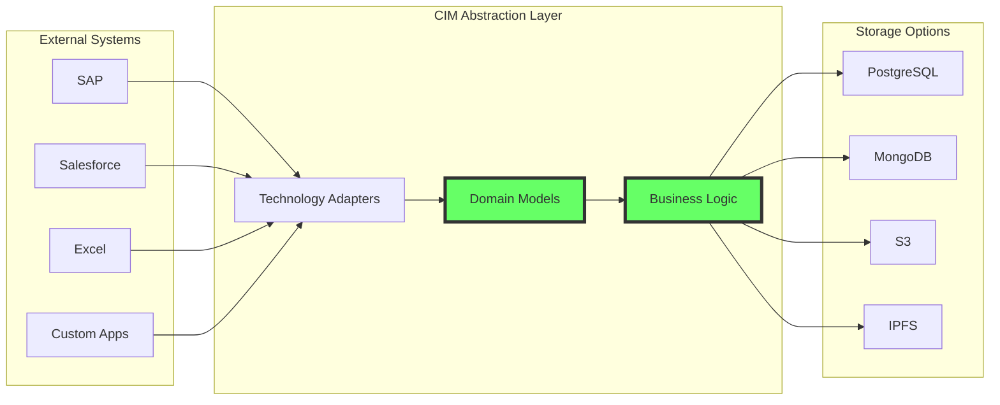
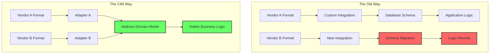
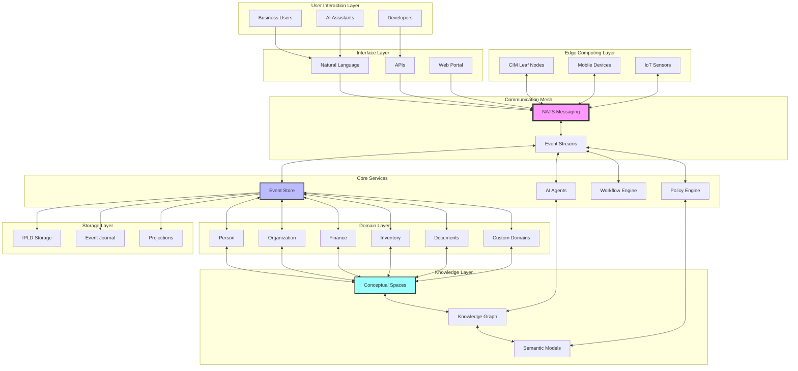

# Composable Information Machine (CIM)

**A continuously improving, distributed system that transforms scattered information into organized, actionable, reactive knowledge while keeping it secure and accessible across your digital world.**

## The Vision: Information That Understands Itself

Imagine a world where your business information isn't trapped in silos, doesn't require endless integrations, and actually understands what it represents. This is the promise of CIM – a revolutionary approach to building information systems that think the way businesses actually work.

## What is CIM?

A CIM is an encapsulation of knowledge, specialized and partitioned by Domain. It's designed to compose many Domains and efficiently create workflows and transitions between them. But more than that, it's a fundamental rethinking of how we build business systems.

### The Core Insight

By composing knowledge into Domains, we create Domain Expert Agents by simply knowing what we have and observing the patterns of use. This isn't artificial intelligence trying to replace human judgment – it's augmented intelligence that amplifies human expertise.

## The Problem We Solve

### The Technology Trap

If you were to describe yourself as a Human Being, what would you say?

You have a body.  
You have a mind.

Ok... but then:
- How was the body made?
- What does the mind care about?
- And thousands of other questions that define your essence.

Now, if you were to describe a business, would you immediately say "we use Spreadsheets to make Calculations for determining the best course of action"?

I seriously doubt it. So why do we call ourselves "Java shops" or "eCommerce Communities"? If you think those mean Coffee and Internet Sales, you may need more clarification.

### The Real Challenge

We already have many well-known patterns that are typically used in the information space:
- **People** - The humans who make it all happen
- **Organizations** - How we structure collaboration
- **Inventory** - What we have and what we need
- **Finance** - How value flows through the system
- **Documents** - How we capture and share knowledge
- **Policies** - The rules that guide our actions
- **Workflows** - How work actually gets done

These are the patterns and flows that make commerce possible. Yet most systems force us to think in terms of databases, APIs, and integrations rather than these fundamental business concepts.

## The CIM Approach

### 1. Domain-Driven Knowledge

CIM is strongly-typed, meaning all the elements and events we create are already known to the system prior to actual usage. We already know our inventory, and we already know our intent. What we don't typically know is how to assemble all the requirements and inventory together in such a way that we:
- Remove all the "unknowns"
- Make undesirable states unrepresentable
- Enable rapid adaptation to change

### 2. Event-Driven Architecture

This is where a Domain-Based knowledge approach and an Event-Driven Architecture help us make sense of this constantly changing information landscape. Every business action becomes an event, every event carries meaning, and meaning drives automated responses.

### 3. Universal Composition

CIM is designed to be a modular system that builds your Business Knowledge in such a way that we can:
- **Universally consume inputs** - From any source, in any format
- **Universally create outputs** - To any system, in any structure
- **Apply workflows and policies** - As the intelligent middleware between input and output

### 4. Technology Independence

We don't care what software creates the information. We don't care how we store our read models. We do care about how the business describes and interprets itself – not by the structure of the database, but by the Entities, Values, and Behaviors that make up the databases, documents, workflows, and everything else.

## The Power of Abstraction

CIM is the toolset we use to isolate the behavior and functionality of our business so that no matter what software or hardware we choose, our workflows can easily adapt to the changes. Consider this scenario:

**The Old Way:**
- Vendor A uses one address format
- You integrate with Vendor A
- Vendor B uses a different format
- You rewrite your integration
- Your database schema changes
- Your entire system needs updates

**The CIM Way:**
- Your business knows what an "Address" means
- Vendor A's format maps to your Address concept
- Vendor B's format also maps to your Address concept
- Your workflows continue unchanged
- Your business logic remains stable

The workflows may not change in the slightest – we simply desire to change vendors and *they* have a different structure. None of your long-term internal structure should need to change. Adding things is not the same as changing things.

## Why CIM Matters

In a world where:
- **Digital transformation** is no longer optional
- **Business agility** determines survival
- **Information overload** paralyzes decision-making
- **Integration complexity** consumes IT budgets
- **Vendor lock-in** limits strategic options

CIM offers a path forward that puts your business logic, not your technology stack, at the center of your information architecture.

## The Complete CIM Ecosystem

## Getting Started

Ready to explore how CIM can transform your information landscape? 

1. **Explore our [Domain Catalog](./doc/CIM_MODULES_CATALOG.md)** to see the building blocks available
2. **Review the [Knowledge Graph](./doc/cim_domain_knowledge_graph.json)** to understand how domains interconnect
3. **Chat with our AI assistant** using `cim-agent-alchemist` to ask questions and explore possibilities
4. **Start small** with a single domain and experience the difference

---

*CIM: Where business logic drives technology, not the other way around.*