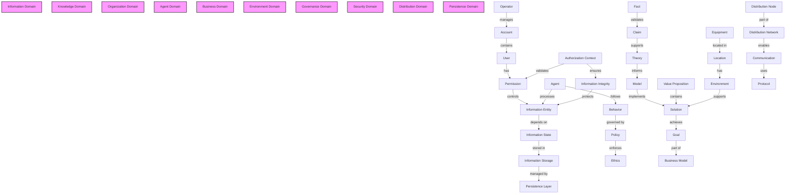
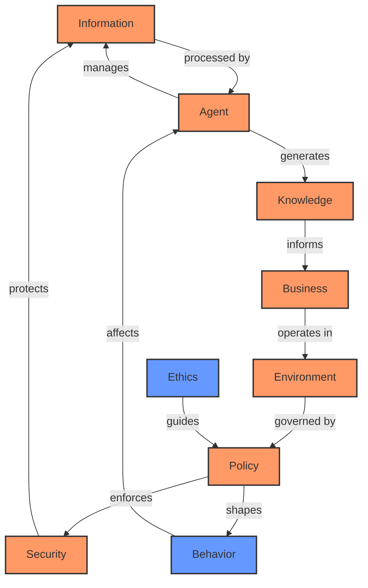
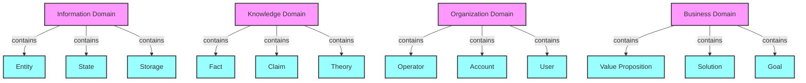
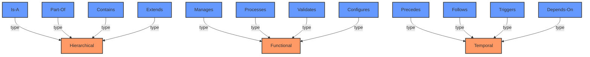

# CIM Knowledge Graphs

## Domain Relationships

```mermaid
graph TD
    %% Domains
    InfoDomain[Information Domain]
    KnowDomain[Knowledge Domain]
    OrgDomain[Organization Domain]
    AgentDomain[Agent Domain]
    BizDomain[Business Domain]
    EnvDomain[Environment Domain]
    GovDomain[Governance Domain]
    SecDomain[Security Domain]
    DistDomain[Distribution Domain]
    PersDomain[Persistence Domain]

    %% Core Information Flow
    InfoEntity[Information Entity]
    InfoState[Information State]
    InfoStorage[Information Storage]

    InfoEntity -->|depends on| InfoState
    InfoState -->|stored in| InfoStorage
    InfoStorage -->|managed by| PersLayer[Persistence Layer]

    %% Knowledge Structure
    Fact -->|validates| Claim
    Claim -->|supports| Theory
    Theory -->|informs| Model
    Model -->|implements| Solution

    %% Organization Structure
    Operator -->|manages| Account
    Account -->|contains| User
    User -->|has| Permission
    Permission -->|controls| InfoEntity

    %% Agent Interactions
    Agent -->|processes| InfoEntity
    Agent -->|follows| Behavior
    Behavior -->|governed by| Policy
    Policy -->|enforces| Ethics

    %% Business Value Flow
    ValueProp[Value Proposition] -->|contains| Solution
    Solution -->|achieves| Goal
    Goal -->|part of| BizModel[Business Model]

    %% Environment Configuration
    Equipment -->|located in| Location
    Location -->|has| Environment
    Environment -->|supports| Solution

    %% Security Flow
    AuthContext[Authorization Context] -->|validates| Permission
    AuthContext -->|ensures| Integrity[Information Integrity]
    Integrity -->|protects| InfoEntity

    %% Distribution Structure
    DistNode[Distribution Node] -->|part of| DistNetwork[Distribution Network]
    DistNetwork -->|enables| Communication
    Communication -->|uses| Protocol

    classDef domain fill:#f9f,stroke:#333,stroke-width:2px
    class InfoDomain,KnowDomain,OrgDomain,AgentDomain,BizDomain,EnvDomain,GovDomain,SecDomain,DistDomain,PersDomain domain
```

## Cross-Domain Interactions

```mermaid
graph TD
    %% Core Domains
    Info[Information] -->|processed by| Agent
    Agent -->|generates| Knowledge
    Knowledge -->|informs| Business
    Business -->|operates in| Environment
    Environment -->|governed by| Policy
    Policy -->|enforces| Security
    Security -->|protects| Info

    %% Cross-cutting Concerns
    Ethics -->|guides| Policy
    Policy -->|shapes| Behavior
    Behavior -->|affects| Agent
    Agent -->|manages| Info

    classDef core fill:#f96,stroke:#333,stroke-width:2px
    classDef concern fill:#69f,stroke:#333,stroke-width:2px
    class Info,Agent,Knowledge,Business,Environment,Policy,Security core
    class Ethics,Behavior concern
```

## Domain Categories

```mermaid
graph TD
    %% Information Domain Categories
    InfoDomain[Information Domain] -->|contains| Entity
    InfoDomain -->|contains| State
    InfoDomain -->|contains| Storage

    %% Knowledge Domain Categories
    KnowDomain[Knowledge Domain] -->|contains| Fact
    KnowDomain -->|contains| Claim
    KnowDomain -->|contains| Theory

    %% Organization Domain Categories
    OrgDomain[Organization Domain] -->|contains| Operator
    OrgDomain -->|contains| Account
    OrgDomain -->|contains| User

    %% Business Domain Categories
    BizDomain[Business Domain] -->|contains| ValueProp[Value Proposition]
    BizDomain -->|contains| Solution
    BizDomain -->|contains| Goal

    classDef domain fill:#f9f,stroke:#333,stroke-width:2px
    classDef category fill:#9ff,stroke:#333,stroke-width:2px
    class InfoDomain,KnowDomain,OrgDomain,BizDomain domain
    class Entity,State,Storage,Fact,Claim,Theory,Operator,Account,User,ValueProp,Solution,Goal category
```

## Relationship Types

```mermaid
graph TD
    %% Hierarchical Relationships
    IsA[Is-A] -->|type| Hierarchical
    PartOf[Part-Of] -->|type| Hierarchical
    Contains -->|type| Hierarchical
    Extends -->|type| Hierarchical

    %% Functional Relationships
    Manages -->|type| Functional
    Processes -->|type| Functional
    Validates -->|type| Functional
    Configures -->|type| Functional

    %% Temporal Relationships
    Precedes -->|type| Temporal
    Follows -->|type| Temporal
    Triggers -->|type| Temporal
    DependsOn[Depends-On] -->|type| Temporal

    classDef reltype fill:#f96,stroke:#333,stroke-width:2px
    classDef rel fill:#69f,stroke:#333,stroke-width:2px
    class Hierarchical,Functional,Temporal reltype
    class IsA,PartOf,Contains,Extends,Manages,Processes,Validates,Configures,Precedes,Follows,Triggers,DependsOn rel
``` 