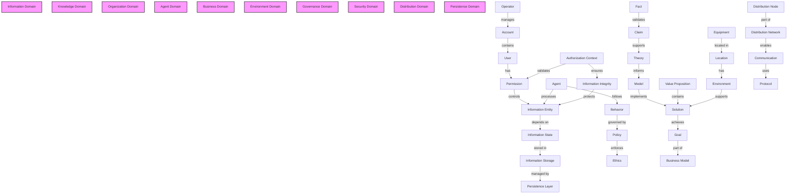
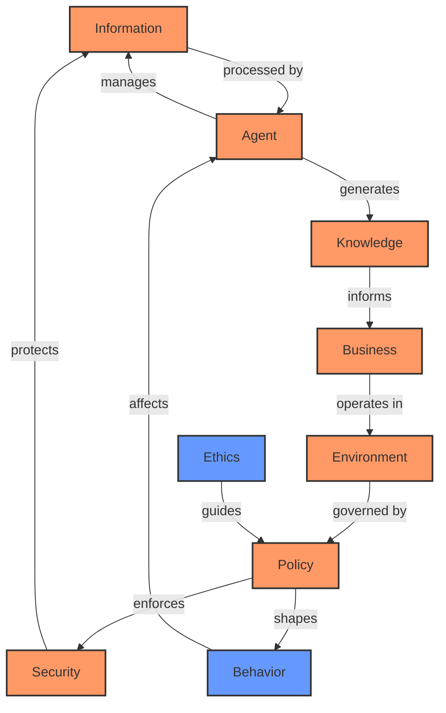
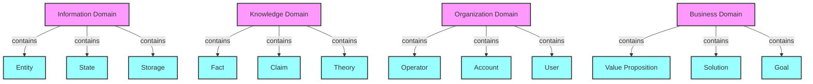
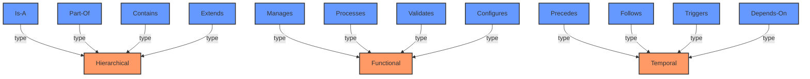

# CIM Knowledge Graphs

## Domain Relationships

## Knowledge Domain Relationships

### Research Relationships
- Research -> Evidence (collects)
- Research -> Method (uses)
- Research -> Finding (produces)
- Research -> Citation (references)
- Research -> Theory (develops)

### Evidence Relationships
- Evidence -> Claim (validates/contradicts)
- Evidence -> Finding (supports)
- Evidence -> Fact (establishes)
- Evidence -> Method (collected_by)

### Method Relationships
- Method -> Evidence (generates)
- Method -> Research (guides)
- Method -> Validation (enables)
- Method -> Classification (implements)

### Finding Relationships
- Finding -> Evidence (based_on)
- Finding -> Claim (supports)
- Finding -> Theory (contributes_to)
- Finding -> Research (result_of)

### Citation Relationships
- Citation -> Research (validates)
- Citation -> Claim (supports)
- Citation -> Evidence (references)
- Citation -> Finding (documents)

### Knowledge Graph Relationships
- KnowledgeGraph -> Relationship (represents)
- KnowledgeGraph -> Navigation (enables)
- KnowledgeGraph -> Classification (implements)
- KnowledgeGraph -> Domain (organizes)

### Validation Relationships
- Validation -> Evidence (assesses)
- Validation -> Claim (verifies)
- Validation -> Method (follows)
- Validation -> Finding (confirms)

### Classification Relationships
- Classification -> Knowledge (organizes)
- Classification -> Domain (structures)
- Classification -> Relationship (defines)
- Classification -> Navigation (enables)

## Cross-Domain Interactions

## Domain Categories

## Relationship Types

# Domain Relationships in CIM

This document describes the key relationships between domains in the CIM system, highlighting how different domains interact and depend on each other.

## Core Domain Relationships

### Information Domain
- Provides foundational information entities and states to Knowledge Domain
- Supports Security Domain with information integrity concepts
- Enables Distribution Domain through composable units
- Facilitates AI Integration through processable information units
- Supplies Persistence Domain with storable information structures

### Knowledge Domain
- Validates and enriches Information Domain entities
- Informs Security Domain through evidence and validation
- Guides Distribution Domain with research findings
- Enhances AI Integration through knowledge graphs
- Supports Business Domain with research and evidence
- Provides Governance Domain with validated knowledge

### Security Domain
- Protects Information Domain integrity
- Secures Knowledge Domain assets
- Controls Distribution Domain access
- Governs AI Integration permissions
- Ensures Persistence Domain protection
- Enforces Organization Domain policies

### Distribution Domain
- Distributes Information Domain entities
- Shares Knowledge Domain resources
- Implements Security Domain policies
- Coordinates AI Integration across nodes
- Manages Persistence Domain replication
- Connects Organization Domain components

### AI Integration Domain
- Processes Information Domain entities
- Leverages Knowledge Domain graphs
- Adheres to Security Domain constraints
- Utilizes Distribution Domain networks
- Optimizes Persistence Domain storage
- Assists Agent Domain decisions

### Persistence Domain
- Stores Information Domain entities
- Archives Knowledge Domain resources
- Implements Security Domain controls
- Supports Distribution Domain state
- Maintains AI Integration models
- Preserves Organization Domain records

### Organization Domain
- Manages Information Domain access
- Coordinates Knowledge Domain usage
- Implements Security Domain roles
- Oversees Distribution Domain topology
- Governs AI Integration deployment
- Structures Agent Domain hierarchy

### Agent Domain
- Processes Information Domain entities
- Uses Knowledge Domain resources
- Follows Security Domain policies
- Operates in Distribution Domain
- Leverages AI Integration capabilities
- Interacts with Business Domain goals

### Business Domain
- Utilizes Information Domain assets
- Applies Knowledge Domain insights
- Complies with Security Domain rules
- Leverages Distribution Domain services
- Benefits from AI Integration solutions
- Guides Environment Domain resources

### Environment Domain
- Hosts Information Domain systems
- Supports Knowledge Domain tools
- Implements Security Domain measures
- Enables Distribution Domain infrastructure
- Provides AI Integration resources
- Maintains Persistence Domain storage

### Governance Domain
- Regulates Information Domain usage
- Validates Knowledge Domain standards
- Defines Security Domain policies
- Controls Distribution Domain rules
- Governs AI Integration ethics
- Oversees Organization Domain structure

## Cross-Domain Patterns

### Information Flow Patterns
- Information → Knowledge → Business
- Information → AI → Agent
- Information → Security → Governance

### Control Flow Patterns
- Governance → Security → Organization
- Security → Distribution → Environment
- Organization → Agent → Business

### Knowledge Flow Patterns
- Knowledge → AI → Agent
- Knowledge → Business → Environment
- Knowledge → Governance → Security

### Resource Flow Patterns
- Environment → Persistence → Distribution
- Organization → Business → Agent
- AI → Agent → Business

## Domain Integration Points

### Primary Integration Points
1. Information-Knowledge Integration
   - Shared entity definitions
   - Validation workflows
   - Classification systems

2. Security-Governance Integration
   - Policy enforcement
   - Compliance checking
   - Audit trails

3. AI-Agent Integration
   - Decision support
   - Behavior modeling
   - Task automation

4. Business-Organization Integration
   - Resource allocation
   - Goal alignment
   - Value delivery

### Secondary Integration Points
1. Distribution-Environment Integration
   - Resource management
   - Network topology
   - Scaling policies

2. Knowledge-Business Integration
   - Evidence-based decisions
   - Research applications
   - Value validation

3. Security-Organization Integration
   - Access control
   - Role management
   - Policy enforcement

## Domain Evolution Patterns

### Capability Evolution
- Information → Knowledge → AI
- Security → Governance → Organization
- Distribution → Environment → Business

### Service Evolution
- Agent → Business → Organization
- AI → Knowledge → Information
- Persistence → Distribution → Environment

### Policy Evolution
- Governance → Security → Organization
- Knowledge → Business → Environment
- Information → AI → Agent 